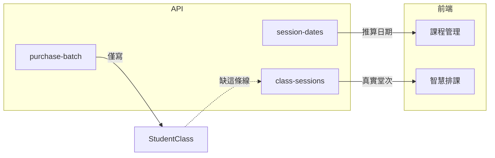

# 加購後課表不顯示（無 ClassSession）— 技術修復計畫

## 現象與已驗證案例

- 學生 **廖吳双**（`Student.id=267`）：課程 **`StudentClass.ID=262`**（數學、堂數制 4 堂、`StartDate=2026-04-13`）在 MySQL 中 **`ClassSession` 筆數為 0**；同學生課程 **#263** 則有 4 筆 `ClassSession`。
- 前端 [CourseManagement.vue](frontend/src/pages/CourseManagement.vue)／[useCourseSessionsDisplay.js](frontend/src/composables/course-management/useCourseSessionsDisplay.js) 在無堂次時仍可用 [StudentClassController::sessionDates](backend/app/Http/Controllers/StudentClassController.php) **推算**上課日，故畫面可見 4/13；[SmartCalendar.vue](frontend/src/pages/SmartCalendar.vue) 主要依 `GET /api/v1/class-sessions`，且當無堂次時 `isOverSessionLimit` 對堂數制會讓 fallback 無法畫出（先前分析），故 **課表空白**。
- **與「未繳費」無直接關係**：新批次本來 `Paid=0` 屬正常。

## 根因（程式層）

[`StudentClassController::purchaseBatch`](backend/app/Http/Controllers/StudentClassController.php)（約 1080–1217 行）在 transaction 內呼叫 `createStudentClassRecordResilient` 建立 **`$newCourse`** 後即回傳 JSON，**從未**插入 `ClassSession`，也未呼叫與 [`POST /api/v1/class-sessions/batch`](backend/app/Http/Controllers/ClassSessionController.php)（[`EnrollmentService::store`](backend/app/Services/EnrollmentService.php)）等價的堂次建立流程。

觸發此 API 的前端：

- [StudentsList.vue](frontend/src/pages/StudentsList.vue) `submitAddSessions`（`purchase-batch`）
- [CourseManagement.vue](frontend/src/pages/CourseManagement.vue) `submitPurchaseSessions`（`purchase-batch` + `mode: new_purchase`）

## 修復方向（建議優先序）

### P0 — 後端：加購完成時一併建立 ClassSession（主修）

**目標**：`purchase-batch` 成功後，`ClassSession` 筆數應等於新課程 `SessionCount`，且日期／時間與「課程管理推算」一致，並與現有堂數／衝堂邏輯相容。

**實作要點**（均在 [`StudentClassController.php`](backend/app/Http/Controllers/StudentClassController.php)）：

1. 在 `purchaseBatch` 於 `$newCourse` 建立成功後：
   - 用 **`$studentClass`（來源課）** 的星期／時段複本已寫入 `$newCourse`，以 `resolveScheduleSlotsForRebuild($newCourse)` 取得 slots（與 [`maybeRebuildSessionsAfterUpdate`](backend/app/Http/Controllers/StudentClassController.php)／[`buildSessionsForCount`](backend/app/Http/Controllers/StudentClassController.php) 相同語意）。
   - 若 slots 為空，需定義 **與 `session-dates` 一致的 fallback**（例如由 `start_date` 推 ISO 週幾 + `time`／`SessionDuration`），避免測試資料或舊資料無 `week*` 欄位時仍產生 0 堂次。
   - 呼叫既有 **`buildSessionsForCount($newCourse->ID, $startDate, $sessions, $slots, $globalDur)`** 產生 session 陣列（注意：該方法目前為 private，僅需同類內呼叫）。
2. **衝堂／教室**：與 `store` 舊路徑或 `ScheduleController` 一致，對每筆預排呼叫 [`ScheduleGuardService::validateScheduleOccurrence`](backend/app/Services/ScheduleGuardService.php)（或抽出與 `EnrollmentService` 共用的驗證）；若衝突則 **整批 transaction 失敗** 並回傳 409／422，**不要**留下無堂次的 `StudentClass`。
3. **寫入**：以 `ClassSession::create` 或 bulk insert 建立列；必要時更新 `$newCourse->EndDate` 為最後一堂日（與其他建立流程對齊）。
4. **計數**：呼叫 [`SessionDeductionService::syncCounters`](backend/app/Services/SessionDeductionService.php)（`$newCourse`），確保 `RemainingSessions`／`UsedSessions` 與實際堂次一致。

### P1 — 測試

擴充 [StudentClassPurchaseBatchTest.php](backend/tests/Feature/StudentClassPurchaseBatchTest.php)：

- 在 `createStudentClass` 的 source／或斷言用的 **新課程** 上補齊 **`week` + `time`**（及必要時 `SessionDuration`），使 `buildSessionsForCount` 可穩定產生 N 筆。
- 於 `test_purchase_batch_creates_separate_unpaid_course_without_merging_source`（或新 test）中 **assert** `ClassSession::where('StudentClassID', $newId)->count() === 6`，並抽樣第一堂 `SessionDate` 與 `start_date`、星期相符。

### P2 — 營運資料補救（一次性）

- 以 SQL／artisan 指令找出：`ScheduleMode=count` 且 `SessionCount>0` 但 **無任何 `ClassSession`** 的 `StudentClass`（可排除已 `Stop=1` 或已結案者）。
- 對 **#262** 與同規則孤兒列：依 `StartDate`、`week*`、`time*`、`SessionCount` 重算日期後 **補 insert `ClassSession`**（建議先在 staging 驗證，production 需備份）。
- 補完後在智慧排課重新整理確認格子出現。

### P3（可選）— 前端防呆

[SmartCalendar.vue](frontend/src/pages/SmartCalendar.vue) 中 `isOverSessionLimit` 在 `courseLastSessionDate` 為 null 時對堂數制一律視為超限，會讓「無堂次」時連 fallback 都不顯示。可於後端修復並補資料後再評估是否仍需調整（避免掩蓋資料問題）；若要做，應與 `session-dates` 行為一致並加註解避免回歸。

### P4 — 文件

- 更新 [docs/CHANGELOG.md](docs/CHANGELOG.md) 簡述：`purchase-batch` 會建立 `ClassSession`；加購後課表／點名依賴此行為。

## 風險與注意

- **衝堂**：若加購批次與既有老師／教室時段衝突，應明確失敗並提示，避免靜默寫入半套資料。
- **舊 sync**：`StudentClassController::sync`／`store` 目前開頭即 **410**（僅保留死碼），與本議題無關；修復焦點在 **`purchaseBatch`**。
- **多時段課**（`week1`–`week6`）：須確認 `buildSessionsForCount` + slots 與課程管理 `session-dates` 對多時段課一致（必要時加測試案例）。

## 驗收標準

1. 新環境：由課程管理或學生管理執行加購（`purchase-batch`）後，**同一課程 ID** 在 DB 有 **N 筆** `ClassSession`，智慧排課該週可見對應格子。
2. 既有測試全綠；`StudentClassPurchaseBatchTest` 新增／強化堂次斷言。
3. 廖吳双 #262 類孤兒資料經補救後，課表與點名與課程管理日期一致。
