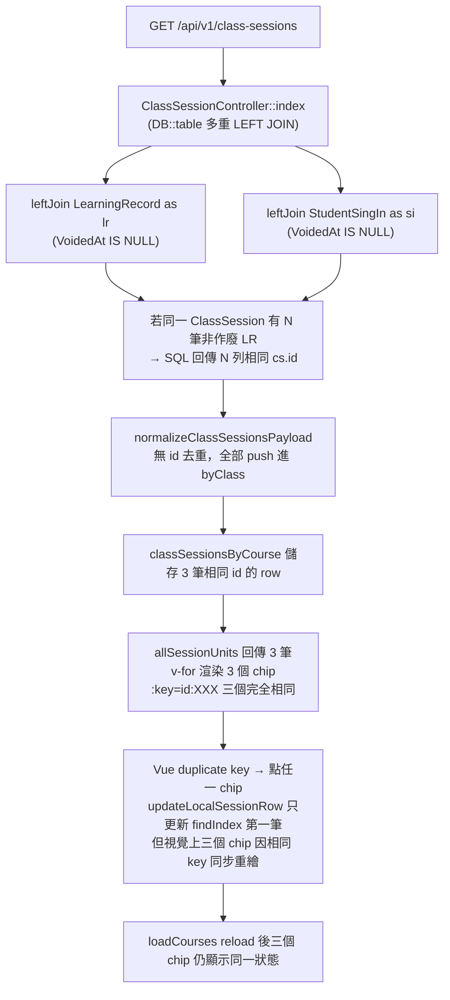

# 同日多堂課誤動修正計畫

## 問題摘要（PM 給 CTO/QA 的白話說明）

木柵校林宥彣理化課程，1/12 同一時段（16:00-18:00）顯示 3 個「取消」chip。  
點任一個標記「已上」，三個全部跳已上；點「取消」，三個全部跟著動。  
與上次修復的「排程列數與購買堂數不一致」警示有間接關聯（警示修正後此問題才被注意到），但根本原因是另一層邏輯錯誤。

---

## 根本原因（Root Cause）



**具體原因**：`ClassSessionController::index`（[backend/app/Http/Controllers/ClassSessionController.php](backend/app/Http/Controllers/ClassSessionController.php) L85–139）對 `LearningRecord` 與 `StudentSingIn` 使用 `leftJoin`，若同一個 `ClassSession.id` 在 `LearningRecord` 有多筆 `VoidedAt IS NULL` 的記錄（例如：課程取消重排多次、評量表建了又作廢後重建），SQL Cartesian Product 使該 session 出現 N 次。[`frontend/src/lib/classSessionsApi.js`](frontend/src/lib/classSessionsApi.js) 的 `normalizeClassSessionsPayload` 無去重，照單全收 push 進 `byClass`。

**次要原因**：[`frontend/src/composables/course-management/useCourseSessionsDisplay.js`](frontend/src/composables/course-management/useCourseSessionsDisplay.js) 的 `updateLocalSessionRow` 只用 `findIndex` 更新第一筆匹配，其餘同 id 的 duplicate 不更新，造成 local patch 後 reload 前的短暫視覺不一致。

---

## 修復方案

### Fix 1（後端，核心）：改用 Derived Table Subquery 避免行乘積

**檔案**：[`backend/app/Http/Controllers/ClassSessionController.php`](backend/app/Http/Controllers/ClassSessionController.php)

將 `LearningRecord` 與 `StudentSingIn` 的 `leftJoin` 改為 **Derived Table**，每個 `ClassSessionID` 只取最新一筆（`MAX(id)`）：

```php
// 修改前（有行乘積風險）
->leftJoin('LearningRecord as lr', function ($join) {
    $join->on('lr.ClassSessionID', '=', 'cs.id')
         ->whereNull('lr.VoidedAt');
})

// 修改後（Derived Table，每 session 只取最新一筆 LR）
->leftJoin(DB::raw('(
    SELECT lr_inner.*
    FROM LearningRecord lr_inner
    INNER JOIN (
        SELECT ClassSessionID, MAX(id) AS max_id
        FROM LearningRecord WHERE VoidedAt IS NULL
        GROUP BY ClassSessionID
    ) latest ON lr_inner.id = latest.max_id
) AS lr'), 'lr.ClassSessionID', '=', 'cs.id')
```

`StudentSingIn` 同樣做法（`si`）。  
`sub_sched` LEFT JOIN 也需評估是否可能對同 course+date+time 有多筆，若有則同法加 derived table。

### Fix 2（前端，防禦層）：`normalizeClassSessionsPayload` 加 id 去重

**檔案**：[`frontend/src/lib/classSessionsApi.js`](frontend/src/lib/classSessionsApi.js)

在 `byClass[key].push(item)` 之前檢查是否已存在相同 `id`：

```javascript
if (!byClass[key].some(r => r.id === item.id)) {
  byClass[key].push(item);
}
```

### Fix 3（前端，防禦層）：`updateLocalSessionRow` 更新所有同 id 列

**檔案**：[`frontend/src/composables/course-management/useCourseSessionsDisplay.js`](frontend/src/composables/course-management/useCourseSessionsDisplay.js)

目前只更新 `findIndex` 第一筆；改為遍歷並更新所有 `r.id === sessionData.id` 的列。

### Fix 4（資料稽核，選做）：查找現有重複非作廢 LR 記錄

執行以下查詢確認問題資料範圍，並視情況做標記/作廢：

```sql
SELECT ClassSessionID, COUNT(*) as cnt
FROM LearningRecord
WHERE VoidedAt IS NULL
GROUP BY ClassSessionID
HAVING cnt > 1
ORDER BY cnt DESC;
```

---

## 與 2026-04-15 警示修正的關係

「排程列數與購買堂數不一致」警示修正（2026-04-15）**並未造成**此 bug，但因為：
1. 警示現在正確顯示，主任才注意到課程有異常
2. 舊 `sessionUnits` 已排除 `cancelled`；`allSessionUnits` 本來就回傳全部（含 cancelled），所以 3 個取消 chip 早就存在，只是警示讓人注意到

---

## AI 防再犯筆記（寫入 AI_REGRESSION_LESSONS.md）

- `ClassSessionController::index` 的 LEFT JOIN 對象若不加 Derived Table 去重，每多一筆非作廢 LR/SSI 就多一列
- `normalizeClassSessionsPayload` **必須** 有 `id` 去重作為防禦層
- `updateLocalSessionRow` 應遍歷所有匹配 id 的列（不只第一筆）
- 禁止直接 `leftJoin('LearningRecord', ...)` 不加 LIMIT/MAX 子查詢

---

## QA 驗收清單

- [ ] 木柵校林宥彣理化課程，1/12 chip 只顯示 1 個（不再重複）
- [ ] 點單一 chip 標「已上」，只有該堂變更，其他 chip 不跟著動
- [ ] 「排程列數與購買堂數不一致」警示在此學生案例中是否仍顯示（若 8 堂有 7 已上 + 1 缺口，屬於合理 under_other，警示合理）
- [ ] 其他正常課程的 chip 顯示、操作不受影響
- [ ] `ClassSessionDuplicateStatusTest` 仍通過（3/3）
- [ ] 回歸測試：同 `StudentClassID` + 同 `SessionDate` 有多筆非作廢 `LearningRecord` 時，API 回傳只有 1 筆 session row
