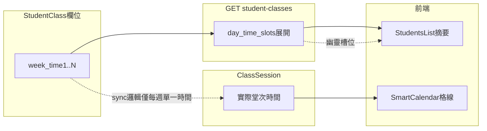

# 同日多時段／幽靈時段與行事曆不一致 — 技術修復計畫

## 一、問題描述（產品／營運現象）

- **觸發**：在學生課程中按「編輯」調整時間（木柵分校、學生沈宇璿、化學一對一為典型案例）。
- **現象 A**：課程摘要「時段」出現**第三段**（例如週六 15:00~17:00），但下方「上課日期／堂次」實際僅有兩段（13:00~15:00、17:00~19:00），**主檔與堂次脫鉤**。
- **現象 B**：智慧排課／課表格線與實際堂次或摘要**對不齊**；極端情況下同欄位出現視覺上重疊或錯位（與多筆課程同小時格篩選邏輯有關）。

**嚴重性**：屬 **資料一致性 + 排課／點名／評量** 鏈路高風險（錯誤時段會誤導櫃檯排課、老師到課、衝堂檢查與家長溝通）。

---

## 二、技術根因（程式碼層級）

### 2.1 課程主檔「時段」來源：`week` + `week1..week6` 與 `time` + `time1..time6` 平行展開

後端在回傳課程列表時，將上述欄位**逐列**轉成 `day_time_slots`（見 [StudentClassController.php](backend/app/Http/Controllers/StudentClassController.php) 約 194–217 行）。只要資料庫中仍存有「同日、不同時間」的第三組欄位（例如 `week2=6, time2=15:00`），API 就會忠實回傳**第三段**，與 `ClassSession` 是否仍存在 15:00 那一堂**無關**。

`dedupeIdenticalConsecutiveDayTimeSlots` **只會合併「相鄰且完全相同」的條目**（同日、同開始時間、同時長），**不會**移除「中間多一段不同時間」的幽靈列（見同檔約 1763–1781 行註解亦提及 legacy 寫入問題）。

### 2.2 有歷史堂次時的「僅同步未來堂次時間」：以「星期幾 → 單一時間」覆寫

當課程已有刷卡／已核准評量等 **immutable history** 時，`maybeRebuildSessionsAfterUpdate` 會改走 `syncFutureScheduledSessionTimes`（見 [StudentClassController.php](backend/app/Http/Controllers/StudentClassController.php) 約 1825–1837、2067–2144 行）。

該函式用關聯陣列 `$timeByIsoWeekday[$weekday] = ...` 寫入：**同一 ISO 星期幾只保留最後一筆 slot 的時間**。若合約為「**週六兩段**（13 與 17）」，但 `ScheduleSlots`／重建用 slots 含三段或同週多筆，則**無法**正確表達「同日多時段」，未來堂次會被錯誤統一到某一時間。

### 2.3 堂數制重建：`buildSessionsForCount` 同樣是「每星期幾一個時間」

`buildSessionsForCount` 內對 `$slots` 做 `foreach` 時，以 `weekday` 為 key 覆寫 `$timeByWeekday`（見約 2469–2477 行）。因此邏輯上**假設每個星期幾最多一個固定時間**；與產品上「週六兩段固定課」的 **ClassSession 多筆同日** 模型不一致時，主檔與堂次生成／同步會分歧。

### 2.4 前端智慧排課：格線篩選仍高度依賴 `start_time` 的小時

[`SmartCalendar.vue`](frontend/src/pages/SmartCalendar.vue) 中 `getCoursesAt` / `getCoursesForTeacherAt` 仍以 `parseHour(c.start_time) === hour` 篩選（約 1224–1231、1287–1291 行），而 `start_time` 來自 API 的「**第一段**」`day_time_slots[0]`（後端約 234–236 行）。同日第二段（例如 17:00）在**依小時格線**的邏輯下容易**漏顯或與其他課程擠在同一格**，與 `resolveCourseGridTimes`（約 1144–1174 行）嘗試用 `sessionDates` 補齊的設計**並未完全打通**。

週檢視合併列表時，對同一 `session_date` 多筆 `ClassSession` 使用 `rows.find(...)` 只取**第一筆符合日期的列**（約 1147–1152 行），**同日第二堂不會再展開成一張獨立卡片**，與「上課日期兩段」的現實不一致。

### 2.5 小結（給 RD 的一句話）

**StudentClass 仍以「最多 7 個 (weekN,timeN) 槽位」表達排課，但堂次同步與行事曆多處仍假設「每星期幾單一時間」或「每格單一列」；編輯後若留下未清乾淨的槽位，就會出現「幽靈第三段」與課表對齊錯誤。**

---

## 三、修復目標（驗收條件）

1. **編輯儲存後**：`day_time_slots`（或 DB 對應欄位）與未來 `ClassSession` 的**時間集合一致**；不應再出現「摘要多一段、堂次沒有」。
2. **週六兩段（或多段同日）**：有 immutable history 時，**仍能以正確規則**更新未來各堂之 `StartTime`/`EndTime`（或明確禁止並提示需用指定流程）。
3. **智慧排課**：同一課程若當日有兩筆堂次，**兩段皆出現在正確小時列**；與點名／`session-dates` 一致。
4. **回歸**：單日單時段、跨日多星期、堂數制／月結、請假調課既有測試不中斷。

---

## 四、建議修復方案（分階段）

### 階段 A — 止血與資料修復（可平行）

- **營運／DB**：針對通報案例（木柵、StudentClass ID、沈宇璿課程）查 `StudentClass` 的 `week, week1..week6` / `time, time1..time6`（及 `duration*`），比對 `ClassSession` 該課程之 `(SessionDate, StartTime)` 分佈；**刪除或 NULL 掉無對應堂次之幽靈槽位**，再請前端重載確認摘要。
- **後端防呆（短期）**：在 `index` 組完 `day_time_slots` 後，可選擇性加上 **與未來堂次之時間聯集比對**（僅診斷用 log 或 `meta.schedule_drift_warning`），避免再靜默錯亂。

### 階段 B — 核心邏輯修正（必做）

| 區域 | 建議方向 | 主要檔案 |
|------|----------|----------|
| 同步策略 | 將「星期幾 → 單一時間」改為能處理 **同日多 slot** 的結構（例如依日期+序或依 ClassSession id 對應），或 **明確定義**：同日多段僅允許透過 `ClassSession`／`session_plan` 維護，主檔僅存「代表欄位」並在儲存時 **重算／截斷** 多餘槽位。 | [StudentClassController.php](backend/app/Http/Controllers/StudentClassController.php)（`syncFutureScheduledSessionTimes`、`buildSessionsForCount`、`mapFrontendPayload`） |
| 寫入一致性 | `mapFrontendPayload` 已會清空 `week1..6`；需稽核 **所有** 更新路徑（含 [EnrollmentService](backend/app/Services/EnrollmentService.php) 與其他 PATCH）是否皆清空；並考慮在儲存後 **以 ClassSession 反推** 應保留的 slots 做驗證。 | 同上 + Enrollment |
| GET 展開 | 展開 `day_time_slots` 時，對「同日多筆」做 **排序 + 業務 dedupe**（例如與際未來堂次之 start_time 交集），避免幽靈列進入前端。 | StudentClassController `index` |
| 前端行事曆 | `filteredCourses` 合併邏輯：同一 `targetYmd` **多筆 session 應 push 多張卡**（或帶不同虛擬 id），勿 `find` 只取一筆；`getCoursesAt` 應以 **該列實際 `start_time`**（來自 resolve 後的 course）比對 hour，而非僅 `course.start_time`。 | [SmartCalendar.vue](frontend/src/pages/SmartCalendar.vue) |
| 編輯表單 | 覆核 [CourseEditForm.vue](frontend/src/components/CourseEditForm.vue) `syncDayTimeSlotsFromSelection` 與 [StudentsList.vue](frontend/src/pages/StudentsList.vue) `editCourse` 載入邏輯，確保儲存 payload 的 `day_time_slots` 與畫面一致，且不會在 `days_of_week` 與 slots 之間留下多餘聯集。 | 上述 Vue |

### 階段 C — 測試與文件

- **Pest Feature**：新增「週六兩段固定課 + 已存在過去堂次（immutable）+ PUT 更新時間」案例：斷言 `ClassSession` 未來列與 API `day_time_slots` 一致、無幽靈第三段。
- **前端單元或 E2E（可選）**：智慧排課週檢視同一日兩筆皆顯示。
- **CHANGELOG / 營運**：註記「同日多段課程請勿僅改摘要第一段」至解決前的暫行說明（若需）。

---

## 五、風險與依賴

- **堂數與扣點**：變更 `ClassSession` 時間勿破壞已扣堂、`LearningRecord`、`StudentSingIn` 關聯；需沿用現有「locked session」判斷（`hasImmutableSessionHistory`）。
- **多校區**：修復與查詢僅限該課程所屬 `CampusID`。
- **與排課例外 `schedules` 表**：若該課同時存在調課／補課例外，驗收時需一併檢查。

---

## 六、建議任務分工（技術部門）

| 角色 | 工作 |
|------|------|
| 後端 RD | 修正 `syncFutureScheduledSessionTimes` / `buildSessionsForCount` 與 `index` 展開邏輯；補測試。 |
| 前端 RD | 修正 `SmartCalendar` 同日多堂次與 hour 篩選；必要時調整 `session-dates` 消費方式。 |
| QA | 用通報案例回歸 + 新增「同日雙時段」矩陣。 |
| 營運／DBA | 個案資料修復與上線後抽樣。 |
