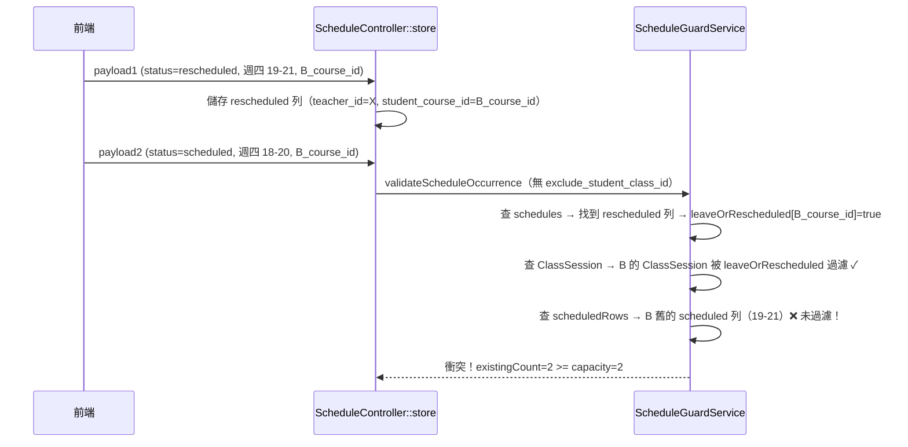

# 同日調課容量誤判修正計畫

## Bug 情境重現

- 週四 19:00–21:00：老師帶 A、B 兩位學生（1對2，容量上限 2）
- B 要將「週四 19-21」調課至「週四 18-20」（同日、不同時段）
- 系統報錯：**「老師此時段已有 2 位學生，一對二 上限為 2 位學生。」**

## 根本原因分析

調課流程需兩次 POST `/api/v1/schedules`：



**Bug 位置**：[`backend/app/Services/ScheduleGuardService.php`](backend/app/Services/ScheduleGuardService.php) 的 `buildTeacherDateOccupancyEntries` 方法，約第 679 行的 `$scheduledRows` 迴圈。

- ClassSession 迴圈（~第 638 行）有正確過濾：`if (isset($leaveOrRescheduled[$courseId])) continue;`
- 但 `$scheduledRows`（來自 `schedules` 表的 `status=scheduled` 列）**沒有同樣的過濾**，導致 B 原有的 scheduled 列仍被計入人數

## 修復方案

### 唯一需要修改的檔案

[`backend/app/Services/ScheduleGuardService.php`](backend/app/Services/ScheduleGuardService.php)，約第 679–691 行：

**修改前**（scheduledRows 迴圈開頭）：
```php
foreach ($scheduledRows as $row) {
    $start = $this->normalizeTime($row->start_time ?? null);
    $end = $this->normalizeTime($row->end_time ?? null);
    if (!$start || !$end) {
        continue;
    }
    $courseId = (int) ($row->student_course_id ?? 0);
    // If this course already has a concrete ClassSession on the date,
    // trust ClassSession as the source of truth and ignore stale schedule overrides.
    if ($courseId > 0 && isset($classSessionCourseIds[$courseId])) {
        continue;
    }
```

**修改後**（新增一個 `leaveOrRescheduled` 檢查）：
```php
foreach ($scheduledRows as $row) {
    $start = $this->normalizeTime($row->start_time ?? null);
    $end = $this->normalizeTime($row->end_time ?? null);
    if (!$start || !$end) {
        continue;
    }
    $courseId = (int) ($row->student_course_id ?? 0);
    // Skip if this course has a leave/rescheduled marker on the same date
    if ($courseId > 0 && isset($leaveOrRescheduled[$courseId])) {
        continue;
    }
    // If this course already has a concrete ClassSession on the date,
    // trust ClassSession as the source of truth and ignore stale schedule overrides.
    if ($courseId > 0 && isset($classSessionCourseIds[$courseId])) {
        continue;
    }
```

## 驗證方式（QA）

### 手動測試情境

1. **主要情境（Bug 復現）**：週四 19-21 兩位 1對2 學生 A、B → B 調課至 18-20 同一天 → **預期：調課成功**
2. **邊界情境 1**：B 調課至完全不重疊時段（如 21-23）→ 預期：成功
3. **邊界情境 2**：嘗試讓 B 調到一個已有兩位不同學生的時段 → 預期：仍應被阻擋（衛兵正常運作）
4. **邊界情境 3**：A 也嘗試調課（非 B），確認 A 調課時 B 的舊 scheduled 列不影響 A 的調課驗證

### 無需前端變更

此 Bug 純屬後端容量衛兵邏輯，不涉及前端程式碼。
