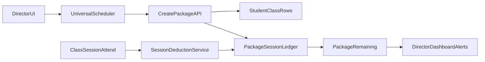

# 24 堂多科多師排課方案（PM + UX）

## 目標與已確認條件
- 客戶目標：同一位學生購買 **24 堂**，可在 **3 科** 間彈性排課，且每科老師可不同。
- 已確認規則：
  - 堂數採 **共用池概念**。
  - 扣堂規則為 **每上 1 堂扣 1 堂**，不分科、不分老師單價。

## 現況盤點（基於現有架構）
- 後端核心仍是「**一筆 `StudentClass` = 單一科目 + 單一主老師**」，見 [/home/admin/backend/app/Models/StudentClass.php](/home/admin/backend/app/Models/StudentClass.php)。
- 但前端排課器已支援「同一排課流程中每個時段可選不同科目」，見 [/home/admin/frontend/src/components/UniversalClassScheduler.vue](/home/admin/frontend/src/components/UniversalClassScheduler.vue)（`day_time_slots.subject`）。
- 目前加購/續報、提醒、報表多依 `StudentClass` 為單位（例如 `purchase-batch`），見 [/home/admin/backend/app/Http/Controllers/StudentClassController.php](/home/admin/backend/app/Http/Controllers/StudentClassController.php)。

## 架構師審視：原計畫需補強的風險
- **雙軌扣堂風險**：若 `StudentClass.RemainingSessions` 與 `PackageSessionLedger` 同時扣堂，容易發生雙扣/對帳不一致。
- **提醒規則變更管制**：`alerts/tuition` 屬高風險產品規則，不能直接改成 package remaining，需先取得產品明示同意。
- **歷史資料遷移風險**：既有 3 科課程綁方案若沒有 dry-run 與核對報表，會影響既有續課提醒與財務判斷。
- **效能風險**：方案餘額若每次即時計算全量 ledger，分校資料大時會拖慢列表/總覽。
- **權限風險**：跨分校查詢 package 時需與既有 `CampusID`/`branch_id` 隔離規則完全一致。

## 建議策略（先上線，再升級）
- **Phase 1（建議先做，2-3 週）**：
  - 不改核心扣堂資料模型，採「**多科課程綁同一方案群組**」方式。
  - 介面上給主任看到「同一份 24 堂方案」；底層維持 3 筆課程（國/英/數各一筆）但共享一個「方案ID」。
  - 共用剩餘堂數由群組聚合計算顯示，避免一次重構所有既有邏輯。
- **Phase 2（可選，4-6 週）**：
  - 新增真正的 `course_packages`（方案主檔）與 `course_package_items`（科目/老師配置）模型。
  - 扣堂改以 package ledger 為唯一真相，`StudentClass` 退為教學設定與查詢視圖。

## Phase 1 詳細規格（推薦採用）

### 1) 資料模型（最小增量）
- 在 `StudentClass` 新增欄位：
  - `PackageID`（同方案共用ID）
  - `PackageTotalSessions`（例 24）
  - `PackageRemainingSessions`（群組剩餘快取）
  - `PackageName`（如「國英數24堂方案」）
- 建立 `PackageSessionLedger`（扣堂流水）：
  - `PackageID`, `StudentClassID`, `ClassSessionID`, `delta`（-1/+1）, `reason`, `recorded_by`。
- 與既有 `SessionDeductionService` 對接：核准/回滾時同步寫 package ledger。
- **新增不變式（必須）**：
  - package 方案啟用後，`PackageRemainingSessions` 為「對外唯一餘額」。
  - `StudentClass.RemainingSessions` 在 package 方案下僅作相容顯示，不作扣堂真相。
  - `PackageSessionLedger` 需有唯一鍵（如 `ClassSessionID + reason`）確保冪等。

### 2) 後端 API 與服務
- 新增 `POST /api/v1/course-packages/create-multi-subject`：一次建立同方案下的 3 筆 `StudentClass`。
- 新增 `GET /api/v1/course-packages/{id}`：回傳方案餘額、各科消耗、下一堂資訊。
- 新增 `POST /api/v1/course-packages/{id}/recompute`：修復歷史資料時重算餘額。
- 既有 API 相容：`/student-classes` 仍可用，但回傳附加 `package_*` 欄位。

### 3) UX 流程（主任）
- 在 [StudentsList]( /home/admin/frontend/src/pages/StudentsList.vue ) 與 [CourseManagement]( /home/admin/frontend/src/pages/CourseManagement.vue )新增「**方案視角**」：
  - 方案卡：`國英數24堂｜剩餘 11 堂｜有效科目 3`。
  - 展開後顯示三科各自老師、固定時段、已上堂數。
- 在 [UniversalClassScheduler]( /home/admin/frontend/src/components/UniversalClassScheduler.vue )新增「建立多科共用方案」模式：
  - Step1 建方案（總堂數24、方案名）
  - Step2 設定科目與老師（最多3科）
  - Step3 設定每科固定星期/時段
  - Step4 日曆預覽（所有科目合併時間軸）
- 衝突提示：若同時段科目撞老師/教室，沿用現有 conflict message。

### 4) 報表與提醒一致性
- 續課提醒仍遵守現有規則文件 [/home/admin/docs/DIRECTOR_PAYMENT_ALERT_RULES.md](/home/admin/docs/DIRECTOR_PAYMENT_ALERT_RULES.md)。
- **管制要求**：在取得產品明示同意前，`AlertController::tuition` 條件不變；Phase 1 先在課程管理/學生頁顯示 package 餘額，不直接改提醒判定來源。
- 科目統計、老師工時仍依實際 `ClassSession.SubjectID/TeacherID` 計，不受共用池影響。

### 5) 遷移與風險控制
- 舊資料不強制轉換：先只對新建方案生效。
- 提供「將既有3筆課程手動綁成同方案」後台工具（管理員可見）。
- 回滾策略：package 相關功能可由 feature flag 關閉，回到原本單課程流程。
- 新增 dry-run 腳本：先輸出「綁定前後餘額差異報表」，人工確認後才執行正式綁定。
- 新增對帳報表：每日比對 `PackageRemainingSessions` 與 ledger 聚合值，差異即告警。

## 建議執行順序
1. 後端：新增 package 欄位與 ledger + service。
2. 後端：先完成扣堂冪等與唯一鍵，確保「只扣一次、可回補」。
3. 後端：建立 create/query/recompute API，並補 Feature tests。
4. 前端：學生頁/課程管理頁新增方案視圖（先讀 API，不改提醒規則）。
5. 前端：Universal scheduler 加入「多科共用方案」入口。
6. QA：回歸扣堂、補請假、加購、提醒、跨分校權限與效能。
7. 小規模分校試點（1 校區 1 週）後全校上線。

## 測試重點（驗收）
- 同方案跨科上課 3 次後，總剩餘正確減 3。
- 請假/補請假回滾後，方案堂數正確回補。
- 同一方案不同科、不同老師可同週排課且不互相覆寫。
- 在未經產品同意前，續課提醒仍維持既有規則與來源，不得行為改變。
- 多校區資料隔離：僅可見授權分校方案。
- 重複提交/重試 API 不可造成重複扣堂（冪等驗證）。
- 大分校資料量下，課程列表與方案查詢需符合既有效能門檻（P95 需定義）。

## QA 審視補強（新增）

### 1) 缺少端到端流程驗收（跨頁）
- 需新增完整 E2E 劇本：`建立方案 -> 建立三科排課 -> 出缺勤/核准 -> 餘額更新 -> 主任列表與總覽一致`。
- 需覆蓋頁面切換後資料一致：`StudentsList`、`CourseManagement`、`DirectorDashboard` 顯示同一 package 餘額。

### 2) 缺少並發/競態測試
- 需測試同一堂課被兩個使用者同時「核准/回滾/補請假」時，ledger 最終只記一筆有效扣堂。
- 需測試 API timeout 後重送（client retry）不會造成多扣。
- 需測試 `recompute` 與日常扣堂同時發生時的鎖定與最終一致性。

### 3) 缺少資料遷移驗收規範
- 需定義 dry-run 驗收門檻：\n
  - 綁定前後總堂數差異 = 0\n
  - 錯誤率 <= 可接受門檻（建議 0）\n
  - 例外名單必須人工簽核
- 需新增「遷移後 24 小時對帳」與「一鍵回退演練」測試。

### 4) 缺少提醒與財務回歸矩陣
- 既有 `alerts/tuition` 規則需建立 frozen regression（快照/斷言）：
  - 堂數制 `RemainingSessions <= 2`（含 0）仍正確。
  - 月結制 0~4 天與逾期邏輯不變。
  - package 上線後，未經核准不得改變提醒結果。
- 需驗證催繳與繳費單資料未被 package 欄位污染。

### 5) 缺少可觀測性驗收
- 需新增 QA 驗收項：\n
  - 每次扣堂都可追到 `request_id`、`student_class_id`、`package_id`、`class_session_id`\n
  - 每日對帳 job 異常會發告警且可定位差異資料
- 需加上操作稽核：誰在何時做了 `recompute`、批次綁定、回滾。

### 6) 建議測試分層（落地）
- Feature tests（Laravel）：
  - package 建立、扣堂、回補、recompute、跨校區權限、提醒不變性。
- Integration tests：
  - 與 `SessionDeductionService`、請假 cascade、加購批次交互。
- E2E/手動場景：
  - 主任端完整操作鏈、異常網路重試、多人同時操作。
- Data quality tests：
  - ledger 與快取餘額一致性、遷移前後差異報表。

### 7) 建議新增驗收門檻（Go/No-Go）
- 功能正確率：關鍵場景 100% 通過（扣堂/回補/權限/提醒不變）。
- 並發安全：重放/競態測試 0 筆重複扣堂。
- 遷移安全：dry-run 對帳差異 0，且有簽核。
- 穩定性：P95 與錯誤率達標後才可全分校開啟。

## 資料流示意

## 我作為 PM 的推薦結論
- 你現在的需求（共用24堂、3科3師、每堂扣1）**非常適合 Phase 1**：
  - 交付快、風險低、可沿用現有排課與扣堂邏輯。
  - 使用者感受上已是「同一份方案共用堂數」。
- 等第一階段穩定後，再評估是否進入 Phase 2 做完整資料模型升級。

## 架構師結論（修正版）
- 這份計畫方向正確，但必須先把「扣堂單一真相、提醒規則管制、遷移對帳」三件事補齊再開工。
- 建議採「**先 UI/流程支援 + 後端 ledger 穩定化**，再評估是否改提醒來源」路線，可避免高風險回歸。