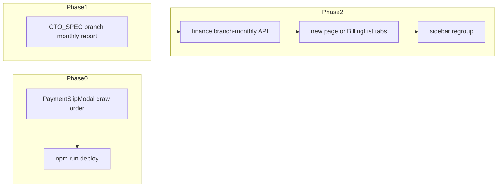

# 學收月報規劃、側欄整理、繳費單預覽空白修復

## 0. 繳費單／催繳圖「空白」根因與修復（工程優先、低風險）

**根因**（[`frontend/src/components/PaymentSlipModal.vue`](frontend/src/components/PaymentSlipModal.vue)）：

- 模板順序為：`v-if="loading"` → `v-else-if="error"` → `v-else-if="slip"`（canvas 僅在 **非 loading** 且 **有 slip** 時掛載）。
- `watch(() => props.show, …)` 流程：`slip.value = …` 之後立刻 `await nextTick()` 再 `drawSlip(canvasRef)`，但此時 **`loading` 仍為 `true`**（`finally` 尚未執行），畫面仍走「載入中」分支，**canvas 未掛載** → `canvasRef.value` 為 `null`，繪圖被略過。
- `finally` 將 `loading = false` 後 canvas 才出現，**已沒有第二次 drawSlip** → 預覽空白、`toDataURL` 亦為空白圖。

**修復方向**（擇一即可，建議 a）：

- **(a)** 成功取得資料後：先 `slip.value = …`，再 **`loading.value = false`**，然後 `await nextTick()`，再 `drawSlip`（必要時再 `await nextTick()` 一次保險）。
- **(b)** 調整模板：載入中仍保留隱藏 canvas 或將「有 slip 時優先顯示預覽」與 loading 解耦（改動面較大）。

**驗證**：[`TuitionCollectionPage.vue`](frontend/src/pages/TuitionCollectionPage.vue)（`studentClassId`）、[`BillingList.vue`](frontend/src/pages/BillingList.vue)（`invoiceId`）各開一次 modal，確認預覽與下載 PNG 有內容；修後執行 `cd frontend && npm run deploy`。

**補強（可選）**：`watch` 同時監聽 `invoiceId` / `studentClassId`，避免「modal 已開著僅換 id」時不重繪（目前多數流程會先關再開，影響較小）。

---

## 1. 給 CTO／產品／財務的規格文件（不先改業務邏輯）

新增一份獨立規格（建議路徑）：[`docs/CTO_SPEC_BRANCH_MONTHLY_TUITION_REPORT.md`](docs/CTO_SPEC_BRANCH_MONTHLY_TUITION_REPORT.md)（名稱可再微調），內容至少包含：

### 1.1 現況與邊界

| 現況 | 說明 |
|------|------|
| [`BillingList.vue`](frontend/src/pages/BillingList.vue) | 綁 **`Invoice`** 列表＋[`GET /api/v1/invoices`](backend/app/Http/Controllers/BillingController.php)；多數分校若未開帳單則列表空。 |
| [`FinanceController::revenue`](backend/app/Http/Controllers/FinanceController.php) | 僅全校／分校篩選後的 **加總堂數**（sold / remaining / used），**非**「學生×科目×月」明細。 |
| 催繳／出圖 | [`TuitionCollectionPage.vue`](frontend/src/pages/TuitionCollectionPage.vue) + [`alerts/tuition`](backend/app/Http/Controllers/AlertController.php) + [`tuition-slip`](backend/app/Http/Controllers/AlertController.php)；與帳單編號語意分離（見 [`docs/AI_REGRESSION_LESSONS.md`](docs/AI_REGRESSION_LESSONS.md) 2026-04-13 節）。 |

**不損壞正常功能原則**：

- **保留** `Invoice`／`BillingController`／既有匯出與記帳相關路由；新頁為 **增量**，或舊頁改為「分頁／子區塊」之一，**不刪除**後端記帳能力。
- 新報表若與「核准評量扣堂」等邏輯有交集，僅 **讀取** 既有表，**不**改 [`SessionDeductionService`](backend/app/Services/SessionDeductionService.php)／[`LearningRecordController`](backend/app/Http/Controllers/LearningRecordController.php) approve 路徑（高風險，見 [`AGENTS.md`](AGENTS.md)）。

### 1.2 產品定義（須 CTO／財務拍板）

- **列維度**：分校 → 學生 → 課程（`StudentClass`）或「學生＋科目彙總」；是否需老師、班型（`ClassType`）欄位。
- **月**：曆月（YYYY-MM）或帳務月（配合 `settlement_day`）；跨月堂次如何歸屬。
- **「每月課堂數」來源（必選一或組合並註明）**：
  - A：`ClassSession` 在該月且 `Status in (attended, …)` 的堂數；
  - B：`StudentSingIn` 實際刷卡／點名；
  - C：已 **核准** 之 `LearningRecord` 對應堂次（與科目數口徑較一致，但可能與實收現金時間不一致）。
- **「每堂課收的錢」**：`StudentClass.Rate`、或 `Charge / SessionCount`（契約均價）、或月結制另議；**月結制**是否改為「當月固定月費」而非按堂乘。
- **學收試算公式**（文件寫死）：例 `月學收_試算 = 月有效堂數 × 單價`（或月費），並註明 **試算 ≠ 已開發票／已入帳**。

### 1.3 技術選項（給 CTO 排程）

- **API**：新增例如 `GET /api/v1/finance/branch-monthly-tuition?branch_id=&year=&month=`（名稱示意），回傳列資料＋分頁；**校區**與 `auth_campus_ids` 與現有 [`FinanceController::getCampusIds`](backend/app/Http/Controllers/FinanceController.php) 一致。
- **效能**：大校區需 **分頁**、可選 **summary 列**（總堂數、總試算學收）；避免 N+1（batch 查 `ClassSession`／`LearningRecord`）。
- **測試**：Pest Feature 測「分校隔離」「空月」「堂數制 vs 月結制」邊界。

文件中明列 **開放決策** 與 **變更管制**：若口徑與 [`docs/DIRECTOR_PAYMENT_ALERT_RULES.md`](docs/DIRECTOR_PAYMENT_ALERT_RULES.md) 或繳費提醒邏輯混淆，須分欄說明「提醒用」vs「學收報表用」。

---

## 2. 側欄分類是否合理（規劃建議）

現況（主任）見 [`App.vue` `sidebarNavGroups`](frontend/src/App.vue)：`營運總覽` / `教務核心` / `考勤與評量` / `系統管理`。

**問題**：`催繳名單`、現有 `帳單列表`、未來「學收月報」混在 **教務核心**，與「課程／學生」並列，語意上較像 **財務／營收**。

**建議（兩階段）**：

1. **短期（少改動）**：在 `教務核心` 將 `帳單列表` 改名為過渡名稱（例如「開立帳單記錄」），與「催繳名單」並列，避免誤以為是學收報表。
2. **中期（與新頁上線同步）**：新增分組 **`財務與收款`**（key 例如 `finance`），內含：`催繳名單`、`學收月報`（新）、`開立帳單記錄`（原 Invoice 列表）；**`科目數統計`** 可留 `考勤與評量`（與評量核准連動）或移入財務—由產品決定，文件註明即可。

**手機底欄**：若新增 `active` key，需檢查 [`mobileTabPages`](frontend/src/App.vue) 等是否要把新頁納入「更多」—一併列在 CTO 規格「前端 IA 檢查清單」。

---

## 3. 實作里程碑（實作階段待規格定案後執行）

- **Phase 0**：修 modal（§0）+ deploy。
- **Phase 1**：寫 [`docs/CTO_SPEC_BRANCH_MONTHLY_TUITION_REPORT.md`](docs/CTO_SPEC_BRANCH_MONTHLY_TUITION_REPORT.md)；[`docs/CHANGELOG.md`](docs/CHANGELOG.md) 簡要記載修復與規格新增。
- **Phase 2**：依規格實作 API + 頁面 + 側欄；**保留** `Invoice` 列表為子功能或獨立入口。

---

## 4. 資安／合規（規格內一節即可）

- 報表含學生姓名、金額、堂數：**分校隔離**、主任權限；是否允許 **CSV 匯出**（內部）由資安與產品決定。
- 與催繳圖相同：**不在 log 中寫完整個資**，沿用現有 `[TuitionSlip]`／`[InvoiceSlip]` 粒度或再收斂。
