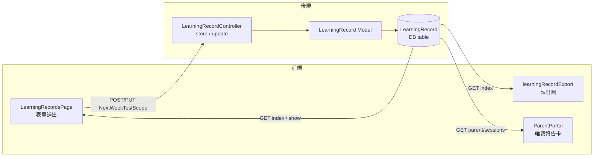

# 學習評量：新增「下次週考範圍」+ 修正「周→週」

## 影響範圍

- **DB 欄位**：`LearningRecord` 表新增 `NextWeekTestScope`（TEXT，nullable）
- **後端**：`LearningRecordController` store / update 驗證規則
- **Model**：`LearningRecord.$fillable`
- **前端 — 評量頁**：[`frontend/src/pages/LearningRecordsPage.vue`](frontend/src/pages/LearningRecordsPage.vue) — 表單新增欄位 + 標籤修正
- **前端 — 匯出**：[`frontend/src/lib/learningRecordExport.js`](frontend/src/lib/learningRecordExport.js) — 標籤修正 + 新欄位繪製
- **前端 — 家長入口**：[`frontend/src/pages/ParentPortal.vue`](frontend/src/pages/ParentPortal.vue) — 報告卡新增唯讀顯示

## 步驟

### 1. Migration — 新增欄位
建立新 migration，在 `LearningRecord` 表加入：
```
$table->text('NextWeekTestScope')->nullable()->after('NextHomework');
```

### 2. Model
[`backend/app/Models/LearningRecord.php`](backend/app/Models/LearningRecord.php) 的 `$fillable` 陣列新增 `'NextWeekTestScope'`。

### 3. Controller — 驗證規則
[`backend/app/Http/Controllers/LearningRecordController.php`](backend/app/Http/Controllers/LearningRecordController.php)

- `store()` validation：加入 `'NextWeekTestScope' => 'nullable|string'`
- `update()` validation：同上

### 4. 前端 — LearningRecordsPage.vue

**標籤修正**（1 處）：
- `周考成績` → `週考成績`（QuizScore 欄位 label）

**新增欄位**（緊接 `NextHomework` textarea 之後）：
```html
<label>下次週考範圍</label>
<textarea v-model="form.NextWeekTestScope" ... />
```

`form` 初始化物件新增 `NextWeekTestScope: ''`。

### 5. 前端 — learningRecordExport.js

**標籤修正**（1 處）：
- `drawLabelValue('周考成績', ...)` → `drawLabelValue('週考成績', ...)`

**新增繪製**（緊接下次作業範圍之後）：
```js
drawLabelValue('下次週考範圍', record.NextWeekTestScope || '—', ...)
```

### 6. 前端 — ParentPortal.vue

在報告卡唯讀顯示區塊（`NextHomework` 後）新增一列：
```html
<div v-if="record.NextWeekTestScope">
  <span>下次週考範圍</span>
  <span>{{ record.NextWeekTestScope }}</span>
</div>
```

### 7. Deploy
```bash
cd frontend && npm run deploy
```

## 資料流示意


