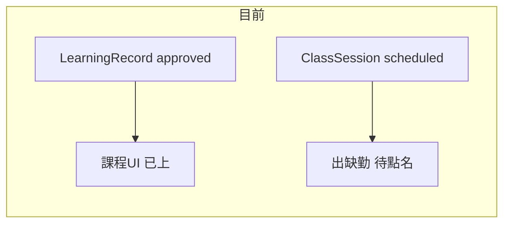

# 已上 = 已點名／已核課（前端對齊）

## 背景與根因

- 課程管理上課日期的「已上」目前由 [`frontend/src/composables/course-management/useCourseSessionsDisplay.js`](frontend/src/composables/course-management/useCourseSessionsDisplay.js) 判定：**`ClassSession.status` 為 attended/late/completed 等，或 `learning_record_status === approved` 任一即顯示「已上」**（約 265–266 行）。
- 出缺勤「今日待點名」只列出 **`status === 'scheduled'`** 的堂次（[`frontend/src/pages/AttendancePage.vue`](frontend/src/pages/AttendancePage.vue) 約 396–397 行）。
- 後端在 [`LearningRecordController::approve`](backend/app/Http/Controllers/LearningRecordController.php) 明確註解：**核准評量不改 `ClassSession`、不扣堂；扣堂只走出缺勤**（約 492–493 行）。因此會出現「畫面已上、實際仍待點名」的矛盾。

## 目標行為（CTO 規則）

- **「已上」只代表該堂次已從「待排／待點」進入已核課狀態**：與 `ClassSession` 的 attended-like 狀態一致（與現有後端 `ATTENDED_STATUSES` 概念對齊：含 absent/excused 等「已標記結案」狀態，不再出現在待點名清單）。
- **僅評量核准、堂次仍 `scheduled`**：不顯示「已上」；須至出缺勤點名（或課程內其他已存在的「標記已上／調狀態」流程）後才顯示已上。
- **你選擇**：不另加「評量已核」標籤（最簡）。

## 實作範圍（僅前端 composable）

集中修改 [`frontend/src/composables/course-management/useCourseSessionsDisplay.js`](frontend/src/composables/course-management/useCourseSessionsDisplay.js)：

1. **`getSessionState`**  
   - 刪除「僅因 `learning_record_status === approved` 就回傳 `{ label: '已上', className: 'completed' }`」的分支（約 266 行），避免與待點名不同步。

2. **與「已上」連動的統計／日期集合（需一併對齊，否則堂次序號／完成數仍會把核准評量當已上）**  
   - `getCompletedSessionCount`（約 218–221 行）：完成數改為只依 `ATTENDED_SESSION_STATUSES`（與 `getSessionState` 一致），**不要**再把 `learning_record_status === approved` 算進去。  
   - `getCourseCompletedDates`（約 233–237 行）：同上。  
   - `ensureCompletedSessionDatesLoaded`（約 36–39 行）：`completedSessionDatesByCourse` 的快取建立改為只收「堂次狀態已 attended-like」的日期，**不要**只用核准評量篩日期。

3. **回歸／手動驗證情境**（Agent 實作後執行）  
   - 評量已核准、`ClassSession` 仍 `scheduled`：課程日期**不**顯示已上；出缺勤仍出現在待點名。  
   - 點名送出後：`ClassSession` 變 attended/late 等，課程顯示已上、待點名消失。  
   - 透過課程管理將已上堂次改回 `scheduled`（既有沖回／作廢出缺勤流程）：應再回到待點名（與你描述的「改成未到／沒上再點名」一致；細節依現有 [`ClassSessionController`](backend/app/Http/Controllers/ClassSessionController.php) 沖回邏輯）。

4. **部署**  
   - 依專案規則：`cd frontend && npm run deploy`。

## 刻意不做的（避免範圍膨脹）

- **不改**後端 `LearningRecordController::approve` 的扣堂策略（現有 [`LearningRecordApprovalDeductionTest`](backend/tests/Feature/LearningRecordApprovalDeductionTest.php) 明確鎖定「核准不扣、點名才扣」）。  
- **不強制**以 `StudentSingIn` 是否存在作為「已上」條件：系統另支援由 [`ClassSessionController`](backend/app/Http/Controllers/ClassSessionController.php) 將 `scheduled → attended` 並扣堂但可能無 SignIn 的路徑；仍以 `ClassSession.status` 為準較安全。

## 文件（可選）

- 若希望營運／交接一致，可在 [`docs/CHANGELOG.md`](docs/CHANGELOG.md) 加一句「課程『已上』不再僅因評量核准顯示」；非必須。
