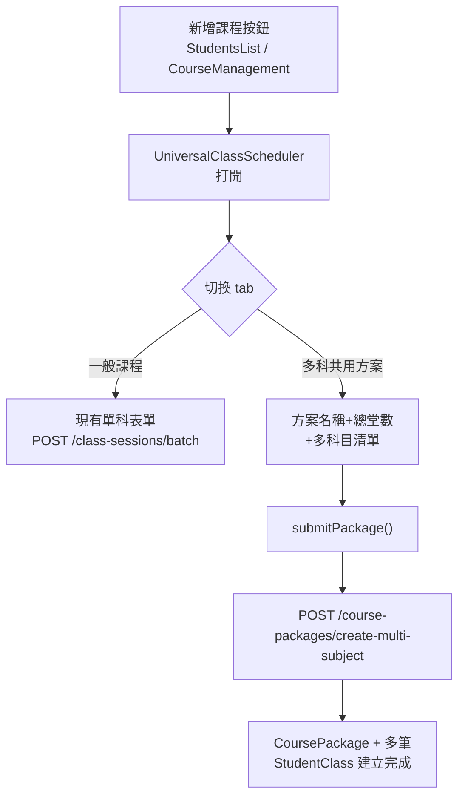

# 排課介面整合多科方案

## 現況說明

- `StudentsList.vue` 與 `CourseManagement.vue` 都透過 `<UniversalClassScheduler>` 建立課程
- 後端 `POST /api/v1/course-packages/create-multi-subject` 已完成，接受 `package_name`, `total_sessions`, `rate`, `subjects[]`
- `CoursePackagesPage.vue`（獨立頁）保留，用於**瀏覽/管理既有方案**；本次只整合**建立入口**

## 修改範圍

### 1. [`frontend/src/components/UniversalClassScheduler.vue`](frontend/src/components/UniversalClassScheduler.vue)

在 `scheduler-header` 下方加一列切換 tab：

```
[ 一般課程 ]  [ 多科共用方案 ]
```

- `packageMode` ref（boolean），預設 `false`
- 一般模式：現有表單完全不動
- **多科模式**（`v-if="packageMode"`）：
  - 欄位一：方案名稱（`packageForm.name`）
  - 欄位二：總堂數（`packageForm.total_sessions`）
  - 欄位三：每堂費率（`packageForm.rate`）
  - 科目清單（`packageForm.subjects`，最多 3 列）：
    - 每列：科目 + 老師 + 上課類型 + 星期/時段（可選）
    - 新增 / 刪除列按鈕
  - 送出走 `submitPackage()` → 呼叫 `coursePackagesApi.js` 裡既有的 `createMultiSubjectPackage()`

### 2. [`frontend/src/lib/coursePackagesApi.js`](frontend/src/lib/coursePackagesApi.js)

- 不需新增函式，現有 `createMultiSubjectPackage()` 直接使用
- 確認 payload 結構符合後端 `createMultiSubject` 的 validation（`subjects[].confirmed_dates` 可傳空陣列）

## 不需修改

- `StudentsList.vue`、`CourseManagement.vue`（切換 tab 對父層透明）
- `backend/`（API 已完成）
- `CoursePackagesPage.vue`（繼續作為方案總覽頁）

## 資料流


