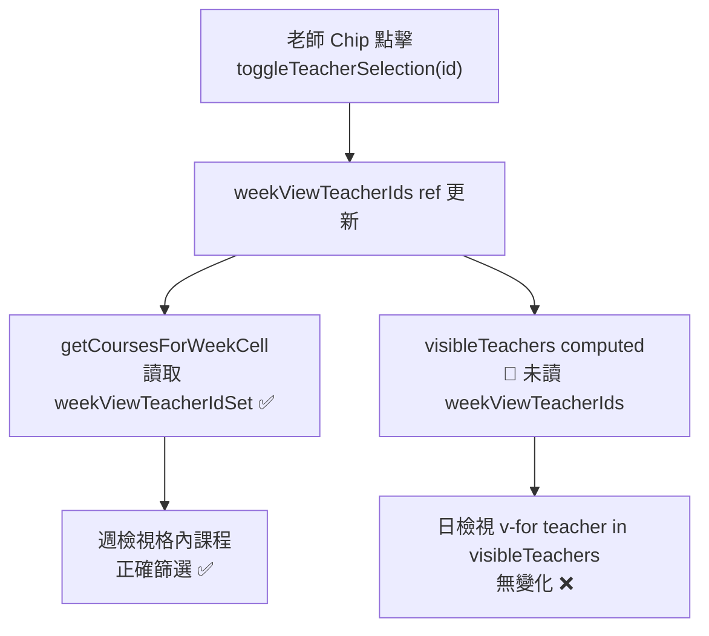

# 日檢視老師 Chip 篩選修復

## 問題根因

`weekViewTeacherIds`（chip 選取）只被 `getCoursesForWeekCell` 使用，週檢視可正常篩選。
日檢視的老師欄來自 `visibleTeachers`，但 `visibleTeachers` 完全不讀 `weekViewTeacherIds`，因此點 chip 沒有任何欄位變化。



## 修改方案

**不改動 `visibleTeachers`**（chip 清單與「全老師數量」判斷依賴它），改為新增一個 `dayViewTeacherColumns` computed，只在日檢視且有 chip 選取時縮小欄位清單。

### 步驟 1 — 新增 computed（[`frontend/src/pages/SmartCalendar.vue`](frontend/src/pages/SmartCalendar.vue)，`visibleTeachers` 定義之後）

```javascript
// 日檢視老師欄清單：在 chip 有選取時只顯示被選中的老師欄
const dayViewTeacherColumns = computed(() => {
  if (isWeekOverview.value) return visibleTeachers.value; // 週檢視不使用
  if (weekViewTeacherIds.value.length === 0) return visibleTeachers.value; // 未選取 = 顯示全部
  return visibleTeachers.value.filter(t =>
    weekViewTeacherIdSet.value.has(String(t.id))
  );
});
```

### 步驟 2 — 日檢視模板換用新 computed（[`frontend/src/pages/SmartCalendar.vue`](frontend/src/pages/SmartCalendar.vue)，約第 183 行）

將日檢視老師欄迴圈：
```html
<!-- 改前 -->
<div v-for="teacher in visibleTeachers" :key="teacher.id" class="teacher-col">

<!-- 改後 -->
<div v-for="teacher in dayViewTeacherColumns" :key="teacher.id" class="teacher-col">
```

### 注意事項

- Chip 清單顯示條件 `v-if="visibleTeachers.length > 1"` 保持不變，chip 列表仍以 `visibleTeachers` 渲染，不會因縮小欄位導致 chip 消失（無循環依賴）。
- `getCoursesForTeacherAt` 不需要修改，因為每欄已傳入正確的 `teacher.id`。
- `hideEmptyTeacherColumns`（只顯示今日有課老師）邏輯在 `visibleTeachers` 裡，`dayViewTeacherColumns` 在其之後再過濾，兩者疊加效果正確。

## 影響範圍

- 只改 `SmartCalendar.vue` 一個檔案
- 行為：日檢視 chip 選取 → 只顯示對應老師欄；全清除 → 恢復全部欄
- 週檢視行為完全不變
