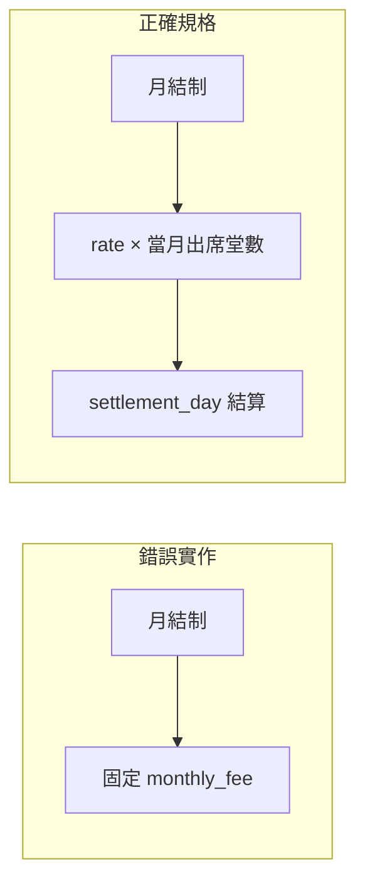

# 月結制修正：按堂計費月結

## 問題核心

目前實作以「固定月費（`monthly_fee`）」為收費依據，但業務規格為：
- **月費 = 當月實際出席堂數 × 每堂費率（`rate`）**（不分科目，共用同一費率）
- 無固定金額，每月依實際出席計算
- `settlement_day`：每月結算日（不變）

---

## 計費模型對比



---

## 修改範圍

### 1. 資料庫 Migration（新增一支）
- 建立 [`backend/database/migrations/2026_04_17_400000_drop_monthly_fee_from_course_packages.php`](backend/database/migrations/2026_04_17_400000_drop_monthly_fee_from_course_packages.php)
- `up()`：`dropColumn('monthly_fee')`（欄位已由前一支 migration 加入）
- `down()`：重新加回 `monthly_fee` nullable int

### 2. CoursePackage Model
- [`backend/app/Models/CoursePackage.php`](backend/app/Models/CoursePackage.php)
- 從 `$fillable` 移除 `'monthly_fee'`
- 從 `$casts` 移除 `'monthly_fee'`

### 3. CoursePackageController
- [`backend/app/Http/Controllers/CoursePackageController.php`](backend/app/Http/Controllers/CoursePackageController.php)

**createMultiSubject（建立）：**
- 移除 `monthly_fee` 驗證規則
- 月結模式改為必填 `rate`（每堂費率）+ `settlement_day`
- 建立 `CoursePackage` 時不寫 `monthly_fee`（欄位已移除）
- 成員 `StudentClass` 仍維持 `ScheduleMode='date'`、`Charge=0`、繼承 `settlement_day`

**update（修改）：**
- 移除 `monthly_fee` 更新邏輯

**index / show（回傳）：**
- 移除回傳中的 `monthly_fee` 欄位

### 4. FinanceController — branchMonthlyTuition
- [`backend/app/Http/Controllers/FinanceController.php`](backend/app/Http/Controllers/FinanceController.php)

月結多科方案行的金額計算改為：
```
amount = SUM(sessions attended in report month by package members) × package.rate
```
具體做法：
- 查詢各 monthly 方案的成員 `StudentClass` IDs
- 透過 `ClassSession` join 計算 `Status='attended'` 且在報表月份內的堂數
- 方案行金額 = `session_count × pkg->rate`
- 若當月無出席，金額為 0（但方案行仍顯示，讓主任知道此方案存在）

### 5. AlertController — tuition
- [`backend/app/Http/Controllers/AlertController.php`](backend/app/Http/Controllers/AlertController.php)

月結多科方案提醒的金額計算改為：
```
amount = sessions_attended_so_far_this_month × package.rate
```
- 顯示「本月已累積 N 堂，應收 X 元（尚未繳費）」
- 移除 `monthly_fee` 欄位回傳

### 6. 前端 UniversalClassScheduler.vue
- [`frontend/src/components/UniversalClassScheduler.vue`](frontend/src/components/UniversalClassScheduler.vue)

**移除**：
- `pkgForm.monthly_fee`、`pkgMonthlyFeeError` computed、月費 input 欄位

**月結制改為顯示**：
- `rate`（每堂費率，與堂數制同一欄位，label 改為「每堂費率（月結計費用）」）
- `settlement_day`（結算日，保留）

**摘要 / toast**：
- 改為「方案已建立，每月 X 日結算，按 Y 元/堂計費」

### 7. 前端 TuitionReportPage.vue
- [`frontend/src/pages/TuitionReportPage.vue`](frontend/src/pages/TuitionReportPage.vue)

- 方案行金額欄位改為顯示 `sessions_count × rate` 的計算結果（後端回傳）
- 移除對 `monthly_fee` 欄位的引用

### 8. CoursePackageMonthlyBillingTest.php
- [`backend/tests/Feature/CoursePackageMonthlyBillingTest.php`](backend/tests/Feature/CoursePackageMonthlyBillingTest.php)

- 移除所有 `monthly_fee` 斷言
- 更新報表測試：驗證金額 = `sessions × rate`（非固定月費）
- 更新提醒測試：驗證金額為按堂計算值

---

## 保持不變
- `billing_mode`、`settlement_day` 欄位（邏輯不變）
- `CoursePackage.rate`、`rate_unit` 欄位（月結模式沿用）
- 成員 `StudentClass.ScheduleMode='date'`、`Charge=0` 設定
- `pkg-fade-slide` 動畫、toast、chevron、skeleton loader 等 UI 改動（保留）
- 堂數制多科方案的所有邏輯（完全不動）
