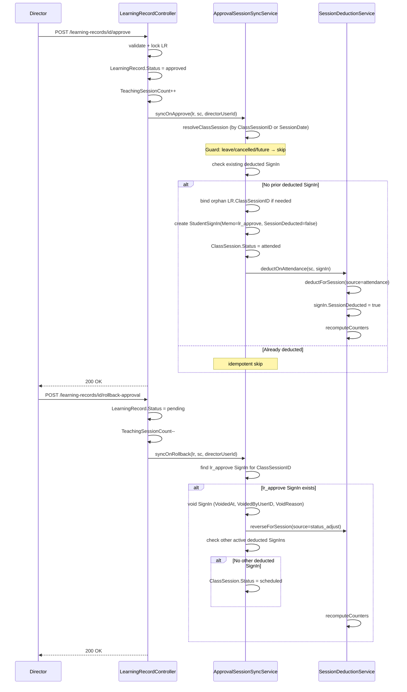

# 核准評量 = 點名核課（架構師重構版）

## 產品規則（最終）

| 事件 | ClassSession | StudentSignIn | 扣堂 |
|---|---|---|---|
| 點名 present/late | → attended/late | 建立（Memo 自訂） | 是 |
| 核准評量（LR approved） | → attended | 建立（Memo=`lr_approve`） | 是，與點名相同管線 |
| 兩者都有 | 以先到者狀態為準 | 各自一筆，均為 SessionDeducted=true | 只扣一次（ledger idempotent 守門） |
| rollback 核准 | 回到 scheduled（若無其他有效 SignIn） | void lr_approve 型 | 沖回（僅 lr_approve 型） |
| 點名 absent/excused | → absent/excused | 建立（SessionDeducted=false） | 否 |

月結制（`ScheduleMode != 'count'`）：不動 `RemainingSessions`（恆 0），但 `UsedSessions` 透過同一條 `recomputeCounters` 累加（`classSessionUsed` 分支已覆蓋）。

---

## 架構設計決策（ADR）

### 為何建立 StudentSignIn 而非只更新 ClassSession

`recomputeCounters` 計算 `usedByAttendance` 取的是三者 max：
1. `StudentSignIn.SessionDeducted=true` 筆數（`attendanceUsed`）
2. `ClassSession.Status ∈ {completed, attended, late}` 筆數（`classSessionUsed`）
3. ledger 淨值

如果核准只更新 `ClassSession` 不建立 SignIn，`rollbackApproval` 時要把 `ClassSession` 改回 `scheduled`，此時 `classSessionUsed` 自然降低；但若後來又有真實點名又沒 SignIn 記錄，家長端和出勤報表會有空白。**建立 SignIn 才是資料完整的路**。

### 為何 rollback 用 Memo='lr_approve' 識別而非獨立欄位

`StudentSignIn` 已有 `Memo` 字串欄位且 `$fillable` 中。不需要 migration，不需要加欄位。rollback 時只要 `where('Memo', 'lr_approve')->where('SessionDeducted', true)` 即可識別是核准驅動的 SignIn。

### 為何 SessionDeductionService 不需要改

核准路徑呼叫 `deductOnAttendance($sc, $signIn)` → source='attendance' 寫入 ledger → `recomputeCounters` 的 `attendanceUsed` 和 `classSessionUsed` 都會捕捉到新狀態。`batchObservedUsedSessions` 也靠 `classSessionUsed`，自然隨 ClassSession.Status 更新。不需要改計算邏輯。

### 為何 recomputeCounters 的 lrOrphan 分支仍保留

補登舊資料可能存在 approved LR 但無 ClassSessionID（歷史 orphan）。這些舊資料不會走過 syncOnApprove，所以仍需 lrOrphan 作為安全網。新核准的 LR 在 syncOnApprove 中會綁定 ClassSessionID，不會再落入 orphan 路徑。

---

## 資料流圖



---

## 實作規格

### 新建 [`backend/app/Services/ApprovalSessionSyncService.php`](backend/app/Services/ApprovalSessionSyncService.php)

**`syncOnApprove(LearningRecord $lr, StudentClass $sc, int $approvedByUserId): void`**

守衛順序（任一命中即 return，不拋例外）：
1. 解析 ClassSession：`$lr->ClassSessionID > 0` 則直接查；否則以 `SessionDate` + `StartTime` 查 `ClassSession::where('StudentClassID')->where('SessionDate')->whereNotIn('Status', ['leave', 'cancelled'])->orderBy('id','desc')->first()`
2. 找不到 ClassSession → return（無法定位堂次）
3. `ClassSession.Status ∈ {leave, leave_adjusted, cancelled}` → return
4. `ClassSession.SessionDate > today` → return（未來堂次不預扣）
5. 若 LR 原本無 ClassSessionID → 寫回 `$lr->ClassSessionID = $cs->id; $lr->save()`
6. 查 `StudentSignIn::where('ClassSessionID', $cs->id)->active()->where('SessionDeducted', true)->exists()` → 已扣則 return（idempotent）

主流程：
```php
$student = Student::find($sc->StudentID);
$signIn = StudentSignIn::create([
    'StudentClassID' => $sc->ID,
    'StudentID'      => $sc->StudentID,
    'TeacherID'      => $lr->TeacherID ?? $sc->TeacherID,
    'RecordedByUserID' => $approvedByUserId ?: null,
    'GradeID'        => $sc->GradeID,
    'SubjectID'      => $sc->SubjectID,
    'Get1byID'       => $sc->by1,
    'SignInDT'       => Carbon::parse($cs->SessionDate . ' ' . $cs->StartTime),
    'SignOutDT'      => Carbon::parse($cs->SessionDate . ' ' . $cs->EndTime),
    'MDT'            => now(),
    'ClassSessionID' => $cs->id,
    'Status'         => 'present',
    'CampusID'       => $student->CampusID ?? null,
    'PersonType'     => 'student',
    'SessionDeducted'=> false,
    'Memo'           => 'lr_approve',  // 識別標記
]);
$cs->Status = 'attended';
$cs->save();
SessionDeductionService::deductOnAttendance($sc, $signIn);
```

**`syncOnRollback(LearningRecord $lr, StudentClass $sc, int $rolledBackByUserId): void`**

守衛：`$lr->ClassSessionID <= 0` → return

主流程：
```php
$approvalSignIn = StudentSignIn::where('ClassSessionID', $lr->ClassSessionID)
    ->active()->where('Memo', 'lr_approve')->where('SessionDeducted', true)->first();

if (!$approvalSignIn) return; // 獨立點名驅動，不沖回

$approvalSignIn->update([
    'VoidedAt'       => now(),
    'VoidedByUserID' => $rolledBackByUserId ?: null,
    'VoidReason'     => '評量核准退回',
]);
SessionDeductionService::reverseForSession(
    $sc->ID, $lr->ClassSessionID, 'status_adjust', $rolledBackByUserId, '評量退回沖回'
);
// 若無其他有效扣堂的 SignIn，把 ClassSession 還原
$otherDeducted = StudentSignIn::where('ClassSessionID', $lr->ClassSessionID)
    ->active()->where('SessionDeducted', true)->exists();
if (!$otherDeducted) {
    ClassSession::where('id', $lr->ClassSessionID)
        ->whereIn('Status', ['attended', 'completed', 'late'])
        ->update(['Status' => 'scheduled']);
}
SessionDeductionService::recomputeCounters($sc->ID);
```

---

### 修改 [`backend/app/Http/Controllers/LearningRecordController.php`](backend/app/Http/Controllers/LearningRecordController.php)

**`approve`**（471 行區域）

在 `$learningRecord->save()` 之後、`User::increment` 之後，同一 `DB::transaction` 內加：
```php
$sc = StudentClass::find($learningRecord->StudentClassID);
if ($sc) {
    ApprovalSessionSyncService::syncOnApprove($learningRecord, $sc, (int)($data['DirectorID'] ?? 0));
}
```

移除舊註解：`// Business rule: approval only affects review status / subject units. Remaining sessions are driven by attendance (present/late) only.`

**`rollbackApproval`**（502 行區域）

在 `$learningRecord->save()` 之後（Status=pending 已存）、`User::decrement` 之後加：
```php
$sc = StudentClass::find($learningRecord->StudentClassID);
if ($sc) {
    ApprovalSessionSyncService::syncOnRollback($learningRecord, $sc, (int)($data['DirectorID'] ?? 0));
}
```

移除舊註解：`// Do not mutate session counters here. Attendance is the sole source.`

**`batchApprove`**（531 行區域）

在迴圈 `$learningRecord->save()` 後加（因已在外層 transaction 內，不再嵌套）：
```php
$sc = StudentClass::find($learningRecord->StudentClassID);
if ($sc) {
    ApprovalSessionSyncService::syncOnApprove($learningRecord, $sc, $directorId);
}
```

---

### `SessionDeductionService` 不需要改

`recomputeCounters` 的 `classSessionUsed` 觀察 ClassSession.Status，核准後更新為 `attended` 即自動計入；rollback 後重置為 `scheduled` 自動移除。`batchObservedUsedSessions` 同樣依賴 `classSessionUsed`，自動正確。

---

## 測試重寫規格（`LearningRecordApprovalDeductionTest.php`）

原有測試 `test_approving_learning_record_does_not_change_session_counters` 和 `test_attendance_after_approved_record_deducts_once_via_attendance_only` 斷言**與新行為相反**，必須全部重寫。

下表列出六個情境（堂數制課程除非特別標示）：

| # | 測試方法名稱 | 情境 | 期望 |
|---|---|---|---|
| 1 | `test_approving_lr_deducts_session_and_marks_class_session_attended` | ClassSession=scheduled，approve → | `RemainingSessions -1`，`ClassSession.Status=attended`，有 SignIn(Memo=lr_approve, SessionDeducted=1) |
| 2 | `test_approving_lr_on_monthly_course_increments_used_sessions` | 月結制課程（ScheduleMode=monthly），approve → | `UsedSessions +1`，`RemainingSessions` 仍 0 |
| 3 | `test_approving_lr_with_no_class_session_id_resolves_and_deducts` | LR 無 ClassSessionID 但 SessionDate 有對應 ClassSession → | approve 後 `LR.ClassSessionID` 被綁定，`RemainingSessions -1` |
| 4 | `test_approving_already_attended_session_does_not_double_deduct` | ClassSession=attended（已有獨立點名），approve → | `RemainingSessions` 不再減少（idempotent），不重複建 SignIn |
| 5 | `test_attendance_after_approval_returns_409` | approve 後，再送出 `POST /api/v1/attendance` → | 回傳 409（Attendance already recorded） |
| 6 | `test_rollback_approval_reverses_deduction_but_not_independent_attendance` | 情境 A：approve 後 rollback → `RemainingSessions` 恢復、ClassSession=scheduled；情境 B：獨立點名後 approve 後 rollback → 點名的扣堂仍在，ClassSession 仍 attended |

`createStudentClassForTest` helper 需補支援月結制（`ScheduleMode=monthly`，`RemainingSessions=0`）。

---

## 前端（不需要改）

- `useCourseSessionsDisplay.js`：已在前一次改動移除 `learning_record_status === approved` 顯示已上；核准後 ClassSession 更新為 `attended`，ATTENDED_SESSION_STATUSES 自然命中。
- `AttendancePage.vue`：待點名篩 `scheduled`，核准後 ClassSession 為 `attended`，自然排除。

---

## OPERATIONS_RUNBOOK 修改

`docs/OPERATIONS_RUNBOOK.md` §K.4（開發禁忌）需改寫：

移除：「禁止在 `approve/batchApprove/rollback` 內呼叫任何扣堂邏輯」

改為：「核准評量時**必須**呼叫 `ApprovalSessionSyncService::syncOnApprove`，此為唯一的核准驅動扣堂入口；禁止在任何地方直接呼叫 `SessionDeductionService::deductForSession` 而不透過 `deductOnAttendance` 或 `syncOnApprove`」

§K.5 回歸清單補充：
- 核准評量後：`RemainingSessions -1`（堂數制）、`UsedSessions +1`（月結制）、ClassSession=attended、出缺勤不再列出待點名
- rollback 後：堂數恢復、ClassSession=scheduled（若無其他點名）
- 若已有獨立點名再核准：堂數不重複扣、rollback 不影響獨立點名

---

## 風險清單

| 風險 | 緩解措施 |
|---|---|
| 雙重扣堂 | `deductForSession` ledger idempotent 守門（同 class_session_id 不重複寫入 deduct 事件） |
| rollback 沖掉獨立點名 | rollback 只 void `Memo='lr_approve'` 的 SignIn，獨立點名 Memo 不同，不受影響 |
| batchApprove 效能（大量記錄） | 目前典型批次 20-40 筆，單一 transaction 可接受；若未來需要 >100 筆，改用 chunk |
| 未來堂次被預扣 | `SessionDate > today` 守衛，approve 不觸發 sync（LR.Status 仍可設 approved 供審核流程） |
| 測試斷言大幅反轉 | 測試情境 1-6 全部重寫；`phpunit --filter LearningRecordApproval` 全綠為上線門檻 |
