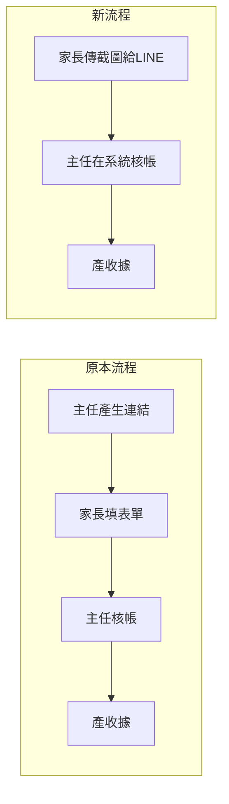

# 核帳流程簡化（移除家長自填端）

## 變更原則

保留已建好的資料庫結構（`payment_reports` 表、`receipt_url`/`reconciled_at` 欄位）和 `ReceiptModal.vue`，只移除「家長填表」相關的 UI 與路由，改為讓主任直接在催繳名單點「核帳」。

## 流程對比



## 需要改動的地方

### 前端

**1. [`frontend/src/pages/TuitionCollectionPage.vue`](frontend/src/pages/TuitionCollectionPage.vue)**
- 移除「回報連結」按鈕（`generateReportLink` 函式、`link-btn`）
- 移除「待核帳」Tab（family-submitted pending reports 概念不再需要）
- 在每筆**未繳費**列新增「核帳登記」按鈕，點選後開啟 `PaymentEntryModal`
- 核帳完成後可立即點「收據」開啟 `ReceiptModal`
- 標題/副標題簡化：「催繳名單」（移除「家長繳費回報」字樣）

**2. 新增 [`frontend/src/components/PaymentEntryModal.vue`](frontend/src/components/PaymentEntryModal.vue)**（新建）
- 主任填寫用的核帳登記 Modal
- 欄位（全部由行政/主任填）：
  - 繳費日期（預填今天）
  - 繳費方式：匯款 / 現金
  - 帳號後5碼（匯款時可填，選填）
  - 繳費金額（預填應繳金額 `r.charge`）
  - 備註
- 送出呼叫 `POST /api/v1/payment-reports/director-record`
- 成功後：更新列表狀態，並可立即開啟 `ReceiptModal`

**3. [`frontend/src/App.vue`](frontend/src/App.vue)**
- 移除 `isPayReportPage` computed 與 `<PayReportPage v-if="isPayReportPage" />` 的渲染
- 移除 `import PayReportPage` 引入

### 後端

**4. [`backend/app/Http/Controllers/PaymentReportController.php`](backend/app/Http/Controllers/PaymentReportController.php)**
- 新增 `directorRecord` 方法：主任直接建立一筆 `status=confirmed` 的 payment_report，同時執行確認入帳的全部邏輯（建 Payment、更新 Invoice、更新 StudentClass.Paid）
- 核心邏輯與現有 `confirm()` 相同，只是跳過「等家長送出」這一步

**5. [`backend/routes/api.php`](backend/routes/api.php)**
- 在 `director` middleware 群組新增：`POST payment-reports/director-record`
- 移除已不需要的公開路由：`GET/POST pay-report`（或保留但不連接前端）

### 可以保留不動的

- `PaymentReportTokenService.php` — 不用刪，也不會被呼叫
- `PayReportPage.vue` — 可留著但不掛 App.vue 路由
- `ReceiptModal.vue` — 完整保留
- `payment_reports` 表 + Migration — 繼續用，現在是由主任寫入
- `ParentPortal.vue` 「已核帳」徽章 — 保留，核帳完成後家長還是能看到狀態

## API 新增端點

```
POST /api/v1/payment-reports/director-record
Body: { student_class_id, payment_date, payment_method, amount, account_last5?, note? }
Auth: director middleware
回傳: { report_id, payment_id, invoice_id }
```

內部流程與現有 `confirm()` 相同，省去 pending 狀態直接寫入 confirmed。

