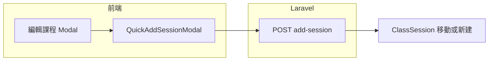

# 編輯課程內「單次加課」（佔用現有堂數）

## 現況與可行做法

- **業務目標**：固定每週四 3 堂（4/16、4/23、4/30）時，臨時在 4/13 多排一堂，且**不**加購、**不**另建新課程；上課日變成 4/13、4/16、4/23。
- **後端已支援**：[`StudentClassController::addSession`](backend/app/Http/Controllers/StudentClassController.php)（路由 `POST /api/v1/student-classes/{studentClass}/add-session`）。堂數制且「未來排課筆數已等於購買堂數」時，會選**日期最晚**、且未被核准評量／出缺勤鎖住的一筆 `scheduled` 未來堂次，**整筆改到新日期與時間**（回傳 `moved_from_date`）；總堂數不變。與您描述一致。
- **前端缺口**：[`CourseManagement.vue`](frontend/src/pages/CourseManagement.vue) 已整合 [`QuickAddSessionModal.vue`](frontend/src/components/course-management/QuickAddSessionModal.vue) + 上述 API；[`StudentsList.vue`](frontend/src/pages/StudentsList.vue) 的「編輯課程」僅有 [`CourseEditForm.vue`](frontend/src/components/CourseEditForm.vue)，**沒有**加課入口，因此分校從「學生→編輯課程」進來時無法操作。

## 建議實作方向（最小範圍）

1. **在 `StudentsList.vue` 的編輯課程 Modal 內**（`CourseEditForm` 下方、`取消`/`儲存`旁或之間）：
   - 僅在 **堂數制**（`courseForm.payment_type === 'session'`）且 **正在編輯既有課程**（`editingCourseId` 有值）時顯示按鈕，例如：「單次加課（不增加總堂數）」。
   - 點擊後開啟與課程管理相同的 [`QuickAddSessionModal`](frontend/src/components/course-management/QuickAddSessionModal.vue)，`course` 使用目前 `courseForm` + `id: editingCourseId`（若 `courseForm` 無 `id`，組一個 `{ ...courseForm, id: editingCourseId }` 供 modal 顯示姓名／科目）。
2. **送出邏輯**：複用 [`CourseManagement.vue` 的 `submitQuickAddSession`](frontend/src/pages/CourseManagement.vue)（約 1059–1113 行）之 `fetch` body／錯誤處理；成功後 `loadAllStudentCourses` + `loadStudentCourses`，並關閉 quick-add modal（可選：不關閉編輯課程 modal，讓使用者繼續改設定）。
3. **（可選）避免重複**：若希望單一維護點，可抽一個極小的 composable（例如 `useQuickAddSessionApi`）給 `CourseManagement` 與 `StudentsList` 共用；若改動面要更小，先在 `StudentsList` 內複製一段並在註解標註與 `CourseManagement` 對齊即可。
4. **使用者說明**（建議寫在 [`QuickAddSessionModal.vue`](frontend/src/components/course-management/QuickAddSessionModal.vue) 的 `modal-desc` 下方短句，兩頁共用）：
   - 說明：若未來堂次已排滿，系統會將**最後一筆可調整的未來排課**改到您選的日期（與後端行為一致），避免誤以為「多排一堂卻變每週一都上課」。

## 刻意不做的範圍（除非之後有需求）

- **不**在 `CourseEditForm` 內改「固定排課日」邏輯去勾週一（那會變成每週一都排）。
- **不**改 `PUT student-classes` 的 `buildSessionsForCount`（目前僅支援首堂日 + 固定星期；單日例外與 `add-session` 路徑重疊且牽涉已上課歷史時 [`maybeRebuildSessionsAfterUpdate`](backend/app/Http/Controllers/StudentClassController.php) 常會 `history_exists` 不重排）。
- **不**實作「選擇要挪掉哪一堂」：現行 API 固定挪**日期最晚**的可移動堂次；若未來要可選，需新參數與後端調整。

## 測試與驗收建議

- 手動：堂數制 3 堂、三筆未來週四 `ClassSession`，加課 4/13 → 應為三筆日期 4/13、4/16、4/23，且 `SessionCount` 不變；alert 含 `moved_from_date` 語意（與課程管理現有提示一致）。
- 邊界：若三堂皆已有核准評量或出缺勤鎖定，預期仍回 **409**「堂次已排滿…」——確認 UI 顯示後端訊息。
- （可選）新增 Pest Feature：mock 課程 + 三筆 future sessions，呼叫 `add-session`，assert 日期集合與 `moved_from_date`。

## 上線注意

- 凡修改 `frontend/src/**`，任務完成後依專案規則執行 `cd frontend && npm run deploy`。
