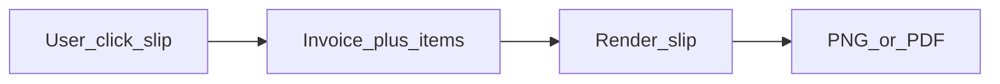

# 未繳費繳費單圖片輸出 — 跨單位規格草案

## 1. 背景與目標

**業務目標**：櫃檯／主任在處理「未繳費」時，能一鍵產出**可傳 LINE／列印／給家長對帳**的繳費單**圖片**，內容需清楚包含**應繳金額**與**與費用對應的上課／計費時間資訊**，視覺需專業、易讀（非截圖雜亂表格）。

**範圍原則（與您對齊）**：以**新增能力**為主，**不為了此功能大改**既有帳務流程、繳費提醒規則（[`docs/DIRECTOR_PAYMENT_ALERT_RULES.md`](docs/DIRECTOR_PAYMENT_ALERT_RULES.md)）、或堂數／評量等高風險模組；預設掛在**帳單／未繳費列表**的單筆操作上。

---

## 2. 現況與資料可支援度（技術事實）

| 層級 | 現況摘要 |
|------|----------|
| 後端 | [`BillingController::index`](backend/app/Http/Controllers/BillingController.php) 已可查詢 `Status=unpaid` 等，並 `with(['items', 'items.studentClass'])` 分頁回傳；[`Invoice`](backend/app/Models/Invoice.php)／[`InvoiceItem`](backend/app/Models/InvoiceItem.php) 有 `TotalAmount`、`PaidAmount`、`Status`、`Note`，明細有 `Description`、`Amount`、`PeriodStart`／`PeriodEnd`、`StudentClassID`。 |
| 路由 | [`backend/routes/api.php`](backend/routes/api.php)：`GET/POST /api/v1/invoices`、`POST invoices/{invoice}/payments`、`GET invoices/export`。 |
| 前端 | [`frontend/src/pages/BillingList.vue`](frontend/src/pages/BillingList.vue) 有狀態篩選含「未繳費」，但 [`frontend/src/api.js`](frontend/src/api.js) 內 `getInvoices` 仍為 **stub（回傳空陣列）**——若要做真實功能，**需先確認帳單 API 是否已改由其他 client 呼叫**；否則此規格實作時應納入「串接真實 `GET /api/v1/invoices`」為前置或同一專案包。 |

**「上課日期」在資料上的意涵**（需產品／教務定義，見下節）：目前明細層最穩的是 **`PeriodStart`～`PeriodEnd`（計費區間）**；若業務要的是**逐堂上課日**，需另從 [`ClassSession`](backend/app/Models/ClassSession.php)（依 `StudentClassID`＋日期區間）彙總，**不在現有 Invoice JSON 裡直接備妥**，屬擴充欄位或專用 read API。

---

## 3. 產品需先拍板的定義（給教務／營運＋ UI/UX）

1. **觸發場景**  
   - 僅限「已有帳單」的 `unpaid`／`partial`？還是包含「尚未開立帳單、僅有繳費提醒」的學生？（後者資料來源會變成 [`AlertController::tuition`](backend/app/Http/Controllers/AlertController.php) 一類，**與本規格分階段**較能維持「不亂動其他東西」。）

2. **「上課日期」顯示規則**（擇一或分階段）  
   - **A（MVP）**：每筆明細顯示 **計費期間**（`PeriodStart`–`PeriodEnd`）＋科目／說明（`Description`）。  
   - **B**：在 A 之外加 **該期間內已排／已上之 `ClassSession` 日期清單**（需後端彙總或前端多次查詢，注意效能與權限）。  
   - **C**：僅顯示 **未來 N 堂**或 **下一個繳費週期**（行銷向簡潔單張）。

3. **partial（部分繳費）**  
   - 圖片上應顯示「應繳總額／已繳／**尚欠**」三列，避免家長誤解。

4. **分校與抬頭**  
   - 圖片需帶 **校區名稱**、聯絡方式／匯款資訊是否固定範本（[`Campus`](backend/app/Models/Campus.php)）。

5. **個資與合規**  
   - 是否完整顯示學生姓名、帳單編號；是否需浮水印或「僅供繳費確認用」字樣。

---

## 4. UI/UX 建議（給設計單位）

- **版型**：直式手機友善（約 1080×1920 或 9:16），同時在桌面可預覽；頂部品牌區＋校區＋標題「繳費通知單」；主體為金額區（尚欠大字）＋明細表；底部聯絡／截止日／備註。  
- **資訊層級**：第一視線 **尚欠金額** → **截止日**（`DueDate`）→ **期間／上課日** → 明細列。  
- **狀態**：載入預覽、一鍵「下載 PNG」、可選「複製到剪貼簿」（行動裝置能力需技術評估）。  
- **無障礙與可讀**：字級、對比、千分位金額、避免純靠顏色表達狀態。  
- **互動位置**：建議 **帳單列表每列**「產生繳費單圖」；點擊後 **modal 預覽** 再下載，避免誤觸。

---

## 5. 技術方案選型（給技術執行長）

| 方案 | 優點 | 缺點／風險 |
|------|------|------------|
| **前端**：隱藏 DOM（Vue）＋ `html2canvas`／`dom-to-image` | UI 迭代快、不增後端負載；與設計稿一致 | 長圖、字型、iOS Safari 相容需測；列印解析度需規格化 |
| **後端 PDF**（dompdf／Snappy） | 列印一致、易存證 | 版面 CSS 子集限制；「圖片」需再轉檔或改交付 PDF |
| **後端截圖**（headless） | 像素級一致 | 維運與資源成本高，對 Pi 部署需評估 |

**建議路線**：**Phase 1 以前端產 PNG 為主**（與「要好看、快速上線」一致）；若日後要「官方存檔／對帳編號」，再評估後端 PDF。

**API 最小增量（若走後端組資料）**：可選 `GET /api/v1/invoices/{id}/slip-data` 僅回傳組圖用 DTO（學生顯示名、校區、明細、尚欠、期間內 sessions 摘要），**不改**既有 `index` 回傳形狀，降低迴歸風險。

---

## 6. 實作邊界與「不亂動其他東西」清單

- **不修改**：`AlertController::tuition` 條件、核准評量扣堂、排課核心、`EnrollmentService` 等（除非產品明確要從提醒清單出單）。  
- **允許**：`BillingList` 新增按鈕與 modal、（必要時）`api.js` 或實際使用的 client **補上真實** `getInvoices`／單筆查詢、小型專用 read API。  
- **測試**：Feature test 驗證 `unpaid`／`partial` DTO 金額與權限（`require_campus`、director-only）。

---

## 7. 建議交付順序

1. 產品確認 **觸發範圍** 與 **「上課日期」定義**（上節 3）。  
2. UI 出 **一頁式繳費單** 線框＋手機預覽規格。  
3. 工程：**串接真實 invoices API**（若仍為 stub）→ slip 資料組裝 → 預覽＋下載 PNG。  
4. 若需 **逐堂日期**：Phase 2 加 `ClassSession` 彙總 API 或欄位。

---

## 8. 文件化建議

定案後可另立短文件（例如 `docs/PAYMENT_SLIP_SPEC.md`）：欄位對照表、範例 JSON、錯誤情境（無明細、無 DueDate、跨多 `StudentClassID`）。**本回覆不修改任何程式碼**，僅供內部對齊用。
