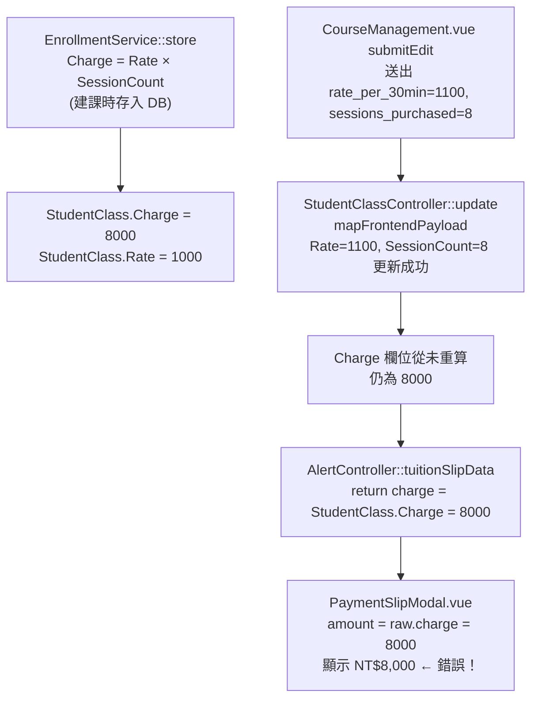

# 繳費催繳通知金額未隨費率更新修正

## 問題根因分析

### 資料流



### 關鍵程式碼

- **建課時**：[`backend/app/Services/EnrollmentService.php`](backend/app/Services/EnrollmentService.php) 計算 `Charge = round(Rate × SessionCount)` 並寫入 `StudentClass`
- **更新時**：[`backend/app/Http/Controllers/StudentClassController.php`](backend/app/Http/Controllers/StudentClassController.php) `update()` 約第 949 行 — `$studentClass->update($mapped)` 只更新 `Rate`，**未重算 `Charge`**
- **催繳單**：[`backend/app/Http/Controllers/AlertController.php`](backend/app/Http/Controllers/AlertController.php) `tuitionSlipData()` 直接回傳 `StudentClass.Charge`（約第 224 行）
- **前端顯示**：[`frontend/src/components/PaymentSlipModal.vue`](frontend/src/components/PaymentSlipModal.vue) `amount: raw.charge || 0`

---

## 修正方案

### 1. 後端：`StudentClassController::update()` 補上 Charge 重算

位置：[`backend/app/Http/Controllers/StudentClassController.php`](backend/app/Http/Controllers/StudentClassController.php) 第 950-960 行（`$studentClass->refresh()` 之後，`cancelExcess` 區塊之前或之後）

加入以下邏輯：

```php
// 若 Rate 或 SessionCount 有更新，重新計算 Charge
if (isset($mapped['Rate']) || isset($mapped['SessionCount'])) {
    $rateUnit = $studentClass->rate_unit ?? 'session';
    if ($rateUnit === 'hour') {
        $newCharge = (int) round((float)$studentClass->Rate * (int)$studentClass->TotalHours);
    } else {
        // session 模式（堂數制）：Charge = Rate × SessionCount
        $newCharge = (int) round((float)$studentClass->Rate * (int)$studentClass->SessionCount);
    }
    // 僅在金額大於 0 時更新，避免誤清月結制課程
    if ($newCharge > 0) {
        $studentClass->update(['Charge' => $newCharge]);
        $studentClass->refresh();
    }
}
```

- `rate_unit = 'session'`（堂數制）：`Charge = Rate × SessionCount`
- `rate_unit = 'hour'`（時數制）：`Charge = Rate × TotalHours`（`TotalHours` 已由 `extendSessionsIfNeeded` 維護）
- `ScheduleMode = 'date'`（月結制）：`SessionCount` 為 0，`newCharge` 為 0，條件 `> 0` 保護不更新

### 2. 防再犯文件：新增回歸教訓

在 [`docs/AI_REGRESSION_LESSONS.md`](docs/AI_REGRESSION_LESSONS.md) 新增一節，說明：
- `Charge` 是「建課時快照」的總費用，不是即時計算欄位
- `update()` 必須在 Rate/SessionCount 異動後同步 `Charge`
- 高風險操作：修改 `StudentClassController::update()` / `mapFrontendPayload()` / `EnrollmentService` 費用計算區塊，均須確認 `Charge` 同步

---

## 影響範圍評估

| 元件 | 影響 |
|------|------|
| `StudentClassController::update()` | 新增 Charge 重算，不破壞其他欄位 |
| `AlertController::tuitionSlipData` | 不變，直接受益 |
| `BillingController::slipData`（Invoice 路徑） | 不受影響，有獨立的 Invoice 金額 |
| `EnrollmentService`（建課路徑） | 不變 |
| 前端 `PaymentSlipModal.vue` | 不變，顯示邏輯正確 |

---

## QA 驗收情境

1. 建課：1000/堂 × 8 堂 → Charge 應為 8000
2. 編輯費率：改成 1100/堂 → Charge 應自動更新為 8800
3. 開啟催繳通知單 → 應顯示 NT$8,800
4. 僅改 SessionCount（不改 Rate）：同步更新 Charge
5. 月結制課程（`ScheduleMode=date`）：Rate 更新後 Charge 不應被清零
6. 時數制課程（`rate_unit=hour`）：Rate 更新後 Charge = Rate × TotalHours
