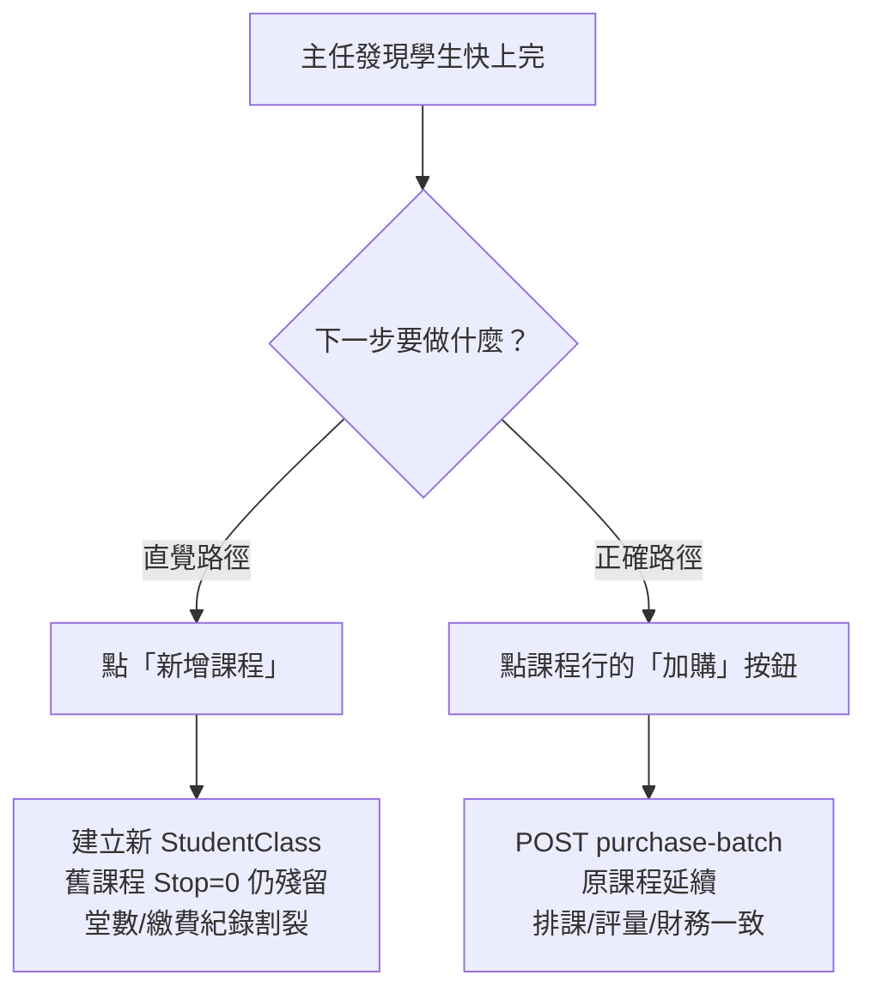

# 續報操作路徑優化 — PM 計畫

## 問題診斷

### 根本原因

**三個層次的問題：**

1. **視覺權重失衡**：「新增課程」是 `primary` 藍色大按鈕置頂；「加購」是行內小灰按鈕，視覺權重相差懸殊（見 `StudentsList.vue` L187–195 vs L294）
2. **無情境引導**：剩餘堂數 ≤2 標紅，但沒有明確的 CTA 告訴主任「點這裡續報」
3. **無後端防呆**：`class-sessions/batch`（建新課）接收時未檢查同學生同科目是否已有進行中的 `StudentClass`，允許重複建立

### 現況資料佐證

- `StudentsList.vue` L294：加購按鈕為 `class="small ghost"` — 最低優先級樣式
- `StudentsList.vue` L193：新增課程為 `class="primary small"` — 最高優先級樣式
- `StudentClassController::purchaseBatch` 會正確延續舊課程；`class-sessions/batch` 新建則產生第二筆 `StudentClass`，舊的無 `Stop=1` 保護

---

## 優化方向

### UX 優化（前端）

**P0 — 剩餘堂數警示 + 加購 CTA（`StudentsList.vue`）**

- 當 `remaining_sessions ≤ 2`，在課程卡片行頭顯示橘色「即將用完」badge
- 同行「加購」按鈕升級為 `class="small warning"` （橘色）並改標籤為「續報加購」
- 加購 modal 標題加入剩餘堂數說明：「目前剩 N 堂，建議加購 __ 堂」

**P1 — 新增課程防呆攔截（`StudentsList.vue`、`CourseManagement.vue`）**

- 點擊「新增課程」後，先呼叫 `GET /api/v1/students/{id}/active-courses`，若回傳同科目的 active `StudentClass`：
  - 跳出攔截 modal：「**(學生) 的 (科目) 課程尚有 N 堂未用完，通常應加購堂數而非新增課程。**」
  - 提供兩個選項：「去加購堂數」（直接開啟加購 modal）／「我知道，仍要新增」（繼續建立）
- `CourseManagement.vue` 的「為此學生新增課程」入口同樣加防呆

**P2 — 課程面板資訊強化**

- 課程列增加「課程狀態」欄，清楚顯示：`進行中 / 剩 N 堂` / `即將到期` / `已暫停` / `已結案`
- 加購 modal 加入「這筆加購會延續原課程，不會建新課程」的說明文字

---

### CTO 技術任務（後端）

**T1 — `GET /api/v1/students/{id}/active-courses`（新 API）**

- 回傳該學生所有 `Stop=0` 的 `StudentClass`（含 `subject`、`remaining_sessions`、`id`）
- 供前端防呆攔截使用
- 路由掛在 `director + teacher` 共用區段

**T2 — `class-sessions/batch` 加重複警示**

- 批次建立前，若同 `StudentID + SubjectID` 有 `Stop=0` 的 `StudentClass`，回傳 `409` 並帶 `existing_course_id`
- 前端收到 `409` 時顯示防呆攔截 modal（P1），不直接建立
- 保留 `force: true` 參數允許主任確認後強制建立（供確實需要新開科目時使用）

**T3 — 資料清理輔助工具（非緊急）**

- 提供 `GET /api/v1/finance/duplicate-courses?branch_id=` — 列出同學生同科目有多筆 `Stop=0` 的情況
- 供主任逐一結案舊課程
- 掛在 `director` 限定路由，前端可在 `TuitionCollectionPage` 或 `StudentsList` 加入稽核入口

---

## 優先順序

| 優先 | 任務 | 負責 | 預估複雜度 |
|------|------|------|-----------|
| P0 | 剩餘堂數 ≤2 時加購按鈕升級樣式 + badge | UX + 前端 | 低 |
| P0 | 新增課程防呆攔截 modal | UX + 前端 | 中 |
| P1 | `GET active-courses` 新 API | CTO | 低 |
| P1 | `class-sessions/batch` 409 防呆 | CTO | 低 |
| P2 | 課程面板狀態欄強化 | UX + 前端 | 低 |
| P3 | 重複課程稽核 API | CTO | 中 |

---

## 關鍵檔案

- [`frontend/src/pages/StudentsList.vue`](frontend/src/pages/StudentsList.vue) — L187（新增課程按鈕）、L294（加購按鈕）、`openAddSessionsForCourse`
- [`frontend/src/pages/CourseManagement.vue`](frontend/src/pages/CourseManagement.vue) — 操作選單 `action-dropdown`
- [`backend/app/Http/Controllers/StudentClassController.php`](backend/app/Http/Controllers/StudentClassController.php) — `purchaseBatch`
- [`backend/routes/api.php`](backend/routes/api.php) — 路由掛載位置

---

## 成功指標

- 主任「新增課程」後被攔截並選擇「去加購」的比例 > 60%（可從 API log 觀察 409 + force 比例）
- 每月新增「同學生同科目雙 active 課程」數量歸零
- 主任反映操作流程更清楚（定性訪談）
