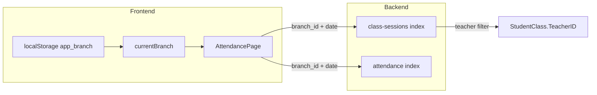

# 老師手機出缺勤空白 — 診斷與修復計畫

## 現象與資料流

- 畫面統計與「今日待點名」來自 [`frontend/src/pages/AttendancePage.vue`](frontend/src/pages/AttendancePage.vue)：以瀏覽器本機日期組 `date` / `start`+`end`，並帶 `branch_id`（即 `props.branchId`）呼叫 `GET /api/v1/attendance` 與 `GET /api/v1/class-sessions`。
- 後端 [`ClassSessionController::index`](backend/app/Http/Controllers/ClassSessionController.php) 對 `role === 'teacher'` 會加上 `sc.TeacherID = auth_teacher_id`，且 `auth_teacher_id` 在 [`AttachAuthUser`](backend/app/Http/Middleware/AttachAuthUser.php) 內等於 **`User.id`**（與 [`StudentClass`](backend/app/Models/StudentClass.php) 的 `teacher()` 關聯一致）。

## 根因（最可能）

1. **分校 context 錯誤且老師無法改**  
   - [`App.vue`](frontend/src/App.vue) 中，手機頂部分校列 `mobile-branch-bar` 僅在 `isDirector` 時顯示（約 196–209 行）；**老師在手機上沒有分校 UI**。  
   - `currentBranch` 在 `onMounted` 時由 [`loadBranches()`](frontend/src/lib/useBranches.js) + `resolveSavedBranchChoice(localStorage, branches)` 決定；`fetchProfile` 後的 [`ensureDirectorBranches()`](frontend/src/App.vue) **對老師為 no-op**（約 772–776 行）。  
   - 因此若 `app_branch` 曾為其他裝置／舊預設 id（[`useBranches.js`](frontend/src/lib/useBranches.js) 內有 legacy id→校名對照），老師實際在 **大安** 上課卻查 **另一分校**，`class-sessions` 回傳空陣列 → 「今日課表 0」、待點名為空、`/attendance` 紀錄也空。

2. **API 非 200 時前端靜默**  
   - `fetchPendingSessions` / `fetchRecords` 在 `!res.ok` 時多半只清空或 return，**未顯示 403/401 訊息**（例如分校不在 `auth_campus_ids` 內時後端回 `Forbidden: branch not accessible`），使用者會以為「沒課」而非「載入失敗」。

## 次要需排除（實作前可快速查 DB／Network）

- **`StudentClass.TeacherID` 與登入 `User.id` 不一致**（舊資料或誤填）：老師篩選會永遠為空；需用該老師帳號對照一筆今日 `ClassSession` 關聯的 `StudentClass`。
- **`UserCampus` 未核准**（`Approved=false` 被 middleware 排除）：通常仍可依請求的 `branch_id` 查該分校，但若同時搭配錯誤分校仍會空；若遇 403 則屬權限與 UI 提示問題。

## 建議修復（最小且符合現有架構）

| 項目 | 作法 |
|------|------|
| A. 老師預設分校 | 在 `fetchProfile` 成功且 `me.role === 'teacher'` 時，用 `me.campuses`（已存在於 [`AuthController::me`](backend/app/Http/Controllers/AuthController.php)）**限制並重選 `currentBranch`**：例如 `resolveSavedBranchChoice(saved, branches)` 的結果若不在 `campuses` 內，改選 `campuses[0]` 或「與 saved 交集的第一個」；寫回 `localStorage.app_branch`。 |
| B. 手機分校選擇 | 將 `mobile-branch-bar` 放寬為 **`isDirector \|\| (isTeacher && userProfile.branch_ids.length > 1)`**（或 `>0` 若希望單分校也能看見目前校名），選項僅列出 **`me.campuses` 與 `branches` 的交集**，避免列出無權限分校。 |
| C. 錯誤提示 | 在 `AttendancePage.vue` 的 `fetchRecords` / `fetchPendingSessions` 於 `!res.ok` 時設定簡短錯誤 state（顯示 status + `message`），避免靜默空白。 |

## 驗證方式

- 用測試老師帳號：故意將 `localStorage.app_branch` 設成非任教分校 → 登入後應自動切到 `me.campuses` 內一分校，出缺勤出現今日堂次。  
- 多分校老師：手機頂部可切換，待點名列表隨分校變更。  
- Network：`GET /api/v1/class-sessions?...` 為 200 且 `data` 非空；若改錯分校應看見明確錯誤而非「沒有待點名」。

## 涉及檔案

- [`frontend/src/App.vue`](frontend/src/App.vue) — 老師 `currentBranch` 初始化／`mobile-branch-bar` 條件與選項來源。  
- （可選）[`frontend/src/lib/useBranches.js`](frontend/src/lib/useBranches.js) — 若抽出「依允許 campus id 列表解析預設分校」小函式供重複使用。  
- [`frontend/src/pages/AttendancePage.vue`](frontend/src/pages/AttendancePage.vue) — API 錯誤提示。

**前端變更後**依專案規則執行 `cd frontend && npm run deploy`。
