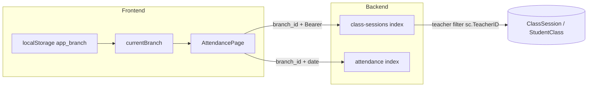

# 老師手機出缺勤空白 — 診斷與修復計畫

## 原因歸納（依程式碼）

### 1. 分校 context 與老師實際校區脫節（最可能）

- [`AttendancePage.vue`](frontend/src/pages/AttendancePage.vue) 的 `fetchPendingSessions` / `fetchRecords` 一律帶 `branch_id: props.branchId` 打 [`GET /api/v1/class-sessions`](backend/app/Http/Controllers/ClassSessionController.php) 與 [`GET /api/v1/attendance`](backend/app/Http/Controllers/AttendanceController.php)。
- `props.branchId` 來自 [`App.vue`](frontend/src/App.vue) 的 `currentBranch`：啟動時用 [`loadBranches()`](frontend/src/lib/useBranches.js) + `localStorage.app_branch` 的 [`resolveSavedBranchChoice`](frontend/src/lib/useBranches.js) 決定預設分校。
- **主任**登入後會再跑 `ensureDirectorBranches()`，用 `/api/v1/campuses` 把分校列表與可視校區對齊；**老師**不會跑這段，且側欄／手機頂部的分校切換 **僅 `isDirector` 顯示**（[`App.vue`](frontend/src/App.vue) 約 L87–L98、L196–L208）。
- 結果：老師手機若曾存過錯的 `app_branch`、或預設解析到「第一間分校」而非任課校區，API 會正確回傳 **該分校下此老師 0 堂**，UI 就如截圖全 0、待點名為空。

### 2. API 失敗時前端不提示（加重「以為壞掉」）

- `fetchPendingSessions` 在 `class-sessions` `!res.ok` 時直接清空列表（[`AttendancePage.vue`](frontend/src/pages/AttendancePage.vue) 約 L367–L368、L357–L359），**不顯示** 403「分校無權限」或 401 等訊息；使用者只會看到空白。

### 3. 較少見但需排除的資料面

- [`ClassSessionController::index`](backend/app/Http/Controllers/ClassSessionController.php) 對 `teacher` 會 `where('sc.TeacherID', $auth_teacher_id)`，而 [`AttachAuthUser`](backend/app/Http/Middleware/AttachAuthUser.php) 將 `auth_teacher_id` 設為 **`User.id`**（與 [`StudentClass`](backend/app/Models/StudentClass.php) 的 `teacher()` 關聯一致）。若極舊資料 `StudentClass.TeacherID` 存成別種 id，會永遠查不到堂次（需用 DB 抽查該老師課程列）。

## 建議修復方向（實作優先序）

1. **老師登入後對齊分校**（[`App.vue`](frontend/src/App.vue) `fetchProfile` 成功後）  
   - 若 `me.role === 'teacher'` 且 `me.campuses`（前端已存為 `userProfile.branch_ids`）非空：  
     - 將 `currentBranch` 設為：`resolveSavedBranchChoice(savedBranch, branchesFilteredToTeacherCampuses)`，若 saved 不在允許清單內則改用 **`teacher_config.branch_id`**（後端 [`teacherConfigForResponse`](backend/app/Http/Controllers/AuthController.php) 已給首個校區）或 `campuses[0]`。  
   - 必要時 `localStorage.setItem('app_branch', …)` 與主任邏輯一致，避免下次仍錯。

2. **手機版給老師分校選擇**（[`App.vue`](frontend/src/App.vue)）  
   - 條件改為：`(isDirector || (isTeacher && teacherCampusCount > 1))` 時顯示 `mobile-branch-bar`（選項僅限 `me.campuses` 與 `branches` 交集），讓多校支援老師可切換。單校老師可選擇仍顯示一個固定分校或省略（產品可二選一，建議至少單校也顯示目前校名避免誤會）。

3. **出缺勤頁面顯示錯誤狀態**（[`AttendancePage.vue`](frontend/src/pages/AttendancePage.vue)）  
   - `class-sessions` / `attendance` 非 2xx 時：顯示簡短錯誤（含 `message`）、勿靜默清空；可保留「重新整理」重試。

4. **驗證與回歸**  
   - 手動：老師帳號、`UserCampus` 僅大安、`app_branch` 故意設成木柵 → 修復後應自動跳到大安且出缺勤有堂次。  
   - 手動：老師僅能進某分校、`branch_id` 故意設無權限 → 應看到錯誤而非空白。  
   - 可選：Pest Feature 測老師 `GET class-sessions` 帶錯分校 403（若專案已有類似 auth 測試可仿照）。

## 不需改後端商業規則時

以上以前端 + `me` 既有欄位為主即可閉環；除非希望「老師可不帶 branch_id 由後端依當日課表推斷校區」，再另開較大 API 行為變更（非本次必要）。
