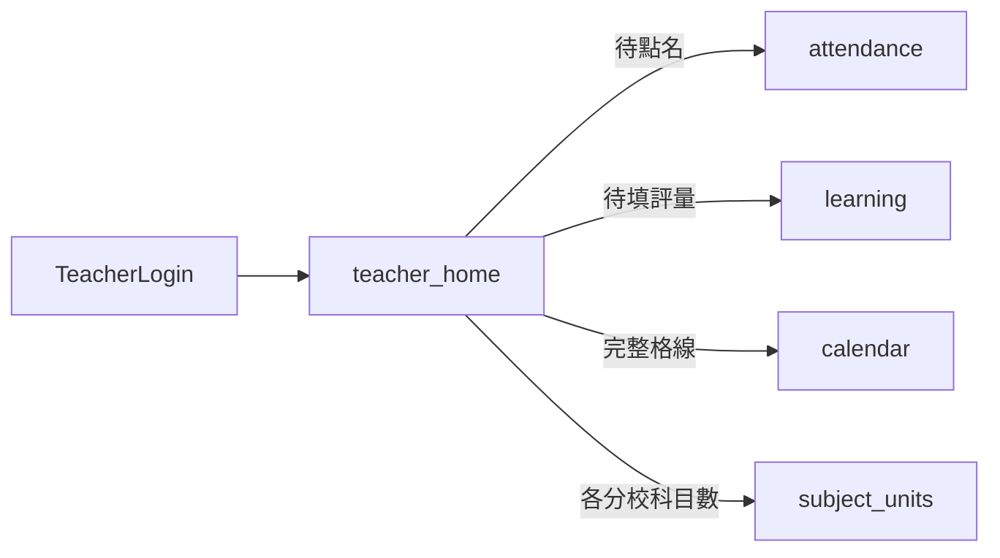

# 老師登入體驗：教學工作台（PM 規格 + 實作方向）

## 文件對象與閱讀指引

| 角色 | 建議閱讀順序 | 目的 |
|------|--------------|------|
| **CTO / 工程** | 執行摘要 → **CTO：技術架構與交付** → 風險與注意 → 建議實作順序 | 工期、依賴、API 是否需擴充、並行請求與錯誤隔離、分階段上線 |
| **UI / UX** | 執行摘要 → **UI/UX：視覺與互動規格** → 手機優先與 RWD → 產品定位（四區表格） | 資訊階層、元件與狀態、與既有產品質感一致、可交付的線框／規格 |

## 執行摘要

- **問題**：老師登入後預設在評量相關流程，與「出缺勤點名」分頁，易遺漏點名；多校老師需一次掌握**當週跨分校**課表。
- **方案**：新增老師預設首頁 **`teacher-home`（教學工作台）**，集中「今日待辦（點名／評量）」與「本週跨分校合併課表」，並保留科目數、行事曆等捷徑；**手機優先 RWD**，評量填寫路徑須一併檢驗。
- **技術要點**：前端無 Vue Router，頁面以 [`App.vue`](frontend/src/App.vue) `active` 切換；跨週課表大概率為 **多 `branch_id` 並行請求 + 前端合併**（可選第二階段後端聚合 API）；須處理點評量時 **分校語境**（切 `currentBranch` 或等同機制）。

## 現況與問題根因

- 登入後預設頁：[`App.vue`](frontend/src/App.vue) 在 `me.role === 'teacher'` 時將 `active` 設為 `'learning'`（約 L1014–1016、L1038），老師第一眼落在「課表與評量」。
- 側欄順序（老師）：行事曆 → 出缺勤 → 課表與評量 → 科目數…（`sidebarNavGroups` 約 L794–808）。**點名與「預設心智首頁」分離**，且老師端 **未掛** `badgeTypes: ['attendance', …]`（同檔 L802 僅出缺勤無 badge；`refreshUnreadNotifications` 對非主任會清空 `badgeByType`，約 L1188–1191），**缺少「還沒點名」的導覽訊號**。
- [`LearningRecordsPage.vue`](frontend/src/pages/LearningRecordsPage.vue) 已具老師用「今日 / 本週」課表與從課表填評量（約 L76–113），**本週課表資訊其實已在評量頁**，但與「今日待點名」不同頁，老師易只留在評量流。

## 產品定位：一個首頁完成「今天要做的兩件事 + 本週脈絡」

建議新增頂層頁 key：**`teacher-home`（建議中文名：教學工作台 或 今日教學）**，作為老師 **登入後預設頁**，結構建議四區（由上而下；**設計順序以手機直向為第一屏**，桌機為加寬而非另一套流程）：

| 區塊 | 老師目標 | 內容要點 |
|------|----------|----------|
| A. 今日待辦 | 不忘點名、不忘填評量 | **兩條主 CTA**：「今日待點名（N）→ 一鍵到出缺勤」；「今日評量待填／待修改（M）→ 一鍵到評量並可帶篩選」；N/M 為 0 時顯示完成態文案。 |
| B. 本週課表 | 一次看懂「這週自己在所有分校要上什麼」 | **跨分校合併週檢視**（必備）：資料來源為老師所屬之 **全部** 分校（[`App.vue`](frontend/src/App.vue) `teacherBranches`／`session.user.campuses` 與公開 `branches` 交集），**不依 `currentBranch` 切斷**；每筆堂次必顯 **分校名稱**（或色塊／標籤），避免混淆。同一週內依「日期 → 開始時間 → 分校」排序。點堂次→「填評量」時若需帶 `branch_id`，應自動切到該堂所屬分校再開表單（或明確提示切分校）。可選「開完整行事曆」→ `calendar`（該頁若仍單分校，僅作補充）。 |
| C. 科目數 | 必要時查各分校 | **捷徑列**：「科目數統計」按鈕 → `subject-units`；若老師多校，簡短說明「頁內可切分校」[`SubjectUnitsPage.vue`](frontend/src/pages/SubjectUnitsPage.vue) 的 `branchOptions`（約 L228–239）已依 `session.user.campuses` 過濾。 |
| D. 次要入口 | 聊天、Bug 等 | 維持現有側欄／底欄即可，避免首頁過載。 |

## 與現有頁面的分工（避免重複造輪子）

- **出缺勤** [`AttendancePage.vue`](frontend/src/pages/AttendancePage.vue)：仍為點名主作業區；首頁只負責 **摘要 + 導向**（可沿用該頁已存在的 `fetchPendingSessions` 請求模式，必要時抽出 **composable** 例如 `useTeacherPendingAttendance(branchId, userId)` 供首頁與出勤頁共用）。
- **評量** [`LearningRecordsPage.vue`](frontend/src/pages/LearningRecordsPage.vue)：仍為表單與課表點擊主流程；首頁可 **嵌入精簡版「今日堂次」** 或僅顯示計數 + 按鈕並 `setActivePage('learning')`，視實作成本取捨。**若該頁老師「本週」widget 仍僅查 `currentBranch`，須與本計畫對齊**：改為跨校合併，或保留單校但在 UI 標示「僅目前分校」以免與工作台不一致。
- **智慧排課** [`SmartCalendar.vue`](frontend/src/pages/SmartCalendar.vue)：保留給需要拖曳／全校格線的情境；首頁週檢視以「讀取為主」即可。

## 手機優先與 RWD（必備，與工作台同級）

多數老師以手機操作，本需求 **非僅「能縮小」**，而是 **單手、直向、易點**。

**教學工作台（`teacher-home`）**

- **版面**：預設單欄卡片流；區塊間距與字級以 375px 寬為基準驗收；寬螢幕至多改為「待辦雙欄 + 週課表全寬」等漸進增強。
- **觸控**：主要 CTA（去點名、去填評量）使用 **全寬或接近全寬**、高度足夠的按鈕；避免一列擠多個小圖示。
- **本週課表（跨校）**：禁止依賴「橫向捲動大表格」作為唯一讀法；改為 **每日摺疊清單**、**直向時間軸卡片**，或「橫滑一週」僅作輔助且需有週標籤與今日高亮；**每一條堂次附分校標籤**，字級與對比在窄螢幕仍可辨識。
- **與底欄關係**：[`App.vue`](frontend/src/App.vue) 既有 `mobile-bottom-nav` 會佔用底部；工作台底部 CTA 需預留 **safe-area / padding**，避免按鈕被底欄遮擋。

**填寫評量（老師路徑）— [`LearningRecordsPage.vue`](frontend/src/pages/LearningRecordsPage.vue)**

- **範圍**：含老師用分頁／課表 widget、「從課表填寫」開啟的表單或 modal、長表單欄位與附件區。
- **原則**：表單欄位 **單欄堆疊**；輸入框 `font-size` 避免 iOS 自動 zoom 怪異行為（常見 ≥16px）；modal **內部可捲動**、關閉鈕固定易達；送出／暫存固定於視窗底部或 sticky footer（需避開手機鍵盤彈起時誤觸，可驗收實機）。
- **驗收**：至少以 Chrome DevTools 裝置模擬 + 一隻實機（iOS 或 Android）走「課表點堂次 → 填完 → 送出」全流程無橫向裁切、無無法捲到底。

## 導覽與預設行為（實作時必改）

1. **預設 `active`**：老師且非強制改密碼時，改為 `'teacher-home'`（取代 `'learning'`），修改點與 [`App.vue`](frontend/src/App.vue) 內 `handleLoginSuccess` / `fetchProfile` 後分支一致。
2. **側欄第一項**：新增「教學工作台」並置頂；其餘順序可調整為：**工作台 → 出缺勤 → 課表與評量 → 班級行事曆**（讓「先完成當日流程」優於「看全校格線」）。
3. **手機底欄** [`mobileTabItems`](frontend/src/App.vue)（約 L619–626）：將首頁納入五格之一（需取捨一格進「更多」，例如將 `subject-units` 移入更多，或將 `calendar` 移入更多）；建議 **保留「出勤」在底欄**，工作台與出勤二擇一顯眼位。

## 紅點與提醒（建議第二階段，成本低可先做）

- 老師側欄的「出缺勤」「課表與評量」可補上與主任類似的 `badgeTypes`，但需 **不依賴** 主任專用的 `notifications/unread-count`：可改為首頁載入時呼叫既有 attendance / learning-records API 計數後，以 **props 或 provide / 小 store** 更新側欄 badge，或新增輕量 `GET /api/v1/teacher/summary`（後端）單次回傳待點名數、待填評量數（需另開 API 與測試）。

## 文件與導覽（可選）

- 若專案使用 [`frontend/src/lib/pageGuideConfig.js`](frontend/src/lib/pageGuideConfig.js)，為 `teacher-home` 補短導覽（3 步內）。

## 風險與注意

- **分校與資料範圍（已釐清）**：**本週課表（區塊 B）＝老師全部所屬分校合併**。**區塊 A「今日待辦」**可採較彈性 MVP：建議 **待點名／待填評量仍可依 `currentBranch` 顯示**（與現有出缺勤、評量 API 一致），但加一句「他校今日有課」的輕提示＋一鍵切分校；若產品希望 A 也全校合併，則需 **跨校加總 N/M** 且點名 CTA 要能分流到正確分校（實作較重，列為進階）。
- **實作策略**：若現有 schedules／learning-records 等 API 皆需 `branch_id`，本週合併為 **對每個允許的 `branch_id` 平行請求**，前端 merge；注意錯誤隔離（單校失敗不應整塊空白）。後續可評估 **單一後端** `GET .../teacher/weekly-sessions?week_start=...` 減少往返。
- **效能**：首頁避免重複載入巨大列表；優先呼叫與 [`AttendancePage.vue`](frontend/src/pages/AttendancePage.vue) 相同的 pending 端點 + 評量列表的精簡參數（若現有 API 支援日期篩選則用，否則前端篩「今日」）。
- **不改** [`docs/DIRECTOR_PAYMENT_ALERT_RULES.md`](docs/DIRECTOR_PAYMENT_ALERT_RULES.md) 與主任提醒邏輯；本需求僅老師 UI/導覽。

## CTO：技術架構與交付

**技術棧與限制（對齊現有 repo）**

- 前端：Vue 3 `<script setup>`、無 Vue Router、全域 `active` 於 [`App.vue`](frontend/src/App.vue)；樣式以 [`frontend/src/styles.css`](frontend/src/styles.css) 與各頁 scoped 為主。
- 認證：Bearer token／`localStorage.alltrue_session`；老師分校範圍來自 `userProfile.branch_ids`、`session.user.campuses`（與 [`SubjectUnitsPage.vue`](frontend/src/pages/SubjectUnitsPage.vue) 過濾邏輯對齊）。
- 後端：Laravel 8 [`backend/routes/api.php`](backend/routes/api.php)；本計畫 **第一階段可不新增路由**，若並行請求造成效能或複雜度問題，再評估 `GET /api/v1/.../teacher/weekly-sessions` 類單一端點（需 Pest Feature test、**不改**主任繳費提醒等高風險模組）。

**核心實作點**

| 項目 | 說明 |
|------|------|
| 新頁面 | `TeacherHomePage.vue`（名稱可依團隊慣例），由 `App.vue` 以 `isTeacher && active === 'teacher-home'` 掛載；props：`branch-id`（仍傳 `currentBranch` 供今日待辦與捷徑）、`user-id`、`user-role`。 |
| 導覽 | 修改 `handleLoginSuccess`／`fetchProfile` 後老師預設 `active`；`sidebarNavGroups`、`mobileTabItems` 增列並重排。 |
| 跨校週課表 | 對老師允許的每個 `branch_id` **`Promise.all` 並行**（建議上限為該 user 分校數，通常 ≤4）；合併後 sort；**單校失敗**僅該校區塊或 skeleton 錯誤提示，不整頁白屏。 |
| 分校切換與深連結 | 從跨校週點「填評量」：寫入 `currentBranch`（與 `localStorage.app_branch`）再 `setActivePage('learning')`，必要時沿用既有 `learningTargetRecordId` 類機制（見 `App.vue` `onNavigateFromNotifications`）。 |
| 效能 | 首屏可 stagger 或合併請求；避免與 `SmartCalendar` 同時 mount 重資料；考慮 `AbortController` 在週切換時取消 in-flight。 |
| 上線 | 凡改動 `frontend/src/**`，依專案規則執行 `cd frontend && npm run deploy`，避免 `index.html` 與 chunk 不同步（見 `docs/AI_REGRESSION_LESSONS.md`）。 |

**建議分階段（利於 CTO 排期）**

1. **MVP**：`teacher-home` + 導覽預設 + 跨校週課表（前端合併）+ 今日待辦 CTA（可依 `currentBranch`）+ RWD 基線。
2. **UX 深化**：[`LearningRecordsPage.vue`](frontend/src/pages/LearningRecordsPage.vue) 老師填表 modal／表單手機優化。
3. **可選**：老師側欄 badge；後端 `teacher/summary` 或週課表聚合 API。

## UI/UX：視覺與互動規格

**設計原則（美感 + 一致）**

- **延續既有語言**：按鈕層級（`primary` / `ghost`）、卡片 `card`、頁首 `page-header`／`page-desc` 與 [`AttendancePage.vue`](frontend/src/pages/AttendancePage.vue)、[`LearningRecordsPage.vue`](frontend/src/pages/LearningRecordsPage.vue) 保持一致，避免老師覺得「進了另一套產品」。
- **資訊階層**：第一屏必見 **今日待辦兩大 CTA**；本週課表次之；科目數／行事曆為 **次要連結**（文字按鈕或次級按鈕即可）。
- **分校辨識**：跨校課表每一條需 **分校標籤**（pill／色點 + 簡稱）；色票需與深色／淺色主題皆可讀（[`App.vue`](frontend/src/App.vue) 主題切換）。
- **狀態設計**：載入（skeleton 或區塊內 spinner）、空狀態（今日無課／本週無課）、部分分校失敗、全部完成（今日點名與評量皆 0 待辦的正向文案）。
- **動效**：以克制為主；`prefers-reduced-motion` 時關閉非必要過渡。
- **無障礙**：主按鈕具可讀 `aria-label`；摺疊週曆 `summary` 可被鍵盤操作；對比度符合 WCAG AA 為目標。

**互動細節（供線稿標註）**

- 區塊 A：兩枚主 CTA 垂直排列（手機）；右滑／誤觸機率低；數字 N、M 與文案對齊（例如「待點名 3 堂」）。
- 區塊 B：建議 **「一週七天摺疊」**，預設展開「今天」；每條列：時間範圍（等寬或 tabular 數字）、學生、科目、分校標籤、次級「填評量」。
- 與 **mobile bottom nav** 的關係：主內容區 `padding-bottom` 須大於底欄高度 + safe-area。

**UI/UX 交付物建議（給設計師工作包）**

1. 手機直向 **線框** 1 張（375）、桌機 **1 張**（1280）即可 MVP。
2. **元件清單**：TodayActionsCard、WeeklyScheduleMergedList、BranchChip、SecondaryLinkRow（與現有 class 對照表）。
3. **複合狀態圖**：載入／空／錯誤／完成（四格）。

## 驗收標準（DoD，CTO + UX 共簽）

- 老師（非強制改密）登入後 **預設進入** `teacher-home`。
- **本週課表**含老師 **全部所屬分校** 堂次，排序正確，每條有 **分校標籤**；點「填評量」不會在錯分校送出。
- **手機 375**：無橫向捲動主流程、主 CTA 可單手點、不被底欄遮擋；評量填寫路徑可 **實機** 完成一筆送出。
- 單一分校 API 失敗時，其餘分校資料仍顯示，並有 **可理解錯誤提示**。
- `npm run deploy` 後無 SPA MIME／hash 不同步問題。

## 名詞說明：估人日區間、Figma／版型命名

- **估人日區間**：以「**一個人全職做滿一天**」為單位，粗估完成某範圍需要幾天；寫成 **區間**（例如 3–5 人日）代表需求細節、重構幅度、實機測試量尚未定案時的**不確定性**。用於 CTO 排期、與設計／前端分工，**不是合約承諾**，實際應依 sprint 再拆。
- **Figma 檔名／版型命名規範**：約定 **檔案（File）**、**分頁（Page）**、**畫框（Frame）** 怎麼命名，讓設計、PM、工程用**同一套關鍵字**找到「手機版／桌機版／載入態」對應畫面，並可對照程式裡的 `teacher-home`、`LearningRecordsPage` 等。

## 估人日區間（參考，待 CTO 依團隊速度調整）

以下假設工程已熟悉本 repo（Vue 3、`App.vue` 切頁、既有 attendance／learning API）；**不含**大型視覺重品牌、不含完整 E2E 自動化。

| 階段 | 範圍（摘要） | 前端工程（人日） | 設計（人日） | 後端（人日） |
|------|----------------|------------------|--------------|--------------|
| MVP | `TeacherHomePage`、導覽預設與側欄／底欄、跨校週課表前端合併、今日待辦 CTA、錯誤隔離與基本 RWD | **3–6** | **1–2**（線框 + 元件表 + 四態） | **0**（沿用現有 API） |
| 深化 | [`LearningRecordsPage.vue`](frontend/src/pages/LearningRecordsPage.vue) 老師填表 modal／表單手機優化、實機微調 | **2–5** | **0.5–1**（若需補高擬真） | **0** |
| 可選 | 老師側欄 badge 聚合；或 `GET .../teacher/weekly-sessions`（或 summary）+ Pest | **0.5–1.5** | — | **1–3** |

**合計粗區間（常見排法）**：前端約 **5.5–12.5 人日**、設計約 **1.5–3 人日**、後端 **0–3 人日**；並行時日曆天會短於人日加總。若 MVP 範圍再縮（例如週課表先不做跨校、只做首頁 CTA），可下修約 **1–2 人日**。

## Figma 檔名／版型命名規範（建議採用，可內部微調）

**檔案（File）**

- 格式：`{產品}_{模組}_{角色或頁面}_{YYYY-MM}`  
- 範例：`AllTrue_TeacherHome_2026-04`（或中文團隊用 `全真_教學工作台_2026-04`）。

**分頁（Page）**

- 用兩位數序號 + 英文小寫，方便排序：  
  - `00-Cover`（封面：目標、連結、最後更新日）  
  - `01-Flow`（可選：使用者動線箭頭）  
  - `02-TeacherHome-mobile`  
  - `03-TeacherHome-desktop`  
  - `04-Components`（BranchChip、CTA 列等）  
  - `05-States`（Loading / Empty / Error / Success）

**畫框（Frame）命名**

- 格式：`{頁面} / {viewport} / {狀態}`，viewport 用寬度數字。  
- 範例：`TeacherHome / 375 / default`、`TeacherHome / 375 / loading`、`TeacherHome / 375 / branch-partial-error`、`TeacherHome / 1280 / default`。
- **與程式對齊**：Frame 描述可括號加 `active=teacher-home`，方便工程搜尋。

**元件（Component）**

- 使用 **前綴** 避免與全域衝突：`ATH_`（AllTrue Teacher Home）+ 名稱，例如 `ATH_BranchChip`、`ATH_TodayActions`。若設計系統已有前綴則從既有規則。

## 建議實作順序

1. 新增 `TeacherHomePage.vue`（或同名）+ 在 [`App.vue`](frontend/src/App.vue) 註冊 `v-if="isTeacher && active === 'teacher-home'"`。
2. 調整老師 `sidebarNavGroups`、`mobileTabItems`、登入預設 `active`。
3. 首頁接上 pending 點名數與今日評量計數（先前端既有 API，必要再抽 composable）。
4. （可選）側欄 badge 或後端 summary API。
5. RWD：`teacher-home` 手機版面與 [`LearningRecordsPage.vue`](frontend/src/pages/LearningRecordsPage.vue) 老師填表路徑盤點修正（見上節驗收）。
