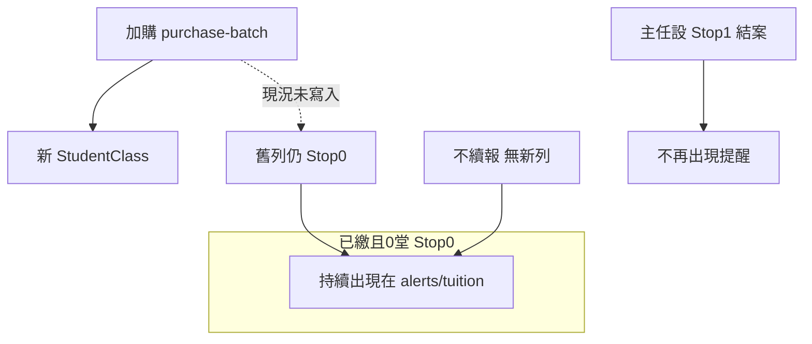

# 舊約 0 堂已繳：加購新批次 vs 不續報 — 主任提醒如何收斂

## 產品決策（已定案 — 2026-04-11）

1. **加購（`purchase-batch`）**：成功建立新 `StudentClass` 後，若來源為 **堂數制**、**`Paid=1`**、**`RemainingSessions=0`**，則**自動**將來源 **`Stop=1`**（歷史批次），避免與新約雙筆洗版 `alerts/tuition`。（`EndDate` 是否寫入：實作時建議設為**加購當日**或與現有暫停邏輯對齊，於 PR 註明。）
2. **不續報**：須有專用 **結案 UI**（非僅依賴主任自己找暫停）。實質仍 **`Stop=1`**；後端可優先複用既有 **`POST /api/v1/student-classes/{id}/pause`**（[`StudentClassController::togglePause`](backend/app/Http/Controllers/StudentClassController.php)：`Stop=1` 並取消未來 `scheduled` 堂次；0 堂時通常無未來堂次，行為安全）。

## 你的問題（確認理解）

**情境一（續報）** 堂數制舊課：**已繳**、**0 堂**，之後「加購／新一批」多一筆新 `StudentClass`。希望舊筆不要永遠跟著出現在「繳費／續課提醒」。

**情境二（不續報）** 同樣 **已繳 + 0 堂**，但學生**不再補習**、不會加購。也希望**不要一直通知**。

結論（現況）：兩種情境下，只要該筆課程仍是 **`Stop=0`（視為進行中）**，`alerts/tuition` 就會把「已繳 + 低堂數含 0」當成續課提醒，**會一直列**，直到有人把課程改成**非進行中**（通常 **`Stop=1` 暫停／結案**）。系統**無法自動推斷**「家長不續了」——必須有明確資料或營運動作。

## 現況（程式行為）

1. **提醒 API** [`backend/app/Http/Controllers/AlertController.php`](backend/app/Http/Controllers/AlertController.php) 堂數制條件包含：`Stop = 0`，且（未繳 **或** `RemainingSessions <= 2` 含 0）。已繳 + 0 堂 → `alert_type` 為 `low_sessions`，**只要 `Stop` 仍是 0 就會列出**。

2. **加購新批次** [`StudentClassController::purchaseBatch`](backend/app/Http/Controllers/StudentClassController.php)（約 1076–1198 行）：註解寫「**不併入舊課程**」，會 `createStudentClassRecordResilient` 建立**新**列；**沒有**把來源那筆舊課程改成 `Stop=1` 或寫 `EndDate`。因此舊列狀態不變 → **仍符合提醒**。

3. **若營運改的是同一筆課程**（例如只加總堂數、拉高 `RemainingSessions`，沒有新增第二筆 `StudentClass`），則舊條件可能自然不成立；問題主要發生在「**多一筆新約、舊約仍掛在進行中**」。

## 「不續報」在資料上代表什麼

- **與加購共用同一套門檻**：提醒只查 **`Stop=0`** 的課程。結案＝**`Stop=1`**（與現有「暫停課程」語意一致；見 [`docs/AI_REGRESSION_LESSONS.md`](docs/AI_REGRESSION_LESSONS.md) 暫停相關說明）。
- **不建議**用「猜測多久沒加購就自動不提醒」當預設（易誤判仍想聯繫加購的個案）；若將來要「逾期 N 天自動降級」，須單獨產品規格與欄位。
- **已定：結案 UI**：在 [`CourseManagement.vue`](frontend/src/pages/CourseManagement.vue) 與／或 [`StudentsList.vue`](frontend/src/pages/StudentsList.vue) 對符合條件者（至少：**堂數制**、**`Paid` 已繳**、**`RemainingSessions===0`**、**`Stop===0`**）顯示 **「結案（不續報）」**；確認後呼叫 **`POST .../student-classes/{id}/pause`**（`action: pause`）。文案需與既有「暫停課程」區隔（例如說明：結案後不再出現在繳費／續課提醒，與暫停排課效果相同資料欄位）。

## 處理方向（備查；已定 A + D）

| 方案 | 狀態 |
|------|------|
| **A. 加購成功自動結案舊約** | **採用** |
| **D. 不續報 — 結案 UI** | **採用**（後端優先複用 `togglePause`／`pause`） |
| **B. 僅改 Alert 查詢** | **不採用**（易與並行課程、加購語意衝突） |
| **C. 純營運手動暫停** | 由 **D** 取代為主要路徑；仍相容既有暫停入口 |

**不**為「猜測不續報」改 [`AlertController::tuition`](backend/app/Http/Controllers/AlertController.php)（見 [`docs/DIRECTOR_PAYMENT_ALERT_RULES.md`](docs/DIRECTOR_PAYMENT_ALERT_RULES.md)）。實作完成後更新該檔與 CHANGELOG；變更已獲使用者本次明示同意。

## 實作步驟（執行時依序）

### 後端：加購自動結案（A）

1. 於 [`StudentClassController::purchaseBatch`](backend/app/Http/Controllers/StudentClassController.php) 的 `DB::transaction` 內，在 `createStudentClassRecordResilient` **成功後**，若 `$studentClass` 滿足 **`ScheduleMode === 'count'`**、**`(int)Paid === 1`**、**`RemainingSessions <= 0`**，則更新來源：`Stop = 1`，並視需要 **`EndDate`**（建議 `Carbon::today()->toDateString()` 或與專案既有日期欄慣例一致）。
2. JSON 回傳中的 `source_course` 帶上更新後的 `stop`、`end_date`（若欄位已有對應 snake 可一併回傳利於前端刷新）。
3. **測試**：加購前後各打一次 `GET /api/v1/alerts/tuition`；或新增 `PurchaseBatchClosesSourceTest` 類小型 Feature test。

### 前端：結案 UI（D）

1. 在課程列／操作選單中，當 **已繳 + 0 堂 + 進行中** 時顯示 **「結案（不續報）」**（按鈕或 dropdown 項）。
2. `confirm()` 後 `fetch(POST /api/v1/student-classes/{id}/pause, body: { action: 'pause' })`，成功後 `toast`／`alert` 並 **reload 該生課程列表**（與加購成功後一致）。
3. 若畫面上已有「暫停課程」，避免重複兩顆無差別按鈕：可保留暫停給「還有堂數但要停課」；**僅在 0 堂且已繳** 強調「結案（不續報）」文案（產品可再微調）。

### 文件

1. [`docs/DIRECTOR_PAYMENT_ALERT_RULES.md`](docs/DIRECTOR_PAYMENT_ALERT_RULES.md)：加註「加購新批次自動關閉來源批次」與「不續報請用結案 UI（`Stop=1`）」。
2. [`docs/CHANGELOG.md`](docs/CHANGELOG.md) 一條；可選 [`docs/FAQ.md`](docs/FAQ.md) 一句「上完不補為何還提醒 → 請結案」。

## 上線前驗收

- **加購**：同一舊約加購後，`alerts/tuition` 僅應出現新約（若新約未繳或低堂數），**舊約不應再出現**。
- **結案 UI**：已繳 + 0 堂點結案後，`Stop=1`，`alerts/tuition` 該筆消失；主任總覽重新載入後確認。
- **回歸**：有加購、有堂數之進行中課程，`purchase-batch` **不得**誤關來源（僅關閉「已繳且 0 堂」來源）。
