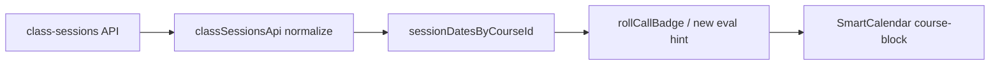

# 智慧排課：評量未填標示（PM／CTO 技術簡報）

## 1. 背景與目標

- **業務痛點**：主任／營運在智慧排課課表上已能一眼看到請假、到班（已點）、漏點等狀態，但**無法在同一視圖**快速發現「該堂已上完卻尚未完成評量流程」的課程，需切到學習評量頁才能追蹤。
- **產品目標**：在 **[`frontend/src/pages/SmartCalendar.vue`](frontend/src/pages/SmartCalendar.vue)** 的課程區塊（日檢視老師欄、週檢視）上，**比照現有 `rc-tag`（roll call）小標**，增加可辨識的「評量未填」提示，降低漏填與稽核成本。
- **非目標（建議寫進 scope）**：不在本階段重做學習評量頁邏輯；不改變核准評量扣堂等高風險後端行為（見 [`AGENTS.md`](AGENTS.md)／[`docs/AI_REGRESSION_LESSONS.md`](docs/AI_REGRESSION_LESSONS.md)）。

## 2. 現況（技術事實）

- 行事曆載入堂次時已呼叫 **`GET /api/v1/class-sessions`**（經 [`frontend/src/lib/classSessionsApi.js`](frontend/src/lib/classSessionsApi.js) 的 `fetchClassSessions`），並將結果整理為 `sessionDatesByCourseId`。
- 後端 **[`backend/app/Http/Controllers/ClassSessionController.php`](backend/app/Http/Controllers/ClassSessionController.php)** 的 index 已 `leftJoin` 非作廢的 `LearningRecord`，並回傳：
  - `learning_record_id`
  - `learning_record_status`（無列時為 **`missing`**）
- 前端 **`rollCallBadge`** 目前**只**依 `ClassSession` 狀態與 `attendance_sign_in_at` 決定 `假`／`✓`／`!` 等，**未讀取**上述評量欄位。

## 3. 建議實作方案（工程）

### 3.1 前端（主體）

| 項目 | 說明 |
|------|------|
| 觸發點 | 與現有相同：[`SmartCalendar.vue`](frontend/src/pages/SmartCalendar.vue) 第 164、213 行附近，`course-block` 內的 `rc-tag`。 |
| 作法 A（推薦） | 新增 **`evalRecordBadge(course, ymd)`**（或合併為單一函式回傳陣列），內部沿用現有 **`findSessionRowForCell`**，讀 `row.learning_record_id`、`row.learning_record_status`。 |
| 作法 B | 擴充 `rollCallBadge` 回傳結構為「主標＋副標」；改動面較大，需調整模板與 CSS。 |
| UI | 第二個 `span`（例如 `er-tag`）或將兩個小標包在同一角落容器，避免與 [`classSessionsApi.js`](frontend/src/lib/classSessionsApi.js) 既有欄位語意脫節。 |
| 圖例 | 更新頂部 **`rc-legend`**（約第 51 行）說明新標籤含義。 |
| 樣式 | 新增 `.er-tag` 或 `.rc-eval-missing` 等，與 `.rc-done` / `.rc-leave` 視覺層級一致。 |

### 3.2 後端（本階段多半不必改）

- 若 **MVP** 定義為「**無任何有效 LearningRecord 列**（`learning_record_id` 空或 `learning_record_status === 'missing'`）」則**無需**改 API。
- 若產品要求與 **[`LearningRecordsPage.vue`](frontend/src/pages/LearningRecordsPage.vue)** 的「只看未填」（有 `pending` 列但**內容空白**）**完全一致**，則需在 `ClassSessionController` 的 select/transform 增加例如 `learning_record_body_filled`（或沿用既有欄位組合），避免在前端複製一大段「有無填寫內容」判斷。**建議列為 Phase 2**，避免首版 scope 膨脹。

### 3.3 顯示條件（需產品拍板，建議預設）

以下為建議預設邏輯，實作前在 PR／spec 中鎖定：

1. **不顯示「評量未填」**：堂次為請假／補請假相關狀態（與 `rollCallBadge` 一致：`leave`、`leave_adjusted`、`excused`）— 與編輯視窗「請假不需填寫評量表」一致。
2. **不顯示**：`cancelled`；**未來日期**或該堂**結束時間未到**（尚未發生完課）不提示未填。
3. **顯示「評量未填」**：堂次已屬「應追蹤完課」語意下，且無有效評量列（MVP）— 例如 `attended` / `completed` / `late` / `absent` 等與現有 `ATTENDED_STATUSES` 對齊，**或**僅在「堂次結束時間已過」且非請假時檢查（兩種取捨會影響「已點名但堂次狀態仍 scheduled」邊界，須二選一）。
4. **與 `✓`／`!` 並存**：建議**兩個標籤可同時顯示**（點名狀態與評量填寫為不同維度）；若版面過擠，可改為單一角落「圖示＋ tooltip」— 首版建議雙標。

### 3.4 測試與文件

- **手動**：同一老師日／週檢視、請假堂、已核准評量、完全無評量列、跨月載入 window。
- **自動化（可選）**：若專案已有前端測試框架則補元件測試；否則以手動 checklist 為主。後端若 Phase 2 加欄位，再補 Feature test 於 class-sessions JSON shape。
- **CHANGELOG**：於 [`docs/CHANGELOG.md`](docs/CHANGELOG.md) 簡述使用者可見行為（依 repo 慣例）。

## 4. 風險與依賴

- **資料一致性**：`class-sessions` 與學習評量頁對「未填」定義若不一致，會造成使用者困惑 — MVP 應在 release note 註明「行事曆標示僅代表無評量列／missing」。
- **效能**：現已批次載入 class-sessions；新增僅客端分支判斷，**不增加請求數**。
- **老師視角**：確認 `isTeacher` 時是否仍載入相同 `sessionDatesByCourseId`；若老師也應看到「自己未填」提示，行為與主任一致即可。

## 5. 驗收標準（建議）

1. 日檢視、週檢視中，符合規則的課程格出現**可辨識**的評量未填標示；圖例有說明。
2. 請假堂不出現評量未填標示。
3. 未來堂、已取消堂不出現評量未填標示。
4. 已有有效 `LearningRecord` 列（`learning_record_id` 有值且非作廢 join）時，MVP 不顯示未填（後續 Phase 2 可再區分「待審但空白」）。

## 6. 開放決策（建議 PM 會前定案）

- 「未填」是否僅 **無評量列**，還是要對齊學習評量頁的 **pending 空表單**（影響是否改後端）。
- 「應顯示未填」的堂次狀態邊界：是否**完全**綁定 `ATTENDED_STATUSES`，或**一律**以「堂次結束時間已過 + 非請假」為準。
