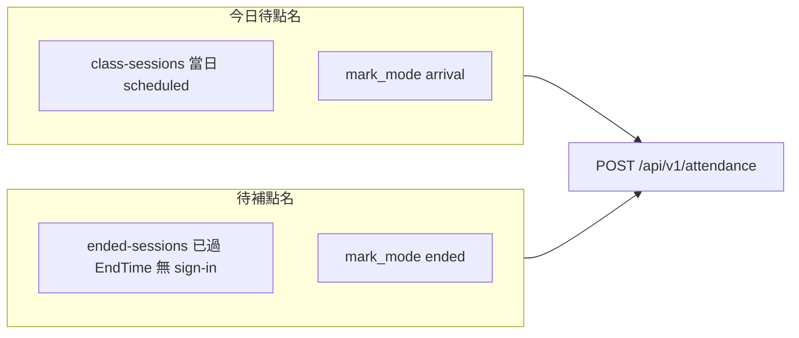

# 出缺勤「事後補點名」產品規劃書（致技術部門 CTO）

**文件性質**：產品需求與技術邊界定義（PRD 精簡版）  
**版本**：v1.0（規劃稿）  
**主責角色**：產品（PM）  
**主要讀者**：CTO、後端／前端負責人、QA  
**關聯模組**：出缺勤、排課堂次（`ClassSession`）、契約（`StudentClass`）、刷卡（可選）

---

## 1. 背景與問題陳述

補習班日常營運中，櫃檯／主任需在課後將「到班／遲到／缺席／請假」與**堂數核銷**對齊。目前系統行為如下：

- **[AttendancePage.vue](frontend/src/pages/AttendancePage.vue)** 的「今日待點名堂次」僅查 **當日** `GET /api/v1/class-sessions?start=今天&end=今天`，且篩選 `status === 'scheduled'`，點名時使用 **`mark_mode: 'arrival'`**（可到班即核課，與區塊文案「已結束才點」不完全一致）。
- 後端已實作 **[GET /api/v1/attendance/ended-sessions](backend/routes/api.php)**（[`AttendanceController::endedSessions`](backend/app/Http/Controllers/AttendanceController.php)），用途為列出「**該節結束時間已過**、且**尚無關聯出缺勤**」的 `ClassSession`，但 **前端未串接**，因此 **跨日漏點** 在 UI 上無法被主動發現與補登。

**使用者痛點**：忙線時當日未點名、隔日才發現時，無專屬流程補齊資料，導致 `ClassSession` 長期停在 `scheduled`、堂數與營運認知不一致、報表與家長／內部稽核困難。

---

## 2. 產品目標與成功指標

| 目標 | 說明 |
|------|------|
| **G1** | 使用者能在出缺勤模組內，**依分校／日期範圍**找到「已結束且尚未點名」的節次並完成補登。 |
| **G2** | 補登行為與 **`POST /api/v1/attendance`** 既有商業規則一致（扣堂、請假順延、`ClassSession.Status` 更新等），不重複發明第二套邏輯。 |
| **G3** | 權限與多校區隔離與現有 `require_campus`／角色矩陣一致，無跨校資料外洩。 |

**建議成功指標（上線後 4～8 週可量測）**

- 補點名區塊 **週活躍使用次數**（主任／櫃檯）。
- **「結束超過 48 小時仍為 scheduled 且無 sign-in」** 的堂次比例下降（需後台查詢或報表，可列為 Phase 2）。
- 與補登相關的 **客服／內部口頭修正** 次數下降（質性）。

---

## 3. 範圍界定

### 3.1 In Scope（MVP）

- 在出缺勤頁新增獨立區塊（或分頁）：**「待補點名（已結束節次）」**。
- 篩選：**分校**（沿用 `branch_id`）、**日期或日期區間**（產品需定義；見第 7 節技術缺口）。
- 列表欄位：日期、時段、學生、科目、授課老師（與現有「今日待點名」表一致即可）。
- 操作：選擇狀態（到班／遲到／缺席／請假）後送出，呼叫 **`POST /api/v1/attendance`**；補點情境應使用 **`mark_mode: 'ended'`**（或省略，走預設「節次結束後才可點」），與「到班即核課」區隔。
- 成功後刷新列表與當日出缺勤紀錄列表。

### 3.2 Out of Scope（第一版不做，可列 backlog）

- 批次一鍵「全部缺席」等大量寫入（誤操作風險高）。
- 自動日結排程將未點名改缺席（政策與法遵需另議，**本 PRD 不主張自動化**）。
- 與主任儀表板「今日排課」的漏點提醒聯動（可做 Phase 2）。
- 家長端顯示邏輯變更（若無明確需求則不動）。

---

## 4. 使用者與情境

| 角色 | 主要情境 |
|------|----------|
| **主任／櫃檯（director/admin）** | 隔日補登前一日或多日漏點；依分校查詢。 |
| **老師（teacher）** | 僅能補自己課程範圍內之節次（與 [`endedSessions`](backend/app/Http/Controllers/AttendanceController.php) 既有 `TeacherID` 過濾一致）。是否開放老師補多日：**建議預設與主任相同能力，或 CTO 與營運二選一**。 |
| **super_admin** | 需明確 **帶 `branch_id`** 才查詢（見第 7.2 風險）；避免「全校混查」造成效能與誤操作。 |

**核心 User Story（驗收敘述）**

> 作為主任，我在選擇分校後，選擇「上週」日期範圍，看到所有**已下課但仍無出缺勤**的節次；我對某一節按下「缺席」並送出後，該節在出缺勤列表出現對應紀錄，且 `ClassSession` 狀態與堂數與現行點名規則一致。

---

## 5. 功能需求（FR）

| ID | 需求 |
|----|------|
| FR-1 | 提供「待補點名」資料來源；優先使用 **`GET /api/v1/attendance/ended-sessions`**，與現有路由一致。 |
| FR-2 | 支援 **分校** 篩選；未選分校時主任顯示引導（與現有出缺勤頁一致）。 |
| FR-3 | 支援 **日期或起訖日期** 篩選已結束之節次（若後端尚不支援，則為 **後端必補項目**，見第 7.1）。 |
| FR-4 | 單筆補登：狀態選項與現有「今日待點名」相同（到班／遲到／缺席／請假）；請假觸發之順延／`Schedule` 寫入行為與 [`AttendanceController::store`](backend/app/Http/Controllers/AttendanceController.php) 現有 `excused` + `ClassSessionID` 分支一致。 |
| FR-5 | 列表需 **分頁或可載入更多**（若單週資料量超過 100 筆）；目前後端 `limit(100)` 為硬上限，產品應要求 **cursor／page** 或提高上限並監控查詢效能。 |
| FR-6 | 空狀態：無待補節次時顯示明確文案（例如「此期間沒有待補點名的已結束節次」）。 |
| FR-7 | 錯誤處理：403／422 訊息與現有頁面一致，不吞錯。 |

### 5.1 與「今日待點名」的產品區隔（建議寫入 UI 說明）

---

## 6. 非功能需求（NFR）

- **效能**：日期區間預設建議 ≤14 天；查詢需有 `branch_id` + 日期索引策略（CTO 評估 `ClassSession.SessionDate`、`StudentClassID`）。
- **安全**：所有 API 沿用既有 Sanctum／`require_campus`；禁止未帶校區之全校掃表（super_admin）。
- **稽核**：沿用 `RecordedByUserID`（若 store 已寫入）；補登成功後紀錄應可追溯「誰在何時補登」（若不足則列技術債）。
- **可維護性**：不重複實作「誰算待補」邏輯於前端；以後端為準。

---

## 7. 技術現況與 CTO 須拍板／補強項

### 7.1 `ended-sessions` 與註解不一致

[`endedSessions`](backend/app/Http/Controllers/AttendanceController.php) 註解寫「Query: … **date (optional)**」，但實作 **未使用 `date`**，僅：

- `CONCAT(SessionDate, EndTime) <= now()`
- `whereDoesntHave('signIns')`
- `limit(100)`

**建議工程規格**：實作 `date` 或 `start_date`／`end_date`，並與前端篩選對齊；否則前端只能顯示「最近 100 筆跨日混雜」，**不符合 FR-3**。

### 7.2 `whereDoesntHave('signIns')` 與作廢紀錄

[`ClassSession::signIns`](backend/app/Models/ClassSession.php) 關聯 **未** 預設排除 `VoidedAt`。若存在「已作廢」之 `StudentSingIn`，該堂次可能被視為「已有 sign-in」而 **不出現在待補列表**，導致無法補登。**建議**：`whereDoesntHave` 改為僅視 **有效（`VoidedAt` 為 null）** 為已點名；或另開 API 參數 `include_voided_review`。

### 7.3 super_admin 與空 `campusIds`

當 `super_admin` 未帶 `branch_id` 時，`Student::whereIn('CampusID', [])` 行為可能導致 **永遠空列表**。產品決策：**強制補點名查詢必帶 `branch_id`**，與主任一致。

### 7.4 前端部署

依專案規則，修改 [frontend/src/pages/AttendancePage.vue](frontend/src/pages/AttendancePage.vue) 後需執行 `cd frontend && npm run deploy`。

---

## 8. 測試與驗收（給 QA／工程）

- **Feature（Pest）**：建立已過 `EndTime` 之 `ClassSession`、無 active `StudentSingIn` → `GET ended-sessions` 含該筆 → `POST attendance`（`mark_mode=ended`）→ DB 有 sign-in、`ClassSession.Status` 與扣堂與現有測試策略一致。
- **迴歸**：今日 `class-sessions` + `arrival` 流程不壞；請假順延仍通過。
- **權限**：老師僅看到自己課程；跨分校 403。

---

## 9. 交付分期建議

| Phase | 內容 |
|-------|------|
| **MVP** | 後端補齊 `ended-sessions` 查詢參數 + 有效 sign-in 判斷 + 分頁；前端「待補點名」區塊 + `ended` 模式送出。 |
| **Phase 2** | 儀表板「漏點提醒」、營運報表（scheduled 僵屍堂次）、可選批次。 |

---

## 10. 開放問題（需 CTO／營運確認）

1. **老師**是否允許補登「非當日」節次？（建議：允許，與後端 teacher filter 一致；若否需後端再加限制。）
2. 補登**最早可回溯天數**（例如 90 天）是否需硬性限制以避免爭議與效能問題？
3. 請假（excused）於「多日後補登」是否允許觸發順延；若營運不允許，需後端加業務日期檢核。

---

## 11. 參考檔案索引

| 層級 | 路徑 |
|------|------|
| 路由 | [backend/routes/api.php](backend/routes/api.php)（`attendance/ended-sessions`） |
| 後端 | [backend/app/Http/Controllers/AttendanceController.php](backend/app/Http/Controllers/AttendanceController.php)（`endedSessions`、`store`） |
| 前端 | [frontend/src/pages/AttendancePage.vue](frontend/src/pages/AttendancePage.vue)（`fetchPendingSessions`、`submitPendingMark`） |
| 模型 | [backend/app/Models/ClassSession.php](backend/app/Models/ClassSession.php)、[backend/app/Models/StudentSignIn.php](backend/app/Models/StudentSignIn.php) |

---

**結論給 CTO**：產品缺口明確為「**跨日待補列表未進前端**」；後端已有 70% 能力，但 **`ended-sessions` 規格與實作不一致、limit/作廢紀錄/super_admin 邊界** 需在 MVP 一併收斂，以免上線後爭議與無法補登之技術債。
