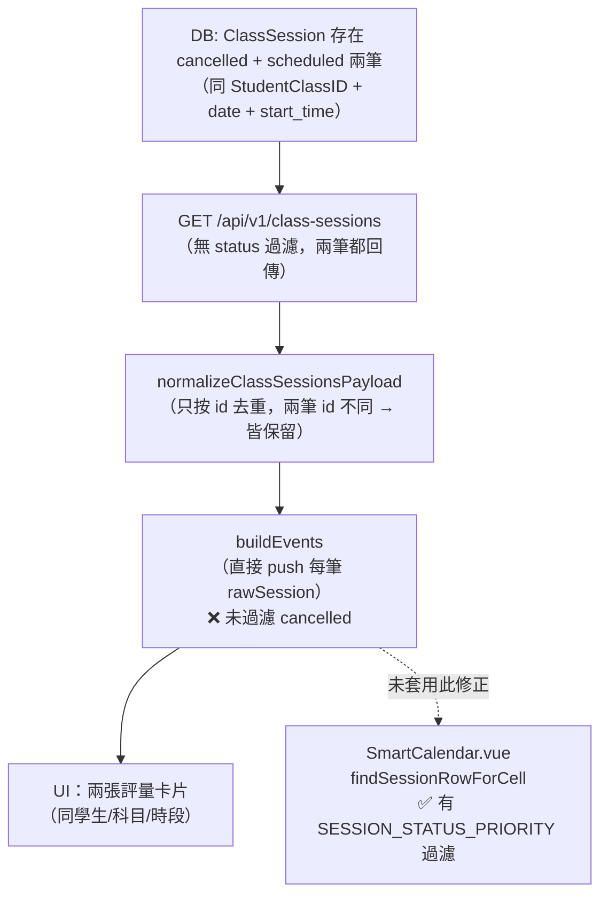

# 評量課表重複卡片修正（LearningRecordsPage）

## 根因分析

### 現象
鄭翔祐 4/15 19:30-21:30，張正樂出現兩張「國文 未填」評量卡。

### 資料層根因（已知）
`AI_REGRESSION_LESSONS.md §2026-04-14` 記載：張正樂 4/15 同一課程同時段存在兩筆 `ClassSession`（一筆 `cancelled`、一筆 `scheduled`），DB 層面合法（不同 `id`）。

### 程式層根因（未修正）
[`frontend/src/pages/LearningRecordsPage.vue`](frontend/src/pages/LearningRecordsPage.vue) 的 `buildEvents`（第 1311-1364 行）**雙層迴圈直接輸出每一筆 rawSession，無 status 過濾**：

```
for (const sc of teacherClassList.value) {       // 每門課
  const rawSessions = sessionDatesByClassId[classId]  // 每筆 ClassSession（含 cancelled）
  for (const rawSession of rawSessions) {
    // ❌ 未過濾 cancelled，cancelled + scheduled → 兩張卡
    events.push({ ... })
  }
}
```

同樣的問題在 `SmartCalendar.vue` 已用 `SESSION_STATUS_PRIORITY` + `pickBestSessionRow` 修正，但 **LearningRecordsPage 未同步**。

對比：`directorSessionsByClassId` 那條路徑（第 1480-1484 行）已有 `st !== 'cancelled' && st !== 'leave'` 篩選，**老師路徑獨缺**。

### 完整根因圖



## 修正方案

### 修改檔案
[`frontend/src/pages/LearningRecordsPage.vue`](frontend/src/pages/LearningRecordsPage.vue)，`buildEvents` 函式（約第 1319-1321 行）

### 修改邏輯
在 `buildEvents` 中，對每門課（`classId`）的 rawSessions 先做**同日同時段去重**，使用與 SmartCalendar 相同的狀態優先序：

```
attended / completed / late / absent  >  scheduled  >  leave / leave_adjusted / excused  >  cancelled
```
同狀態取 `id desc`（較新優先）。

具體做法：groupBy `(session_date, start_time)` → 每組只保留優先序最高那筆 → 再進入原有 `events.push(...)` 邏輯。

可抽一個 `pickBestSession(sessions)` 輔助函式（可在同頁定義，或 import 自 composable），與 SmartCalendar 共用相同常數表。

### 不需修改
- `ClassSessionController::index()` — 不過濾 cancelled 是設計正確（其他地方需要這些資料）
- `normalizeClassSessionsPayload` — id 去重已足夠，底層不應假設上層如何使用
- `fetchTeacherSessionDates` — 不加 status 參數（其他消費者可能需要 cancelled 資料）

## 防再犯補充

在 `docs/AI_REGRESSION_LESSONS.md` 新增一節，說明：
- **LearningRecordsPage `buildEvents` 同格去重規則**與 SmartCalendar 相同
- 每次修改 `buildEvents` 或新增 session 資料消費點，必須套用 `pickBestSession` 去重
- 引用測試：`ClassSessionDuplicateStatusTest`（既有），建議補 `LearningRecordsPage` 課表 widget 的視覺層測試說明
