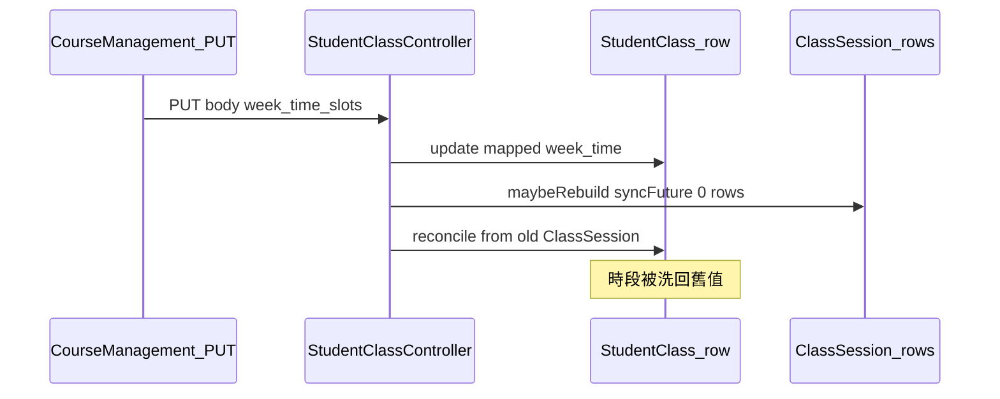

# 課程時段與排程 API 修正計畫

## 背景與目標

- **主要 bug**：[`StudentClassController::update`](backend/app/Http/Controllers/StudentClassController.php) 在 `update($mapped)` 後呼叫 `maybeRebuildSessionsAfterUpdate`（有歷史時僅 `syncFutureScheduledSessionTimes`），再**無條件**呼叫 `reconcileWeekTimeFieldsFromSessions`。當未來堂次時間未被同步（`updated_future_sessions === 0`）時，`reconcile` 仍依舊 `ClassSession` 回寫 `StudentClass.week/time`，導致使用者儲存的時段被洗回舊值（見 [docs/TECH_REPORT_COURSE_SCHEDULE_SYNC_ISSUES.md](docs/TECH_REPORT_COURSE_SCHEDULE_SYNC_ISSUES.md)）。
- **次要**：[`SmartCalendar.vue`](frontend/src/pages/SmartCalendar.vue) 仍 `POST` 已退役的 [`StudentClassController::sync`](backend/app/Http/Controllers/StudentClassController.php)（固定 410），造成主控台噪音與誤判。
- **非本計畫核心**：`POST /api/v1/schedules` 的 422 與課程管理 `PUT` 儲存無直接關聯；修正後若仍出現，應另開工單依該次 payload/response 追查 [`ScheduleController::store`](backend/app/Http/Controllers/ScheduleController.php)。

---

## 一、後端修正（優先）

**檔案**：[`backend/app/Http/Controllers/StudentClassController.php`](backend/app/Http/Controllers/StudentClassController.php)

1. **在 `update()` 內取得 `maybeRebuildSessionsAfterUpdate` 回傳後，條件式呼叫 `reconcileWeekTimeFieldsFromSessions`**
   - 建議條件（可與產品微調）：
     - **仍呼叫 `reconcile`**：`session_sync['rebuilt'] === true`（整批重建／開課日對齊等已重寫 `ClassSession`）；或本次請求**未**包含排程相關變更（與現有 `maybeRebuildSessionsAfterUpdate` 內 `scheduleUpdated` 判定一致，可抽成 private 方法 `scheduleFieldsPresentInMapped(array $mapped): bool` 避免重複）。
     - **跳過 `reconcile`**：本次有排程欄位變更，且 `session_sync['reason'] === 'history_exists'` 且 `(int)($session_sync['updated_future_sessions'] ?? 0) === 0`（避免用舊堂次覆寫剛寫入的主檔）。
   - **風險說明**：跳過 `reconcile` 時，短期內可能出現「`StudentClass` 顯示新時段、部分 `ClassSession` 仍舊時段」；回應 JSON 建議在 `session_sync` 增加明確欄位，例如 `reconcile_skipped: true`、`warning` 字串，讓前端可選擇提示主任「未來堂次未全部更新，請檢查堂次狀態或聯絡管理員」。

2. **（可選加強）** 若產品要求「有歷史時仍應盡力改未來堂次」：檢視 `syncFutureScheduledSessionTimes` 僅處理 `Status = scheduled` 是否合理；若需納入其他狀態，須與 [`ClassSessionController`](backend/app/Http/Controllers/ClassSessionController.php)／出缺勤流程對齊，**不建議在未釐清前擴大範圍**。

3. **`maybeRebuildSessionsAfterUpdate` 早退 `start_date_not_updated`**
   - 若前端固定送 `day_time_slots` 但後端未把 `week`/`time` 放進 `$mapped`（例如 payload 邊界），會導致不進同步。建議修正計畫內加一項：**對照** [`mapFrontendPayload`](backend/app/Http/Controllers/StudentClassController.php) 與 [`CourseManagement.vue` `submitEdit`](frontend/src/pages/CourseManagement.vue)  body，確認 `PUT` 永遠帶齊觸發 `scheduleUpdated` 所需欄位；必要時後端對「僅 `start_time`/`end_time` 變更」也視為排程更新。

---

## 二、前端修正（消除 410）

**檔案**：[`frontend/src/pages/SmartCalendar.vue`](frontend/src/pages/SmartCalendar.vue)（約 1802–1824 行區塊）

- **移除**對 `POST /api/v1/student-classes/sync` 的呼叫；或改為註解並附註改走 `class-sessions/batch`（與後端 410 訊息一致）。
- 若仍須相容舊 Supabase 資料流：改為**不發請求**或僅在明確 feature flag 下呼叫，避免 production 無意義流量。

完成後依專案規則執行：`cd frontend && npm run deploy`。

---

## 三、測試（Pest Feature）

**建議新檔或擴充**：`backend/tests/Feature/StudentClassUpdateScheduleReconcileTest.php`（名稱可調）

- **情境 A**：課程已有 `StudentSignIn` 或已核准 `LearningRecord`（觸發 `hasImmutableSessionHistory`）；存在未來 `ClassSession` 且 `Status = scheduled`；`PUT` 變更 `day_time_slots` 時間。
  - 期望：未來堂次 `StartTime`/`EndTime` 更新；`StudentClass` 的 `week`/`time` 與新時段一致；**不**出現「主檔被 reconcile 洗回舊值」。
- **情境 B**：同上但刻意讓未來堂次非 `scheduled`（若測試資料易建），期望：`session_sync` 帶 `updated_future_sessions: 0` 且行為符合產品（跳過 reconcile + warning，或明確 4xx—由實作選定後寫進斷言）。

可參考現有 [`LargeBranchDataHandlingTest`](backend/tests/Feature/LargeBranchDataHandlingTest.php) 等 Factory 慣例建立 `Campus`/`Student`/`StudentClass`/`ClassSession`。

---

## 四、文件

- 更新 [`docs/CHANGELOG.md`](docs/CHANGELOG.md)：簡述「課程編輯時段與堂次同步、停用智慧排課對退役 sync 的呼叫」。
- 可於 [`docs/TECH_REPORT_COURSE_SCHEDULE_SYNC_ISSUES.md`](docs/TECH_REPORT_COURSE_SCHEDULE_SYNC_ISSUES.md) 文末加「修正版本／PR 連結」欄位（實作後填）。

---

## 五、驗收清單（給 QA／主任試跑）

1. 堂數制課程：已有多堂「已上」＋多堂未來排課；編輯變更星期或開始時間後儲存；列表與堂次 chip 時間一致。
2. 開啟智慧排課載入：DevTools **無** `student-classes/sync` 410（或已不發該請求）。
3. 請假／調課既有流程 smoke（避免誤傷 `ScheduleController`）。

---

## 建議不納入本輪（避免範圍膨脹）

- 全面重寫 Supabase ↔ MySQL 同步策略。
- 未取得實際 payload 前深挖 `POST /schedules` 422 根因。
