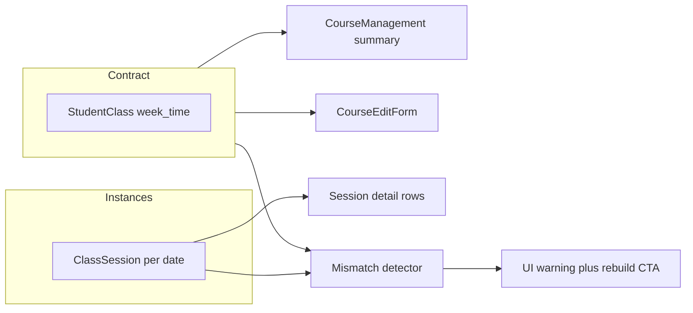

# 課程管理：專注全螢幕 + 契約時段一致性

## 業務問題對照（給技術部門）

| 現象 | 技術根因（已讀程式） |
|------|----------------------|
| 專注模式下按「編輯」看不到或很怪 | 專注層 [`.grouped-course-list.focus-fullscreen-mode`](frontend/src/pages/CourseManagement.vue) 設 `z-index: 1000`；全域 [`.modal-overlay`](frontend/src/styles.css) 僅 `z-index: 200`，**編輯 modal 被蓋在專注層底下**。 |
| 專注仍要捲、不像全螢幕 | 專注層本身 `overflow-y: auto` + 內層 [`.group-table-wrap { max-height: 56vh }`](frontend/src/pages/CourseManagement.vue)、[`.table-wrap { max-height: 70vh }`](frontend/src/pages/CourseManagement.vue) 形成**巢狀捲動**，視窗利用率差。 |
| 編輯時「固定排課日」像歷史紀錄、列表時段亂跳 | **後端** [`StudentClassController::index`](backend/app/Http/Controllers/StudentClassController.php) 在組完 DB `week/time` 的 `day_time_slots` 後，若存在 [`$sessionSlotsByClassId`](backend/app/Http/Controllers/StudentClassController.php)（由 `ClassSession` 推導），會**覆寫** `$class->day_time_slots`（約 L285–303）。**前端** [`editCourse`](frontend/src/pages/CourseManagement.vue) 還會把 `classSessionsByCourse` 推斷的時段**合併**進 `existingSlots`（約 L1941–1974）。因此 UI 與編輯表單吃的是「堂次歷史／未來實例」，不是純契約。 |

與現有文件的張力：[docs/AI_REGRESSION_LESSONS.md](docs/AI_REGRESSION_LESSONS.md) 曾為「幽靈星期」把 **index／reconcile** 改成優先**未來 scheduled 堂次**，以避免舊補登汙染；但與你方決策 **「列表與固定排課編輯以 StudentClass 契約為準」** 衝突時，應以產品決策為準：**契約主導摘要**，堂次只用於逐堂詳情／不一致偵測。

---

## 產品原則（已依你方回覆定稿）

- **契約（`week`/`time`/`week1..`/`time1..`/`duration*` → `days_of_week` + `day_time_slots`）**：課程管理「時段」欄、`CourseEditForm`「固定排課日」的**預設載入與儲存對象**。
- **過去手動補登／非契約星期的堂次**：允許存在於 `ClassSession`，**不得**覆寫契約 UI；僅在「詳情／堂次列表」呈現實際時間。
- **今日起的未來 `scheduled` 堂次**：若與契約（星期＋起迄或時長）不一致，**不覆寫契約**；改為 **提示**（文案例如「未來堂次與固定排課不一致」）並保留現有「[重建未上堂次](frontend/src/pages/CourseManagement.vue)」作為修復動線。

---

## 部門分工（軟體公司視角）

### CTO／架構

- 定義 API 契約：`day_time_slots` / `days_of_week` 在 `GET /api/v1/student-classes`（及任何消費端）語意為 **「排課契約」**，與「由堂次推導的摘要」分離。
- 若智慧排課仍需「每格實際時間」，維持 [AI_REGRESSION_LESSONS 智慧排課一節](docs/AI_REGRESSION_LESSONS.md)：**格子優先該日 `ClassSession`**；與課程管理「契約摘要」並存，不互相覆寫同一欄位語意。
- 評估 [`reconcileWeekTimeFieldsFromSessions`](backend/app/Http/Controllers/StudentClassController.php)：是否應改為「僅在明確同步策略下更新契約」或改寫入別欄，避免再度用堂次**回寫**契約（與 [同檔 2026-04-11 手動補登汙染](docs/AI_REGRESSION_LESSONS.md) 的敘述一併審查）。

### 前端（UI／UX）

1. **層級**：專注層 z-index **低於** modal，或編輯／重建等 overlay **高於** 1000（擇一，建議：**modal-overlay 全站或本頁提升至 >1100**，專注層維持 1000 以下亦可）。
2. **專注模式版面**：在 `.focus-fullscreen-mode` 下覆寫子層 `max-height`（例如 `.focus-fullscreen-mode .group-table-wrap`、`.focus-fullscreen-mode .table-wrap` 改為 `none` / `min-height: 0` + flex），減少**雙重捲軸**；可選：專注時隱藏外層 page header 或改用 `100dvh`。
3. **編輯載入**：[`editCourse`](frontend/src/pages/CourseManagement.vue) **移除或預設關閉**「由 `classSessionsByCourse` 推斷並 merge 進 `day_time_slots`」邏輯；契約缺欄再考慮極窄的 fallback（與後端協調）。
4. **列表顯示**：[`formatDayTimeSlotLines`](frontend/src/pages/CourseManagement.vue) 中與 `sessionsRowsForCourse` 合併推斷的邏輯，改為**以契約 slots 為主**；若需「同日多段僅在堂次出現」的 edge case，改由後端契約欄位補齊，避免前端再用堂次補契約。

### 後端

1. [`StudentClassController::index`](backend/app/Http/Controllers/StudentClassController.php)：停止用 `$sessionSlotsByClassId` **覆寫** `$class->day_time_slots`；改為：
   - 維持由 `week/time/...` 組出的契約 `day_time_slots`；
   - **選擇性**新增欄位（例如 `schedule_drift` / `future_session_mismatch`）或僅在 director 端點回傳簡短 boolean + 計數，供 UI 顯示警告（避免 breaking change 時可先只加欄、前端漸進）。
2. 針對「未來 scheduled vs 契約」做純讀比對（不寫 DB），供前端顯示提示。
3. 調整／新增 **Feature tests**（可延伸 [SameDayMultiSlotTest](backend/tests/Feature/SameDayMultiSlotTest.php)、[StudentClassUpdateScheduleReconcileTest](backend/tests/Feature/StudentClassUpdateScheduleReconcileTest.php)）：**index 回傳的 `day_time_slots` 與 DB 契約一致**，即使存在不同時間的 `ClassSession`。

### QA

- 矩陣：**專注開啟 → 編輯／加購／重建／刪除** 皆可見 modal；手機窄寬；長列表捲動行為。
- 資料：**多週幾契約**、**過去補登星期不在契約內**、**未來堂次手動改時間** 三種下，列表「時段」欄與編輯表單固定排課是否**始終等於契約**；詳情區仍顯示實際堂次時間。
- 迴歸：智慧排課格子時間、[docs/DIRECTOR_PAYMENT_ALERT_RULES.md](docs/DIRECTOR_PAYMENT_ALERT_RULES.md) 未動前提下之主任總覽。

### 資安

- 本次多為讀取語意與 UI；確認新欄位不洩漏他校資料（維持既有 `branch_id`／`require_campus`）。

### 技術文件／版本追蹤（你要求「給 AI 防再犯」）

- [docs/CHANGELOG.md](docs/CHANGELOG.md)：條列「課程管理專注模式 z-index 修正」「student-classes 契約與堂次語意分離」。
- [docs/AI_REGRESSION_LESSONS.md](docs/AI_REGRESSION_LESSONS.md)：新小節 — **專注模式與 modal 層級**、**契約摘要不得被 ClassSession 覆寫**；並註明與 2026-04-11「未來堂次優先」敘述的**關係**（改為：未來堂次用於**漂移偵測**，不覆寫契約欄）。
- （可選）`docs/TECH_REPORT_COURSE_SCHEDULE_SYNC_ISSUES.md` 或簡短 ADR：資料流 mermaid — `StudentClass` 契約 vs `ClassSession` 實例。

---

## 實作順序建議

1. **Quick win**：z-index（modal 高於專注）— 立刻恢復「編輯可見」。
2. **契約語意**：後端 index 不再覆寫 `day_time_slots`；前端 `editCourse` / `formatDayTimeSlotLines` 對齊契約。
3. **UX**：專注模式巢狀捲動收斂。
4. **漂移提示** + **測試** + **CHANGELOG / AI_REGRESSION_LESSONS**。

---

## 風險與待 CTO 拍板

- 依賴「index 用堂次覆寫契約」的隱性使用者或腳本：需 release note 說明改為契約為準；若舊資料契約空白僅有堂次，需定義 fallback（可一次性 backfill 或僅顯示「未設定契約」）。
