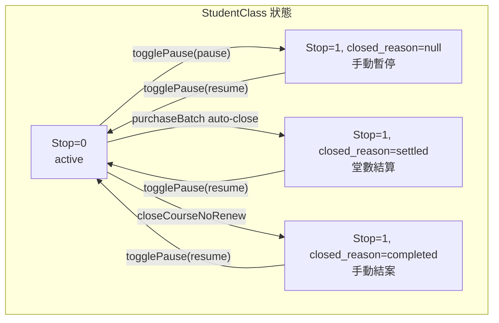

# 課程結算 vs 暫停 — `closed_reason` 欄位方案

## 現況問題

`StudentClass.Stop = 1` 同時代表「手動暫停」和「堂數用完加購結算」，前端一律顯示黃色大 banner「課程暫停中」。用戶期望：堂數用完的已結算課程應低調顯示，與主動暫停在視覺上有明確區別。

## 方案：新增 `closed_reason` 欄位

`Stop = 1` 的語意不變（課程不活躍），但新增 `closed_reason` 標示**為何**被停。

```
closed_reason:
  null          → 手動暫停（維持黃色 banner）
  'settled'     → 堂數用完結算（灰色小標籤「已結算」）
  'completed'   → 主任手動結案（灰色小標籤「已結案」）
```



---

## 1. Migration

新檔 `backend/database/migrations/2026_04_13_300000_add_closed_reason_to_student_class.php`：

```php
$table->string('closed_reason', 20)->nullable()->after('Stop');
```

- 不回填舊資料（已暫停課程保持 `closed_reason = null`，顯示為「暫停」，行為不變）。

---

## 2. Backend 改動

### 2.1 Model

[`backend/app/Models/StudentClass.php`](backend/app/Models/StudentClass.php) — 把 `closed_reason` 加入 `$fillable`。

### 2.2 加購結算

[`backend/app/Http/Controllers/StudentClassController.php`](backend/app/Http/Controllers/StudentClassController.php) `purchaseBatch()` (line 1374)：

```php
// 現在
$studentClass->Stop = 1;
$studentClass->EndDate = Carbon::today()->toDateString();
$studentClass->save();

// 改為
$studentClass->Stop = 1;
$studentClass->closed_reason = 'settled';
$studentClass->EndDate = Carbon::today()->toDateString();
$studentClass->save();
```

### 2.3 手動結案

同檔 `togglePause()` (line 3029-3049)：

- `action === 'pause'`：不設 `closed_reason`（維持 null = 手動暫停）。
- `action === 'resume'`：清除 `closed_reason = null`。

[`CourseManagement.vue`](frontend/src/pages/CourseManagement.vue) `closeCourseNoRenew()` (line 964-978) 目前呼叫 `/pause` endpoint，可考慮在 body 傳 `reason: 'completed'`，後端 `togglePause` 收到時寫 `closed_reason = 'completed'`。

### 2.4 API 回傳

`StudentClassController::index()` (line 331) 目前只回 `status`。增加：

```php
$class->closed_reason = $class->closed_reason; // 直通
```

### 2.5 不需改的地方

以下位置都只檢查 `Stop = 0` 或 `Stop = 1`，語意不變，**不需修改**：
- `AlertController::tuition`（`where('Stop', 0)`）
- `AttendanceController`（`where('Stop', 0)`）
- `FinanceController::outstanding`
- `LearningRecordController`（多處 `where('Stop', 0)`）
- `ParentPortalController`（`$c->Stop`）
- `NotificationSyncService`
- `ScheduleGuardService`
- `SwipeRfidController`
- `SessionDeductionService`
- `EnrollmentService`
- `LearningRecord::excludePausedCoursePendingReview`

全部照舊——`Stop = 1` 不管 reason 都排除。

---

## 3. Frontend 改動

### 3.1 CourseManagement.vue

[`frontend/src/pages/CourseManagement.vue`](frontend/src/pages/CourseManagement.vue)

**模板** (line 133-143)：目前 `c.status === 'inactive'` 時一律顯示黃色 banner。改為：

```
if c.status === 'inactive' && !c.closed_reason:
  → 黃色大 banner「課程暫停中」（現行樣式不動）

if c.status === 'inactive' && c.closed_reason === 'settled':
  → 灰色小標籤「已結算（堂數用完）」，不要大 banner，整列低調灰

if c.status === 'inactive' && c.closed_reason === 'completed':
  → 灰色小標籤「已結案」，不要大 banner，整列低調灰
```

**CSS**：新增 `.course-settled` class（比 `.course-paused` 更低調，淡灰不透明），取代目前所有已結算行的黃色樣式。

**操作欄**：
- 已結算／已結案課程：仍顯示「恢復」按鈕（以便重啟）。
- 移除已結算課程的「暫停課程」按鈕（已停了）。

### 3.2 StudentsList.vue

[`frontend/src/pages/StudentsList.vue`](frontend/src/pages/StudentsList.vue)

- line 706-724：`closeCourseNoRenew` 的 confirm 文字可改為「結案」語意，body 傳 `reason: 'completed'`。
- 列表如有顯示暫停 badge 的位置，也依 `closed_reason` 區分。

### 3.3 篩選下拉

`CourseManagement.vue` line 52-56 的 `course_status` 篩選：可加 `settled`（「已結算」）和 `completed`（「已結案」）選項，或合併為「已停用」即可——先不擴充，短期只改顯示。

---

## 4. 測試

- [`PurchaseBatchClosesSourceTest.php`](backend/tests/Feature/PurchaseBatchClosesSourceTest.php)：追加 assert `source_course` 回傳 `closed_reason === 'settled'`；DB assert `$source->closed_reason === 'settled'`。
- 新增 test case：手動暫停 → `closed_reason` 為 null；手動結案 → `closed_reason` 為 `completed`；resume → `closed_reason` 清為 null。

---

## 5. 文件更新

- [`docs/CHANGELOG.md`](docs/CHANGELOG.md)
- [`docs/AI_REGRESSION_LESSONS.md`](docs/AI_REGRESSION_LESSONS.md)：新節「課程 Stop 語意：closed_reason 區分暫停 vs 結算」
