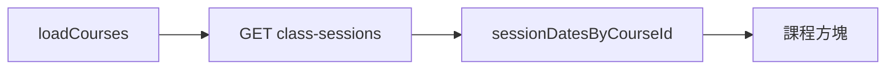

# 班級課表行事曆：顯示點名／堂次狀態

## 現況與資料來源

- 行事曆載入課程後會呼叫 [`fetchClassSessions`](frontend/src/lib/classSessionsApi.js)，結果存於 `sessionDatesByCourseId`（[`loadCourses`](frontend/src/pages/SmartCalendar.vue) 約 1720–1736 行）。
- 後端 [`ClassSessionController::index`](backend/app/Http/Controllers/ClassSessionController.php) 已 `leftJoin StudentSingIn`，並回傳：
  - `status`：`ClassSession.Status`（點名後會變成 `attended` / `late` / `absent` / `excused` 等，見 [`applyAttendanceEffects`](backend/app/Http/Controllers/AttendanceController.php)）
  - `attendance_sign_in_at`：有出缺勤紀錄時有值
- 方塊上的課程物件來自 `filteredCourses`：一般課用 `StudentClass` 的 `id`；調課／加課例外列用 `is_exception: true`、`student_course_id` 指向原課程（約 1524–1540 行），比對堂次時應以 **`String(course.is_exception ? course.student_course_id : course.id)`** 為 key 讀取 `sessionDatesByCourseId`。

## 行為定義（與出缺勤一致）

對「該格」的日期 `ymd`（日檢視：`selectedDateStr`；週檢視：`getDisplayDateFull(dow)`）與課程的 `start_time`（已正規化），在該 `student_class_id` 的陣列中找**同一天且開始時間一致**的堂次列（與 [`resolveCourseGridTimes`](frontend/src/pages/SmartCalendar.vue) 使用同一套 `session_date` + `start_time` 邏輯即可）。

| 條件 | 標籤建議 | 說明 |
|------|----------|------|
| 無對應 `ClassSession` 列 | 不顯示 | 月結或僅週期顯示、尚無堂次資料 |
| `status` 為 `leave` / `leave_adjusted` | 請假 | 不當成漏點名 |
| `status` 為 `cancelled` | 取消 | 可選淡色 |
| `status` 為 `scheduled`，且該堂**結束時間已過**（`session_date` + `end_time` 與本地現在比較） | **漏點**（或「未點」） | 與出缺勤「待點名」語意一致 |
| `status` 為 `scheduled` 且尚未到結束 | 可不顯示或極淡「待點」 | 避免過度打擾；若你希望連未開課都顯示可再調 |
| `status` 為 `attended` / `late` / `absent` / `excused` / `completed`，或具 `attendance_sign_in_at` | **已點**（若堅持用「已上」二字也可，但需知 **缺席也算已點名完成**） | 與主任／老師「點名完成」一致 |

**缺席、遲到、公假**一律視為「已點名」，不可標成漏點，否則與業務矛盾。

## 實作項目（僅前端為主）

1. **新增純函式**（建議放在 `SmartCalendar.vue` 的 script 區，或抽到 `frontend/src/lib/rollCallDisplay.js` 若希望單元測試）  
   - `studentClassKey(course)`  
   - `findSessionRowForGridCell(course, ymd)`：在 `sessionDatesByCourseId[key]` 內比對日期與 `normalizeTimeTo30` 後的 `start_time`  
   - `rollCallBadgeForCell(course, ymd)`：回傳 `{ kind: 'done'|'missed'|'leave'|'cancelled'|null, label: string }`

2. **模板**（兩處 `.course-block`，約 149–163 行與 197–211 行）  
   - 在 `.cb-type` 下方或右上角加一小列 `span`（沿用檔內既有 [`eval-status-tag`](frontend/src/pages/SmartCalendar.vue) 風格或新增 `.rollcall-tag`），依 `rollCallBadgeForCell(course, dateStr)` 顯示文字。  
   - 日檢視傳入 `selectedDateStr`；週檢視傳入 `getDisplayDateFull(idx + 1)`（與現有 `@click` 一致）。

3. **樣式**  
   - 已點：綠底或白字邊框（與現有方塊底色對比要足）  
   - 漏點：琥珀／橘色，讓「有問題」一眼可辨  
   - 請假／取消：灰階

4. **工具列簡短圖例**（可選，放在 `smart-cal-toolbar` 右側或統計旁一行小字）：「已點名 · 漏點名 · 請假」

## 可選優化（非必做）

- 在 `loadCourses` 呼叫 `fetchClassSessions` 時帶入與行事曆相同的月份視窗 `start` / `end`（例如現有 `schedStart`–`schedEnd` 的範圍），減少一次載入全部歷史堂次的量；需確認後端分頁在篩選後仍不超過 `per_page`。
- 若希望點名後不重新整理即可更新：可在從出缺勤頁返回時觸發 `loadCourses()`（例如 `document.visibilitychange`）— 範圍較大，建議第二階段再做。

## 不需改動的部分

- 後端 API 契約已滿足需求；除非要做上述日期範圍優化，否則不必改 Laravel。
- 「老師清單」分頁的表格（約 237–265 行）若也要狀態，可列為後續；你提供的畫面以網格為主，計畫先完成網格兩種檢視。

## 驗收建議

- 堂數制：在出缺勤對某堂按「到／遲到／缺席」後，重新載入課表（或整頁重整），該格應顯示已點。  
- 同一學生調課到例外列：該日該時段仍應對到正確 `ClassSession`。  
- 已請假：`schedules` 請假後該日不重複顯示原堂或例外列顯示邏輯維持不變，若有堂次為 `leave` 則顯示請假而非漏點。
