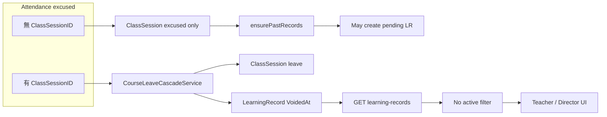

# 請假與學習評量一致性 — 技術修復計畫

## 背景與嚴重度

營運觀察：**學生已透過出缺勤請假，系統仍要求填寫／審核評量表**；若誤審或與科目數統計鏈結，會造成信任與帳務認知風險。

程式碼層面已可歸因為三類問題（可並存）：

1. **請假路徑不一致**：僅在 `POST /api/v1/attendance` 且 `Status=excused` **並帶 `ClassSessionID`** 時才會呼叫 [`CourseLeaveCascadeService`](backend/app/Services/CourseLeaveCascadeService.php)（作廢該堂 `LearningRecord`、將 `ClassSession` 標為 `leave` 等）。若為 `excused` 但無既有堂次，會走一般流程，[`applyAttendanceEffects`](backend/app/Http/Controllers/AttendanceController.php) 只把堂次標成 **`excused`**，**不會**作廢評量、也不等於智慧排課的 `leave` 語意。
2. **`ensure-past` 過寬**：[`LearningRecordController::ensurePastRecords`](backend/app/Http/Controllers/LearningRecordController.php) 只排除 `cancelled`，其餘過去堂次（含 `leave` / `excused`）在「尚無任何列被 `first()` 撿到」時仍可能 **`LearningRecord::create` pending**。
3. **作廢列仍被當成「有效待辦」**：請假 cascade 對評量只做 `VoidedAt` 作廢（[`CourseLeaveCascadeService` L96–101](backend/app/Services/CourseLeaveCascadeService.php)），`Status` 常仍為 `pending`。但 [`LearningRecordController::index`](backend/app/Http/Controllers/LearningRecordController.php) **未** `whereNull('VoidedAt')` / `->active()`，主任儀表板亦以 `status=pending,changes_requested` 拉清單（[`DirectorDashboard.vue`](frontend/src/pages/DirectorDashboard.vue)），[`NotificationSyncService::buildLearningNotifications`](backend/app/Services/NotificationSyncService.php) 同樣只篩狀態、**未排除作廢** → 待審／通知與畫面與實際業務不一致。

科目數：`GET /api/v1/finance/subject-units` 已限 `approved`（[`FinanceController::subjectUnits`](backend/app/Http/Controllers/FinanceController.php)），但若營運在錯誤待辦上完成核准，仍可能進統計；應從源頭不顯示作廢列並避免對請假堂補建評量。

---

## 目標行為（驗收條件）

- 已請假且評量已作廢（`VoidedAt` 有值）的列：**不得**出現在老師／主任的「待填／待審」列表、**不得**進「待審評量」通知。
- 對「無實際上課」的堂次（至少 `ClassSession.Status` 為 `leave`，並與產品確認是否含 `excused` / `leave_adjusted`）：**不得**因 `ensure-past` 自動建立新的 pending `LearningRecord`。
- `excused` 無 `ClassSessionID` 的請假：產品需二選一（見下方決策點），工程依決策實作單一路徑，避免雙軌。

---

## 實作方案（建議順序）

### 1. 後端：所有「營運待辦／統計」讀取一律排除作廢列

在以下查詢鏈補上 **`->active()`**（或等價 `whereNull('LearningRecord.VoidedAt')`，注意 join 時表別名）：

| 區域 | 檔案 | 說明 |
|------|------|------|
| 評量列表 API | [`LearningRecordController::index`](backend/app/Http/Controllers/LearningRecordController.php) | 主入口；老師／主任列表 |
| 批次核准 | [`batchApprove`](backend/app/Http/Controllers/LearningRecordController.php)（`whereIn` pending 的 query） | 避免誤核准作廢列 |
| 其他 batch 操作 | `batchReject` / `batchRequestChanges` | 若 id 來自前端，仍建議只處理 `active()` |
| 通知 | [`NotificationSyncService::buildLearningNotifications`](backend/app/Services/NotificationSyncService.php) | 與儀表板一致 |
| 財務 | [`FinanceController`](backend/app/Http/Controllers/FinanceController.php)：`subjectUnits`、`teacherPayroll`、summary 內 `approvedRecords` count | `approved` 且作廢理論上不應並存，仍應 `->active()` 防呆 |
| 家長端 | [`ParentPortalController`](backend/app/Http/Controllers/ParentPortalController.php) 核准評量列表 | 同上 |

**注意**：若未來需要「稽核／除錯」查看作廢列，可另加 query flag（例如 `include_voided=1`）僅限 `director`/`super_admin`，預設關閉。

### 2. 後端：`ensurePastRecords` 與「依 ClassSessionID 是否已存在評量」判斷

- 將 `ClassSession` 查詢改為排除所有**不應產生評量**的狀態（至少 **`leave`**、**`cancelled`**；與產品確認後加入 **`excused`**、**`leave_adjusted`** 等，需與 [`ApprovalSessionSyncService`](backend/app/Services/ApprovalSessionSyncService.php) 的 skip 清單對齊）。
- 將 `LearningRecord::where('ClassSessionID', $cs->id)->first()` 改為 **`->active()->first()`**：若僅存在作廢列，**不應**再 `create` 新 pending（避免請假後又被補一張表）。

### 3. 後端（選配但建議）：`LearningRecordController::store` 等「找既有筆」

[`store`](backend/app/Http/Controllers/LearningRecordController.php) 內 `existing = where('ClassSessionID', ...)->first()` 建議改為 **`active()->first()`**，避免與作廢列衝突或誤判已存在。

### 4. 出缺勤與堂次狀態（產品決策後實作）

- **選項 A（最小改動）**：維持現有兩種請假，但文件化；僅依第 1–2 點修復列表與 `ensure-past`。
- **選項 B（一致化）**：當 `excused` 且能唯一解析到應請假之 `ClassSession`（含由 `SessionDate`+時段反查）時，**一律**走與現有相同的 cascade／作廢評量邏輯，使 `ClassSession` 最終為 `leave` 而非長期停在 `excused`。

技術部需與產品確認 **`excused` 堂次是否代表「未到班但課仍算開了」**；若否，應偏向選項 B。

### 5. 測試

- **更新** [`backend/tests/Feature/LearningRecordApprovalDeductionTest.php`](backend/tests/Feature/LearningRecordApprovalDeductionTest.php) 內與 `ensure-past` 相關案例：`leave` 堂次不應新建評量；僅作廢列時不應再建。
- **新增** Feature 測試（可併入現有 Attendance／Leave 測試檔）：`excused` + `ClassSessionID` 請假後 → `GET /api/v1/learning-records?status=pending` **不包含**該 `ClassSessionID` 之作廢列（或至少不包含於待審集合；若 API 需保留稽核用 voided，則改為驗證前端／儀表板所用參數行為）。
- **通知**：若有通知相關 Feature test，assert 作廢列不產生 `learning:` 來源鍵；否則新增輕量測試呼叫 `buildLearningNotifications` 或整合 endpoint。

### 6. 文件與發版

- 依團隊慣例更新 [`docs/CHANGELOG.md`](docs/CHANGELOG.md)（行為變更：請假後評量不再出現在待辦）。
- **不需**為本計畫自動執行前端 `npm run deploy`，除非後續調整 Vue 對 `VoidedAt` 的顯示或篩選（目前前端未處理作廢欄位，修後端即可閉環）。

---

## 風險與回歸注意

- **歷史資料**：若 DB 中曾手動把 `VoidedAt` 設錯，修正後列表會變動；上線前可選跑一次性報表比對。
- **`batch-approve`**：補 `active()` 後核准筆數可能下降（屬預期）。
- **與** [`StudentClassController`](backend/app/Http/Controllers/StudentClassController.php) **多處** `LearningRecord::where('ClassSessionID')->first()` **一致性**：若該路徑也會建立／顯示待填評量，建議同一輪 audit 改為 `active()`，避免另一入口重建 bug。

---

## 建議工時與角色

- 後端實作 + 測試：**1–2 人日**（視是否採選項 B 與 StudentClassController 掃描範圍而定）。
- 產品確認 **`excused` 語意** 與 **哪些 `ClassSession.Status` 永不產生評量**：**0.5 人日**內可書面定案。
