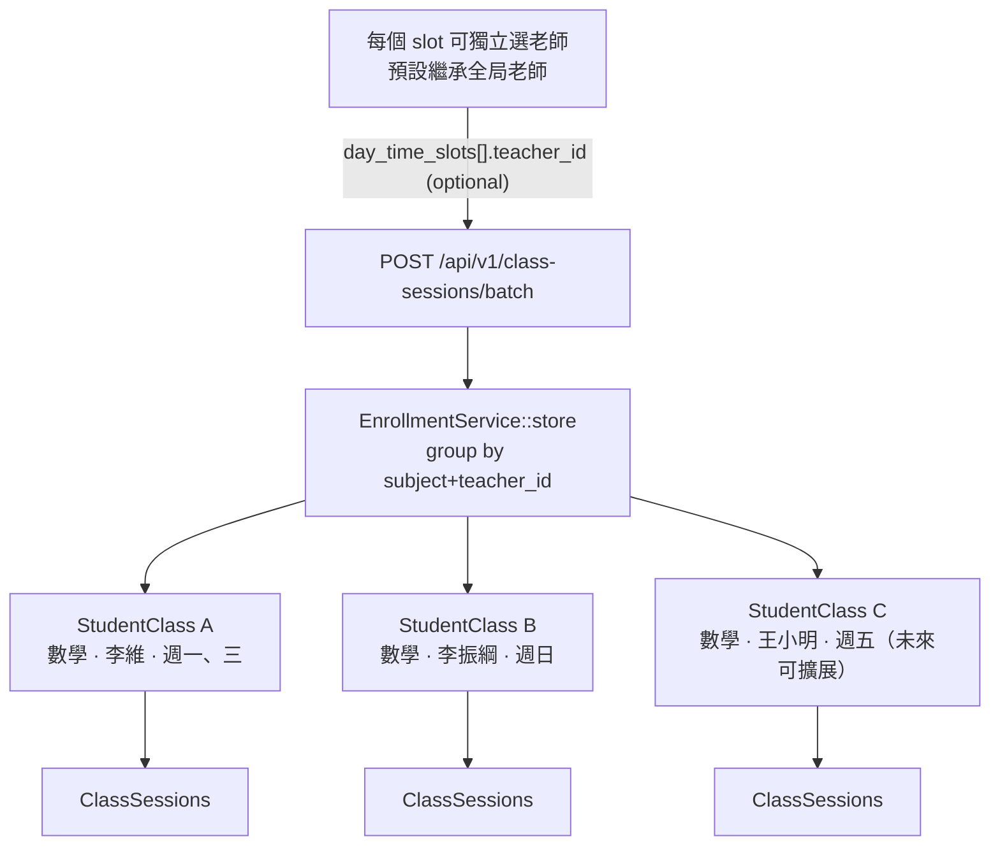

# 多師排課功能

## 設計修正說明

原案使用「雙師」binary toggle，只支援 2 位老師。業界標準做法是 **per-slot teacher override**：每個排課時段格子預設繼承全局老師，可各自覆蓋，自然支援 1、2、3…N 位老師，不需要新的概念或按鈕。

## 核心設計

不新增資料表。`day_time_slots[]` 每個 slot 加選填 `teacher_id`（未設則 fallback 全局 `teacher_id`）。後端按 `(subject + teacher_id)` 分組，各建一筆 `StudentClass`。

## 需修改的檔案

**1. [`frontend/src/components/UniversalClassScheduler.vue`](frontend/src/components/UniversalClassScheduler.vue)**

- **全局老師欄不變**，作為預設值快速填入
- `weekday-slot-row` 尾端加一個「老師」欄位：
  - 預設顯示「同主責老師（姓名）」灰色文字
  - 點擊展開 `SearchableSelect`，可選任意老師
  - 選完後顯示「XX 老師 ✕」badge，點 ✕ 清除回繼承
- `form.day_time_slots[i].teacher_id`：有選則帶該值，未選則帶 null（後端 fallback）
- payload 加 `allow_multi_teacher: true`（只要有任一 slot teacher_id 與全局不同時自動帶入）

**2. [`backend/app/Services/EnrollmentService.php`](backend/app/Services/EnrollmentService.php)**

- `normalizeDayTimeSlotGroups()` 解析時保留 `slot['teacher_id']`（可選）
- 主分組邏輯由「per subject」改為「per (subject + effective_teacher_id)」：
  - `effective_teacher_id` = slot 的 teacher_id ?? 全局 teacher_id
  - 若全部相同 → 行為不變，一個 SC
  - 若有差異 → 拆成多組，各自建 SC with 各自 teacher_id
- `allow_multi_teacher: true` 時跳過 `$dualTeacherWarnings` push

**3. [`backend/app/Http/Controllers/ClassSessionController.php`](backend/app/Http/Controllers/ClassSessionController.php)**

- `batchStore` validation rules 加：
  - `allow_multi_teacher` → `nullable|boolean`
  - `day_time_slots.*.teacher_id` → `nullable|integer|exists:users,id`
- 將 `allow_multi_teacher` 傳入 `EnrollmentService::store`

## 使用者流程

1. 主任點某個星期 slot 的老師欄 → 展開選擇器，選「李振綱」
2. slot 顯示「李振綱 ✕」badge，其他 slot 維持「同主責老師」
3. 送出 → 後端自動按老師分組建立 2（或 N）筆 StudentClass
4. 成功顯示：「已建立 2 筆課程（含多師排課）」

## 範圍外（本次不做）

- 多師課程的合併帳單顯示（維持現有各自計費）
- 多師課表衝堂統一偵測（現有衝堂判斷各組各自檢查）
