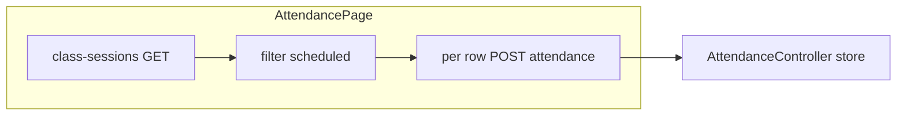
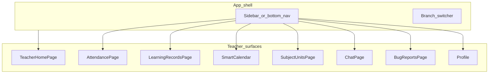

# 老師端整體介面與「待點名」體驗 — 跨部門產品計畫（PM 文件）

## 背景與問題陳述

除 **出缺勤「今日待點名」** 外，本計畫納入 **老師登入後所見的整體介面**：全域殼層（頂欄、側欄、手機底欄、分校切換）、預設首頁 **教學工作台**，以及老師可進入之各功能頁。目標是 **手機與桌機一致的 RWD 可用性**、**減少重複操作與認知負擔**、並讓資安與效能可逐頁驗收。

**待點名次要問題（延續前版）**：使用者需 **先選狀態再按「點名」**、逐列重複；預設多為「到班」，**防呆不足**，操作步數高。

**現況實作（供各部門對照）**

- 前端主畫面：[frontend/src/pages/AttendancePage.vue](frontend/src/pages/AttendancePage.vue) — 「今日待點名堂次」為 `<table>` + `<select>` + 逐列「點名」按鈕；送出為 `POST /api/v1/attendance`，`mark_mode: 'arrival'`。
- 待點名資料來源：同頁以 `GET /api/v1/class-sessions?start&end&per_page=500`（主任另帶 `branch_id`）於前端篩 `status === 'scheduled'`。
- **效能訊號**：老師路徑在 `fetchPendingSessions` 內對 **同一日 `class-sessions` 可能連打兩次**（先取一次算 `todaySessionTotal`，再取一次組 `pending`），屬冗餘 IO，資料組可列為快速 wins。
- 後端路由：[backend/routes/api.php](backend/routes/api.php) — `GET attendance`、`POST attendance`、`GET attendance/ended-sessions`；**目前無「批次點名」專用 API**。

### 老師端整體介面 — 現況盤點（供設計／工程對照）

| 區塊 | 實作位置 | 說明 |
|------|----------|------|
| 登入後預設頁 | [frontend/src/App.vue](frontend/src/App.vue)（`role === teacher` 時 `active = teacher-home`） | 老師進系統先落在教學工作台。 |
| 全域殼層 | [frontend/src/App.vue](frontend/src/App.vue) | 側欄群組 `sidebarNavGroups`（教學工作：工作台、出缺勤、課表與評量、行事曆、科目數、聊天、Bug）；手機 **底欄五格**（工作台／出勤／評量／行事曆／更多）；**分校切換**（多校老師頂欄 chip + 手機 `mobile-branch-bar`）。 |
| 教學工作台 | [frontend/src/pages/TeacherHomePage.vue](frontend/src/pages/TeacherHomePage.vue) | 今日待辦（待點名、待評量 CTA）、本週跨校課表合併、`details` 摺疊日區塊。 |
| 與主任共用頁 | `AttendancePage`、`LearningRecordsPage`、`SmartCalendar`、`SubjectUnitsPage`、`ChatPage`、`BugReportsPage`、`Profile` 等 | 同一 SPA 內切換 `active`，老師與主任 **共用元件** 但導覽入口不同；RWD 問題常出現在 **大表／複雜頁** 與 **殼層擠壓**（底欄 + 分校列）。 |

---

## 產品目標（Success metrics）

| 指標 | 方向 |
|------|------|
| 完成今日待點名所需 **點擊／步驟** | 顯著下降（尤以「全班到齊」情境） |
| **誤操作率**（錯狀態仍送出） | 下降（以確認摘要、非預設路徑加強提示衡量） |
| **RWD 可用性** | 小螢幕不需橫向捲動即可完成單列／批次點名；觸控目標符合 WCAG 建議寬度 |
| **老師殼層首屏體驗** | 教學工作台與底欄導覽在 **360–430px 寬** 下無重疊、無誤觸；**分校切換**與「當前分校上下文」一眼可辨 |
| **跨頁一致性** | 老師常用路徑（工作台 → 出勤／評量／行事曆）**標題、按鈕層級、返回／刷新**行為一致 |
| **API 次數與 payload** | 同頁載入不重複打同一資源；批次送出時 round-trip 可控；工作台首屏避免 **waterfall 過長** |
| **資安與稽核** | 維持分校／角色隔離；敏感操作可追溯（誰、何時、對哪堂、結果） |

---

## 角色情境與範圍

- **老師**：僅能點自己今日堂次（與現行 `class-sessions` 篩選一致；後端仍須複驗）；登入後主要使用 **殼層 + 教學工作台 + 出勤／評量／行事曆／科目數／聊天／Bug／個人資料**。
- **主任／櫃檯**：依分校看「今日已結束但仍 scheduled」之待點名（與現行文案一致）；本計畫中 **待點名區塊** 與老師共用頁面，可一併受惠於 RWD／批次 UX。
- **In scope**：
  - **全域**：老師側欄／手機底欄／「更多」抽屜、分校切換與頂欄空間、密碼變更鎖定時僅能進 profile 的體驗是否足夠清楚。
  - **教學工作台**：今日待辦 CTA、本週課表摺疊與載入／錯誤狀態的 RWD。
  - **出缺勤頁**：「今日待點名」與（可選）**待補點名**若互動可重用。
  - **其他老師常用頁**：至少列 **LearningRecordsPage、SmartCalendar、SubjectUnitsPage** 為第二階 RWD／效能盤點（不強求首版全改程式，但計畫需含 **設計走查清單**）。
- **Out of scope（首版可明確排除）**：刷卡機流程、家長端、變更扣堂商業規則本身（僅改善 **操作與 API 形狀**，不擅自改 `AlertController::tuition` 等規則）。

---

## UI/UX 需求（給設計／前端）

### 0. 老師端全域殼層與教學工作台

- **導覽模型**：釐清「底欄五格」與「更多」內項目的 **優先順序**（是否將通知中心納入老師常用路徑）；避免 **重要 CTA 落在需兩次點擊** 才到達的深處。
- **分校語境**：多校老師在 **工作台（跨校合併課表）** 與 **分校限定頁**（如部分 API 依 `currentBranch`）之間切換時，需 **明確視覺提示**（目前已有跨校提示文案，可強化為標籤／色條）。
- **RWD**：手機同時存在 **底欄 + 分校列 + 頁首按鈕** 時，檢查 **安全區（safe-area）**、捲動區高度、最後一塊內容是否被底欄遮擋；側欄收合行為與桌機 **最小寬度**。
- **教學工作台**：`details` 日區塊在觸控裝置上的 **開合目標區**、本週課表 **資訊密度**（是否需「僅今日」摺疊預設）；與 [frontend/src/pages/TeacherHomePage.vue](frontend/src/pages/TeacherHomePage.vue) 現有 skeleton／錯誤 UI 對齊設計系統。
- **交付物**：除待點名 wireframe 外，補 **老師殼層線框（320／768／1280）** 與「工作台 → 出勤」動線標註。

### 1. 待點名：資訊架構與主要路徑

- **主路徑（80%）**：「多數到班」→ 提供 **一鍵／批次「全部到班」** 或 **依時段批次**（例如同一時段勾選後一次送出）。
- **例外路徑**：遲到、請假、缺席 → **視覺權重高於「到班」**（避免誤觸 absent 仍建議需確認或兩步）。
- **防呆**：送出前 **固定區塊摘要**（學生、時段、科目、狀態、是否扣堂／請假順延提示）；對 **非到班** 或 **批次筆數超過門檻** 強制 `confirm` 或 bottom sheet 確認。

### 2. 元件策略（取代「先下拉再按鈕」）

- **桌機**：可保留表格，但建議 **狀態改為 segmented control / button group**；批次欄 **checkbox + 列操作列**。
- **手機（RWD）**：改 **卡片列表**（每卡：時段、學生、科目、老師、狀態按鈕列、單卡「確認」或整頁底部 **sticky 批次確認**），避免寬表 + `overflow-x` 為主操作路徑。
- **觸控**：主要按鈕最小高度 **44px** 級距；批次與單列層級清楚（避免 sticky 擋住最後一張卡 — 加 `padding-bottom`）。

### 3. 回饋與錯誤

- 批次結果：**成功／失敗分項**（部分失敗時列出 session id 或學生名 + 錯誤原因），避免只顯示「部分失敗」卻無法補救。
- Loading：**整批進行中鎖定重複送出**，單列可選 skeleton 或 row spinner。

### 4. 設計交付物

- Wireframe：**老師殼層**（320／768／1280）+ **待點名** Desktop table + mobile card（建議 `768px` 與現有 [AttendancePage.vue scoped `@media`](frontend/src/pages/AttendancePage.vue) 對齊或整併設計 token）。
- 元件規格：狀態色、按鈕層級、確認 sheet 文案（繁中）；**Material Symbols** 與現有按鈕樣式對齊（見教學工作台）。

---

## 技術方案（給 CTO / 工程）

### 選項 A — 純前端批次（短期）

- 前端迴圈或 `Promise.all`（建議 **有限併發**）多次 `POST /api/v1/attendance`。
- **優點**：不改後端即可上線部分 UX（批次勾選 + 確認）。
- **缺點**：**非原子**：中途失敗會半完成；round-trip 多；需細緻錯誤匯總與重試策略。

### 選項 B — 後端批次 API（建議中長期）

- 新增例如 `POST /api/v1/attendance/batch-mark`（名稱可再定）：body 為 `items: [{ class_session_id, status, ... }]`，**單一 transaction 或明訂「逐筆 commit + 回傳每筆結果」**（需產品決策：要全有或全无還是可部分成功）。
- **重用** [AttendanceController::store](backend/app/Http/Controllers/AttendanceController.php) 內既有驗證／扣堂邏輯，抽出 service 方法避免複製貼上。
- **測試**：Pest Feature 覆蓋「老師越權」「跨分校」「部分失敗」「請假順延」等；與 [docs/AI_REGRESSION_LESSONS.md](docs/AI_REGRESSION_LESSONS.md) 中高風險區（堂數、作廢、評量連動）對照，**不改「核准評量扣堂」架構前提下**僅封裝既有 store 行為。

### CTO 決策點

- 首版採 A 或 B，或 **A 上線 UX + B 跟進** 的階段切割。
- 批次 **最大筆數**（例如 50）與 **timeout** 與 **重試 idempotency**（同一 `ClassSessionID` 短時間重送是否安全）需後端定義。
- **老師殼層**：多數為前端與設計工；若要走「工作台儀表板 **單一 BFF 聚合 API**」則需另排後端工與快取策略，與純前端合併請求二選一。

---

## 資安需求（給資安部經理）

| 項目 | 說明 |
|------|------|
| **認證** | 延續 Bearer token；批次 endpoint 同等 middleware（`role`、`require_campus`）。 |
| **授權** | 每一筆 `ClassSessionID` **後端再驗** 與 token 使用者之關係（老師僅己班；主任僅 `branch_id` 校區）。禁止僅依前端傳 `TeacherID`。 |
| **大量寫入濫用** | 對 `POST attendance`／新批次 API 做 **rate limit**（每使用者每分鐘請求數 + 每請求最大筆數）。 |
| **稽核** | 建議 log：`user_id`、`branch_id`、每筆 `class_session_id`、`status`、結果、request id；敏感欄位不入 log。 |
| **輸入驗證** | 嚴格 whitelist `status`；拒絕未知 `class_session_id` 時回 **404/403 一致策略**（避免列舉）。 |
| **Idempotency** | 定義「重送同一堂已點名」行為（409 + 明確訊息或 idempotent 200），避免重複扣堂。 |
| **老師可見面** | 複驗 `App.vue` 中 **老師不可進主任專屬頁**（僅 `v-if` 渲染差異仍須防 deep link／手改 `active` 若存在）；聊天／Bug 模組依 [docs/CHAT_BUG_SYSTEM.md](docs/CHAT_BUG_SYSTEM.md) 角色矩陣不擴權。 |
| **Token 與 XSS** | 殼層與各頁共用 `localStorage` session；任何新內嵌 HTML／`v-html` 需列入 review；CSP 若未上線則依現行部署慣例做輸入消毒與依賴盤點。 |

---

## 資料與效能（給資料組長／平台）

| 項目 | 說明 |
|------|------|
| **消除重複請求** | 合併 [AttendancePage.vue](frontend/src/pages/AttendancePage.vue) 老師路徑內 **兩次** `class-sessions` 為 **一次**，前端衍生 `todaySessionTotal` 與 `pending`（低風險、立即降載）。 |
| **per_page=500** | 評估實際分校單日上限；若常觸頂，改 **後端「待點名專用」精簡欄位 API** 或 **游標分頁**，減少 JSON 與前端 filter 成本。 |
| **批次寫入** | 若採選項 B，注意 DB lock 時間 — 可能需 **小批次 chunk** 或 **每筆獨立 transaction + 聚合回應**（與產品「全有或全无」一致）。 |
| **重新整理策略** | 批次完成後 **單次** `fetchPendingSessions` + `fetchRecords`，避免 N 次全頁刷新。 |
| **教學工作台首屏** | [TeacherHomePage.vue](frontend/src/pages/TeacherHomePage.vue) 與 [App.vue](frontend/src/App.vue) 內 badge／輪詢邏輯一併盤點：是否可 **合併請求**、降低 **輪詢頻率**、或改 **visibility API** 暫停背景分頁請求（須與產品確認即時性）。 |

---

## 交付里程碑（建議）

1. **M0 — 研究與規格凍結（1 週內）**：確認批次商業規則（全成功 vs 部分成功）、最大筆數、確認文案；**老師殼層走查清單**（頁面清單 + breakpoint）簽核。
2. **M1 — UX + RWD（3–4 週）**：**殼層 + 教學工作台** 線框與高保真優先；接續 **待點名** 手機卡片／桌機表格、批次勾選與確認 sheet；可搭配選項 A。
3. **M2 — 後端批次 + 測試（視選項 B，2–4 週）**：API、rate limit、稽核 log、Pest；前端改打批次。
4. **M3 — 上線與觀測**：前端務必遵守專案 **`npm run deploy`** 同輪更新 `index.html` 與 assets（見 [docs/AI_REGRESSION_LESSONS.md](docs/AI_REGRESSION_LESSONS.md)）；監控 API 錯誤率與 p95；老師端 **Core Web Vitals** 或至少 **首屏請求數** 對照改版前。

---

## 風險與依賴

- **範圍膨脹**：「整個老師介面」易與 **智慧排課大頁** 綁在一起；建議 **分波**：P0 殼層 + 工作台 + 待點名；P1 評量／行事曆重度 RWD。
- **堂數／請假順延**：任何新 API 必須 **沿用** 現行 `AttendanceController::store` 行為，避免重寫商業規則。
- **並行編輯**：兩人同時點同一堂 — 需明確錯誤訊息與前端刷新。
- **無額外文件產出**：本計畫以 Cursor plan 為準；若需正式 PRD／資安 review 表，可再由 PM 匯出到 `docs/`（非本工具自動寫入）。
