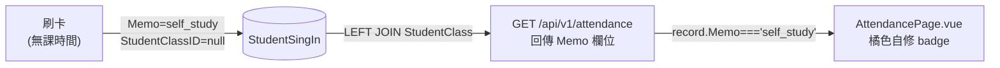

# Phase 2b — 學生自修記錄可視化 PRD
## PRD v1.0 | 狀態：Draft | 2026-04-23

---

## §1 文件資訊

| 欄位 | 內容 |
|---|---|
| 功能名稱 | Student Self-Study Visibility |
| 版本 | v1.0 |
| 狀態 | Draft |
| 作者 | PM Agent |
| 目標角色 | PM → ARCH → DEV → TEST → SEC → REVIEW → DOCS → OPS |
| 前置計畫 | Phase 2 Presence Window（`Memo = 'self_study'` 已實作） |

---

## §2 目標與業務背景

### 痛點

Phase 2 已在資料庫建立 `Memo = 'self_study'` 記錄，但：

1. **後端 INNER JOIN 缺口**：`AttendanceController::index()` 用 `->join('StudentClass')` INNER JOIN，`StudentClassID = null` 的自修記錄被整個過濾掉，API 從不回傳。
2. **前端無自修欄位**：即使 API 修好，表格也沒有 `Memo` 欄，自修與正常出席無法區分。
3. **管理盲區**：主任無法知道學生在非課堂時間進補習班幾次、待多久。

### 業務價值

- 主任可查看學生自修到訪時間與頻率，評估自習室使用率（業界 KPI：space utilization）
- 家長可看到孩子「非上課時間也在補習班」的記錄，提升透明度
- 自修記錄不扣堂、不產生費用（Phase 2 已保證）

### 可量化 KPI

| 指標 | 目標 |
|---|---|
| `Memo = 'self_study'` 記錄出現在出缺勤頁面 | 100% |
| 自修記錄視覺上可與課堂出勤區分 | 視覺驗收 pass |
| API p99 回應時間 | 維持 < 500ms |

---

## §3 範圍

### In Scope

| # | 功能 | 優先 |
|---|---|---|
| FR-001 | 後端 `AttendanceController::index()` 將 `StudentClass` INNER JOIN 改為 LEFT JOIN，讓 `StudentClassID = null` 的自修記錄可被查詢 | P0 |
| FR-002 | `Memo` 欄位已在 `si.*` 的 SELECT 中，確認 API response 包含 `Memo`；無需新增欄位 | P0 |
| FR-003 | 前端出缺勤表格新增「類型」欄，自修記錄顯示 `自修` badge（橘色）；課堂記錄顯示狀態 tag（現有邏輯） | P0 |
| FR-004 | 前端狀態篩選器新增「自修」選項，對應 `Memo = 'self_study'` 過濾 | P1 |

### Out of Scope

- 自修歷史統計報表（另排 Phase 3）
- 自修時數計算或費用（明確不做）
- 家長入口顯示自修記錄（`ParentPortal.vue` 排 Phase 3）
- 手動新增自修記錄的 UI

---

## §4 RACI

| 角色 | 職責 |
|---|---|
| `[FEATURE]` Agent | 後端 Controller 修改 + 前端 Vue 修改 |
| `[TEST]` Agent | Pest Feature Test（FR-001 回歸） + 前端驗收 |
| `[REVIEW]` Agent | Code Review（JOIN 安全性 + 前端 XSS） |
| `[DOCS]` Agent | CHANGELOG 更新 |
| `[OPS]` Agent | 部署與 smoke test |
| 使用者（CEO） | 每 Phase 批准 |

---

## §4b Dependencies

| 項目 | 狀態 |
|---|---|
| Phase 2 `Memo = 'self_study'` 實作（PR 已 merge） | ✅ 確認 |
| `StudentSignIn.StudentClassID` 允許 null（migration） | ✅ 確認（nullable） |
| 無 DB schema 異動 | ✅ 確認 |

---

## §5 User Stories

### US-01：主任查看學生自修記錄

**As a** 主任，  
**I want** 在出缺勤頁面看到學生自修的到離時間，  
**so that** 我可以知道學生在非課堂時間幾點進來、幾點離開。

**AC：**
- GIVEN 學生在無課時間刷進、刷退
- WHEN 主任開啟今日出缺勤頁面
- THEN 該記錄出現在表格中，標示「自修」badge（橘色），無科目、無老師欄、狀態欄顯示「自修」而非「到班」

### US-02：自修與課堂出勤視覺區分

**As a** 主任，  
**I want** 自修記錄有明顯不同的視覺樣式，  
**so that** 我一眼就能區分哪些是上課、哪些是自習。

**AC：**
- 課堂記錄：現有狀態 tag（綠色 present、紅色 absent…）
- 自修記錄：獨立橘色 `自修` badge，替代狀態 tag

### US-03：篩選只看自修記錄（P1）

**As a** 主任，  
**I want** 可以只篩選出「自修」類型的記錄，  
**so that** 我可以快速統計今日或某日的自修到訪人次。

**AC：**
- 狀態篩選器加入「自修」選項
- 選擇「自修」後，表格只顯示 `Memo = 'self_study'` 的記錄

---

## §5b UI/UX 精緻化

### 出缺勤表格（`AttendancePage.vue`）

| 面向 | 規格 |
|---|---|
| 版面層次 | 新增「類型」欄，插在「狀態」欄左側；欄寬 64px |
| 自修 badge 色彩 | `background: var(--color-warning, #f59e0b)`（橘色）；白字；border-radius: 4px；padding: 2px 8px；font-size: 12px |
| 課堂記錄「類型」欄 | 顯示空白（不新增多餘資訊） |
| 空狀態 | 篩選「自修」但無資料時：圖示 + 「今日暫無自修記錄」；非空白 |
| 載入狀態 | 沿用現有 30 秒自動更新機制，無需額外 skeleton |
| 響應式 | 手機版（< 640px）隱藏「類型」欄；自修記錄在「狀態」欄直接顯示橘色 badge |
| 無障礙 | badge 有 `aria-label="自修記錄"`；顏色對比度 ≥ 4.5:1 |

---

## §6 功能需求 FR

| 編號 | 描述 | 優先 | 涉及位置 |
|---|---|---|---|
| FR-001 | `AttendanceController::index()` 第 24 行：`->join('StudentClass as sc', ...)` 改為 `->leftJoin('StudentClass as sc', ...)`；所有依賴 `sc.*` 的 `COALESCE`/`DB::raw` 已有 null fallback，不需額外改動 | P0 | `AttendanceController.php` L24 |
| FR-002 | 確認 API response 的每個 record 包含 `Memo` 欄位（`si.*` 已涵蓋，PR 合併後 smoke test 驗證） | P0 | `AttendanceController.php` |
| FR-003 | `AttendancePage.vue` 出缺勤表格：讀取 `record.Memo`；若 `Memo === 'self_study'` 則在狀態欄顯示橘色「自修」badge，取代原有 `status-tag`；科目欄顯示「—」；老師欄顯示「—」 | P0 | `AttendancePage.vue` |
| FR-004 | 篩選器 `<select v-model="filterStatus">` 新增 `<option value="self_study">自修</option>`；`filteredRecords` computed 新增對 `self_study` 的匹配邏輯（用 `Memo` 欄判斷） | P1 | `AttendancePage.vue` |

---

## §7 非功能需求 NFR

| 編號 | 描述 |
|---|---|
| NFR-001 | LEFT JOIN 不增加額外 DB query；對無 `StudentClass` 的記錄，所有 COALESCE 欄位 fallback 到 null/空字串，不拋 SQL 錯誤 |
| NFR-002 | 現有課堂出勤記錄的 JOIN 行為不變（`StudentClass` 存在時結果與原 INNER JOIN 相同） |
| NFR-003 | 前端不新增 API endpoint；沿用 `GET /api/v1/attendance` |
| NFR-004 | 多校區隔離邏輯不受影響（CampusID 過濾條件沿用） |

---

## §8 技術方向

### 異動檔案

| 檔案 | 異動說明 |
|---|---|
| [`backend/app/Http/Controllers/AttendanceController.php`](backend/app/Http/Controllers/AttendanceController.php) | 第 24 行 `->join` 改 `->leftJoin`（一字之差） |
| [`frontend/src/pages/AttendancePage.vue`](frontend/src/pages/AttendancePage.vue) | 表格 template 加自修 badge 判斷；篩選器加「自修」選項；`filteredRecords` computed 補 self_study 匹配 |

**無 DB migration、無新路由、無 Breaking Change。**

### 資料流

---

## §8b Decision Log

| 日期 | 問題 | 選項 | 選擇 | 理由 |
|---|---|---|---|---|
| 2026-04-23 | 自修記錄放在同一表格還是獨立分頁 | A：同一表格加 badge / B：獨立「自修記錄」分頁 | **A（同一表格）** | 業界（Tutorbase）：所有 attendance type 在同一 roster 顯示，用視覺標籤區分；減少頁面跳轉；改動量最小 |
| 2026-04-23 | LEFT JOIN 後 `sc.*` 欄位 null 處理 | A：後端補 COALESCE / B：前端 fallback | **B（前端 fallback）** | 前端已有 `record.subject_name \|\| '—'` 等 fallback；後端 `si.*` SELECT 已有 COALESCE；不需額外後端改動 |
| 2026-04-23 | 自修 badge 顏色 | 橘色 / 藍色 / 灰色 | **橘色** | 橘色（warning）表示「非正式課堂但有到場」；藍色易與一般狀態混淆；灰色代表停用 |

---

## §9 資安與存取控制

| 面向 | 分析 |
|---|---|
| 存取控制 | `GET /api/v1/attendance` 已有 JWT 驗證 + CampusID 隔離；LEFT JOIN 不改變授權邊界 |
| PII 最小化 | 自修記錄含學生姓名、時間；與現有課堂出勤記錄相同，無新 PII 欄位 |
| XSS | `record.Memo` 在 Vue template 用 `{{ }}` 插值（自動 escape），不使用 `v-html` |
| STRIDE | 無新威脅面；JOIN 修改不影響輸入驗證 |

---

## §10 QA 驗收

### Happy Path

| 場景 | 預期結果 |
|---|---|
| 學生無課時刷進刷退，主任開出缺勤頁面 | 該記錄出現，橘色「自修」badge，科目「—」，老師「—」 |
| 同日有課堂出勤 + 自修記錄 | 課堂記錄顯示原有狀態 tag；自修記錄顯示橘色 badge；兩者共存 |
| 篩選「自修」 | 只顯示 self_study 記錄；課堂記錄隱藏 |
| 篩選「到班」 | 只顯示 Status=present 的課堂記錄；自修記錄隱藏 |

### Edge Cases

| 場景 | 預期結果 |
|---|---|
| 今日無任何自修記錄，篩選「自修」 | 空狀態：圖示 + 「今日暫無自修記錄」 |
| 自修記錄只有 SignInDT（未刷退） | 時段欄顯示「HH:mm –」，無 SignOutDT |
| 學生轉班後 StudentClass 被刪除（StudentClassID 有值但 SC 不存在） | LEFT JOIN 結果與自修相同：科目「—」，老師「—」；不崩潰 |

### Regression

| 場景 | 預期結果 |
|---|---|
| 現有課堂出勤記錄 | JOIN 結果不變（StudentClass 存在時 LEFT JOIN = INNER JOIN） |
| 老師打卡 tab | 不受影響（不查 AttendanceController::index） |

### UI/UX 驗收清單

- [ ] 自修 badge 橘色，白字，contrast ratio ≥ 4.5:1
- [ ] 空狀態有圖示 + 說明文字，非純空白
- [ ] 手機版（< 640px）自修 badge 仍可見
- [ ] 篩選器「自修」選項鍵盤可操作

---

## §11 上線與維運

| 項目 | 說明 |
|---|---|
| **Migration** | 無 |
| **前端部署** | `npm run deploy`（修改 Vue 檔後執行） |
| **Route Cache** | 無新路由 |
| **Feature Flag** | 無（改動為 bug fix 性質，直接上線） |
| **回滾** | `git revert <commit>`；無 DB 破壞性操作，可立即回滾 |
| **Smoke Test** | `GET /api/v1/attendance?date=<today>&branch_id=<id>` 回傳含 `Memo` 欄位的記錄；含 `self_study` 記錄出現在 data[] |

---

## §12 里程碑與優先級

| 優先 | 功能 | 執行 Agent |
|---|---|---|
| P0 | FR-001 LEFT JOIN 修復 | `[FEATURE]` |
| P0 | FR-002 API Memo 欄確認 | `[FEATURE]` |
| P0 | FR-003 前端自修 badge | `[FEATURE]` |
| P1 | FR-004 篩選器「自修」選項 | `[FEATURE]` |

---

## §13 風險 / 假設 / 開放問題

### 業界解法（WebSearch 來源：Tutorbase 2026）

| 風險 | 等級 | 業界標準解法 | 本專案採行 |
|---|---|---|---|
| LEFT JOIN 大量增加 null 記錄拖慢查詢 | 低 | Tutorbase：同一 attendance roster，type 欄區分；不建獨立表 | LEFT JOIN + CampusID where 條件保持選擇性；生產資料量（每日 < 200 筆）可控 |
| 自修與課堂記錄視覺混淆 | 低 | 業界標準：color-coded status badges（attended=綠、no-show=紅、drop-in=橘）| 橘色 badge 替代狀態 tag |

### 假設

- `StudentSingIn.Memo` 欄位長度足夠（varchar，migration 2026_02_07 確認）
- 自修記錄的 `StudentID` 不為 null（SwipeRfidController 建立時帶入）

### 開放問題

無（所有設計決策已在 §8b Decision Log 確定）

---

## §14 Definition of Done

- [ ] **FR-001**：驗證方式：`GET /api/v1/attendance?date=<date>` 回傳含 `Memo = 'self_study'` 且 `StudentClassID = null` 的記錄
- [ ] **FR-003**：驗證方式：`[REVIEW]` Agent 對照 §5b UI/UX 規格，橘色 badge 出現，對比度 pass
- [ ] **FR-004**：驗證方式：篩選器選「自修」後 filteredRecords 只含 self_study 記錄
- [ ] **Regression**：驗證方式：Pest `php artisan test --filter AttendanceController` 全 green（CI）
- [ ] **CHANGELOG**：驗證方式：`[DOCS]` Agent 確認 diff 含版本條目
- [ ] **Smoke Test**：驗證方式：`[OPS]` Agent `curl GET /api/v1/attendance` 200 + Memo 欄位存在
