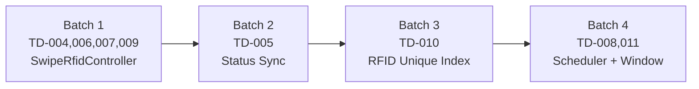

# 技術債清償計畫：TD-004 ~ TD-011

## 清償流程（SOP）

```
[ARCH 評估] → [DEV 實作] → [TEST regression] → [REVIEW 確認] → CI green → merge
```

不走完整 PRD，每個 PR 附對應測試，清償後更新 TECH_DEBT.md + CHANGELOG。

---

## Batch 1 — SwipeRfidController 四項修復（TD-004, TD-006, TD-007, TD-009）

**單一 PR，同一檔案，全部低成本。**

### 涉及檔案

- [`backend/app/Http/Controllers/SwipeRfidController.php`](backend/app/Http/Controllers/SwipeRfidController.php)
- [`backend/tests/Feature/SwipeRfidEdgeCaseTest.php`](backend/tests/Feature/SwipeRfidEdgeCaseTest.php)（新增）

### 改動摘要

**TD-004** — `findMatchingClass`：過濾 leave sessions

```php
// L221，ClassSession query 加一條：
->where('Status', '!=', 'leave')
```

**TD-006** — `handleStudentSwipe`：學生 debounce（對齊老師的 60 秒機制）

```php
// 在 $openRecord 存在的分支最開頭：
const STUDENT_SWIPE_DEBOUNCE_SECONDS = 60;

if ($openRecord) {
    $age = Carbon::parse($openRecord->SignInDT)->diffInSeconds($swipeAt);
    if ($age <= self::STUDENT_SWIPE_DEBOUNCE_SECONDS) {
        return response()->json([...action => 'duplicate_ignored'...], 200);
    }
    // ... 原有 sign_out 流程
}
```

**TD-007** — `handleStudentSwipe` sign_in 分支：若 ClassSession 已有 active StudentSignIn，跳過重複建立

```php
// 在 findMatchingClass 之後、StudentSignIn::create 之前：
if ($classSessionId) {
    $alreadyRecorded = StudentSignIn::where('ClassSessionID', $classSessionId)
        ->whereNull('VoidedAt')->exists();
    if ($alreadyRecorded) {
        return response()->json([...action => 'already_recorded'...], 200);
    }
}
```

**TD-009** — `backfillPresenceWindow`：EndTime null guard

```php
// foreach 最開頭加：
if (!$session->EndTime) {
    Log::warning('presence_window_skip_null_endtime', ['session_id' => $session->id]);
    continue;
}
```

### 測試涵蓋

- leave session 刷卡 → 不建立第二筆 StudentSignIn
- RF bounce（< 60 秒）→ 回傳 `duplicate_ignored`，無新記錄
- 老師手動點名後刷卡 → 回傳 `already_recorded`，無重複記錄，堂數不變
- EndTime = null 的 session → backfill 跳過，無 SignOutDT = 00:00 記錄

---

## Batch 2 — 前端狀態修改同步（TD-005）

**單一 PR，一個前端檔案 + 一個後端 Controller。**

### 涉及檔案

- [`frontend/src/pages/AttendancePage.vue`](frontend/src/pages/AttendancePage.vue)
- [`backend/app/Http/Controllers/ClassSessionController.php`](backend/app/Http/Controllers/ClassSessionController.php)

### 改動摘要

**前端（立即修）**：`saveStatusEdit` 成功後呼叫 `fetchRecords()`，消除本地暫存與伺服器狀態差距。

```javascript
// 在 record._editing = false 之後加：
fetchRecords();
```

**後端（根本修）**：`ClassSessionController::update` 在更新 `ClassSession.status` 時，一併同步該 ClassSession 對應的 active `StudentSingIn.Status`。

```php
// 更新 ClassSession 後：
StudentSignIn::where('ClassSessionID', $classSession->id)
    ->whereNull('VoidedAt')
    ->update(['Status' => $newStatus]);
```

### 測試涵蓋

- PATCH ClassSession → StudentSignIn.Status 同步更新
- 前端修改狀態後重新 fetch，顯示新狀態（regression：30 秒後不回復）

---

## Batch 3 — RFID 唯一性約束（TD-010）

**單一 PR，一個 migration + 後端驗證。**

### 涉及檔案

- 新 migration：`backend/database/migrations/2026_04_23_add_rfid_unique_index_to_student.php`
- [`backend/app/Http/Controllers/StudentController.php`](backend/app/Http/Controllers/StudentController.php)（RFID 綁定入口加驗證）

### 改動摘要

**Migration**：`Student.RFID + CampusID` 加 partial unique index（只在 `RFID IS NOT NULL AND RFID != ''` 時生效，不破壞空值）。

```php
// 上線前先掃現有重複資料：
// SELECT RFID, CampusID, COUNT(*) FROM Student
// WHERE RFID IS NOT NULL AND RFID != ''
// GROUP BY RFID, CampusID HAVING COUNT(*) > 1
// 若有重複需先人工處理
```

**後端驗證**：RFID 綁定 API 加唯一性檢查，重複時回傳 422 + 明確錯誤訊息。

### 注意事項

- migration 執行前需確認生產 DB 無重複 RFID（否則 migration 會失敗）
- 使用 `whereNotNull('RFID')->where('RFID', '!=', '')` partial index 不影響 null/空值的學生

---

## Batch 4 — 孤兒 SignIn 每日自動修復（TD-008）+ 匹配窗口邏輯（TD-011）

**單一 PR，新增 Artisan Command + 修改 findMatchingClass。**

### 涉及檔案

- 新 Command：`backend/app/Console/Commands/CloseOrphanStudentSignIns.php`
- [`backend/app/Console/Kernel.php`](backend/app/Console/Kernel.php)（每日凌晨 2:00 排程）
- [`backend/app/Http/Controllers/SwipeRfidController.php`](backend/app/Http/Controllers/SwipeRfidController.php)（`findMatchingClass` 窗口邏輯）

### TD-008 改動摘要

每日凌晨掃描 `SignOutDT = null` 且 `SignInDT < today`（跨日孤兒）：
1. 找該學生當日最後一堂 `ClassSession.EndTime` 作為 `SignOutDT`
2. 若無堂次，fallback 為 `SignInDT` 當日 `22:00`（補習班關門預設）
3. 設定後觸發 `backfillPresenceWindow`
4. 記錄 `Log::info('orphan_signin_autoclosed', [...])`

### TD-011 改動摘要

`findMatchingClass` 窗口從「距 StartTime ≤ 30 分鐘」改為「StartTime - 30 分鐘 ≤ 刷卡時間 ≤ EndTime」，讓課中到場的學生也能匹配（遲到半堂也算入該課而非被歸為 self_study）。

```php
// 原本：abs($startTime->diffInMinutes($swipeAt)) <= $windowMinutes
// 新邏輯：
$windowStart = $startTime->copy()->subMinutes(30);
$windowEnd   = Carbon::parse($session->SessionDate . ' ' . $session->EndTime);
if ($swipeAt->between($windowStart, $windowEnd)) { ... }
```

### 測試涵蓋

- 昨日孤兒記錄 → Command 執行後 SignOutDT 填入，backfill 觸發
- 今日記錄不受影響
- 學生課中刷卡（StartTime + 45min）→ 匹配成功，非 self_study
- 學生課後刷卡（EndTime + 5min）→ 不匹配，走自修
- 連排課遲到場景驗證

---

## 執行順序與依賴



每個 Batch CI green + merge 後才進行下一個。

---

## 清償後動作

- 更新 `docs/TECH_DEBT.md` 各筆狀態為 Done + 清償日期
- `docs/CHANGELOG.md` 新增一行記錄
- 不需要完整 PRD，不需要 PM sign-off
