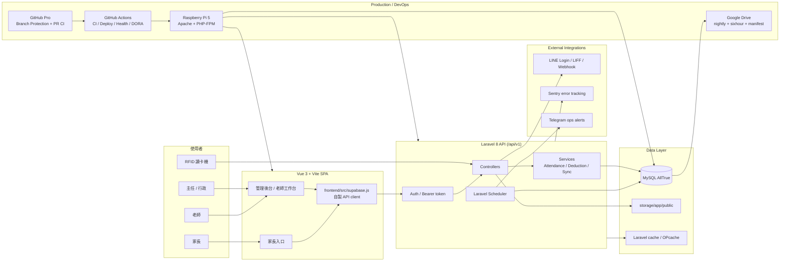
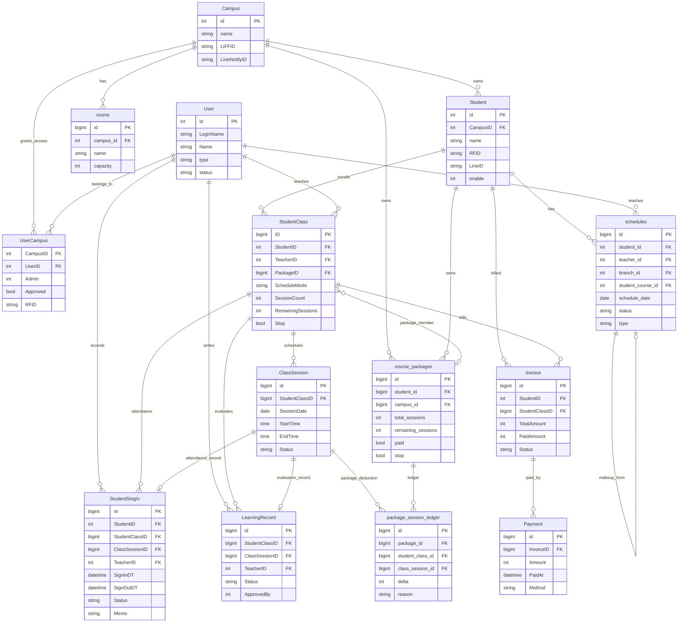

# AllTrue 補習班管理系統

AllTrue 是一套給補習班使用的**全端管理系統**，把「學生、課程、排課、點名、繳費、薪資、學習評量、家長通知」整合在同一個平台，大幅降低人工行政成本。

> **生產環境**：Raspberry Pi 5（/home/admin/）+ Apache / PHP-FPM，24 小時不停機  
> **GitHub**：[jerry200176-png/AllTrue_System](https://github.com/jerry200176-png/AllTrue_System)

---

## 目錄

- [系統現況一覽](#系統現況一覽)
- [功能模組](#功能模組)
- [角色與使用情境](#角色與使用情境)
- [技術架構](#技術架構)
- [Architecture Diagram](#architecture-diagram)
- [ERD - Entity Relationship Diagram](#erd---entity-relationship-diagram)
- [Engineering Maturity](#engineering-maturity)
- [前端頁面清單](#前端頁面清單)
- [目錄結構](#目錄結構)
- [本地開發快速開始](#本地開發快速開始)
- [部署方式](#部署方式)
- [GitHub 同步工作流程](#github-同步工作流程)
- [AI 開發工作流程（Engineering Workflow）](#ai-開發工作流程engineering-workflow)
- [重要文件索引](#重要文件索引)
- [⚠️ 安全警示（必讀）](#️-安全警示必讀)

---

## 系統現況一覽

| 指標 | 現況 |
|---|---|
| **前端頁面** | 30 個 Vue 頁面（管理後台 + 家長入口） |
| **API 端點** | 70+ RESTful routes（`/api/v1/*`） |
| **資料庫** | MySQL，核心表 15+，含核心關聯欄位與效能索引 |
| **部署平台** | Raspberry Pi 5，含自動備份 + Telegram 告警 |
| **RFID 整合** | 刷卡自動點名，60s debounce 防重複，重複卡 422 保護 |
| **LINE 整合** | 家長出缺勤通知、評量推播 |
| **安全加固** | Route throttle、HTTP 安全標頭（HSTS/CSP/nosniff）、密碼最低 8 碼 |
| **自動備份** | 每日 nightly + 每 6 小時快照 → Google Drive 異地同步 + sha256 manifest |
| **工程治理** | GitHub Pro Branch Protection、PR CI、CODEOWNERS、Sentry、UptimeRobot、DORA metrics |

---

## 功能模組

| 模組 | 說明 |
|---|---|
| **學生管理** | 建立學生資料、一般課程主約、加購堂數、歷程管理、學生建立精靈（多步驟） |
| **智慧排課** | 固定週期排課、調課、補課、請假、教室與老師時段協調、排課例外保護 |
| **出缺勤** | 櫃台點名、RFID 刷卡自動登記、缺勤補登、自修記錄管理（含轉換為到班）、孤兒記錄自動清理 |
| **財務管理** | 課程收費、剩餘堂數追蹤、帳單與繳費狀態、月結報表、繳費狀態管理 |
| **方案管理（舊資料維護）** | 多科共用方案（Course Packages）保留歷史查詢與既有方案維護；新課程建立優先使用一般課程 |
| **學習評量** | 老師填寫評量、主任審核（approve/reject）、學習進度留存 |
| **家長入口** | 家長可查課程排程、評量內容、繳費狀態，LINE 推播通知 |
| **教師工作台** | 老師個人課表、打卡狀態卡片、補課申請、月報 XLSX 匯出 |
| **兼職薪資** | 兼職教師薪資計算（含個別覆寫規則）、薪資報表 |
| **課表回報管理** | 老師回報課表異常、主任審核，30s 輪詢即時通知 |
| **通知中心** | 站內通知 + LINE 訊息整合管理 |
| **校區 / 教師管理** | 多分校隔離、教室管理、代課容量三態標籤（有空 ✓ / 尚有容量 ⚠ / 已滿 ✗） |
| **系統管理** | 主任帳號、科目設定、LINE 整合、超級管理員 DB Migration |

---

## 課程加購語意

- 堂數制「加購堂數」會建立一筆新的未繳 `StudentClass` 批次，並替新批次建立 `ClassSession` 上課日期。
- 原課程的 `SessionCount` / `RemainingSessions` 不會被直接追加；主任應在新批次課程詳情查看加購後的上課日期。
- 月結制不走加購批次；請使用「續約月結」延長月數或指定到期日，系統會補齊月結固定時段的未來預排堂次。

## 課程建立語意

- 日常新建課程以「一般課程」為主；同一課程可設定多個固定時段，且每個時段可覆寫科目與老師。
- 多科共用方案屬於舊資料維護能力，保留既有 `CoursePackage` 歷史與財務查詢，不作為主任日常新建入口。

---

## 角色與使用情境

| 角色 | 主要裝置 | 主要操作 |
|---|---|---|
| **主任 / 行政** | 電腦（桌面優先） | 建立學生與課程、統整排課、追蹤繳費、審核評量、查看營運總覽 |
| **老師** | 平板 / 手機 | 查看個人課表、填寫學習評量、打卡、補課申請、月報匯出 |
| **櫃台** | 電腦 / 平板 | 到班點名、RFID 綁定、缺勤補登、家長通知 |
| **家長** | 手機 | 查詢孩子課程進度、評量內容、繳費狀態（含 LINE 推播） |

---

## 技術架構

```
前端（Vue 3 + Vite 5）
  ├── 頁面：frontend/src/pages/*.vue（30 頁）
  ├── API Client：frontend/src/supabase.js（自製 client，實際打 Laravel API）
  └── build → backend/public（SPA 靜態資產）

後端（Laravel 8 / PHP 8+）
  ├── API Routes：backend/routes/api.php（/api/v1/*）
  ├── Controllers：backend/app/Http/Controllers/
  ├── Services：AttendanceEffectsService / SessionDeductionService…
  ├── Models：backend/app/Models/（PascalCase 資料表命名）
  └── Auth：Laravel Sanctum + localStorage Bearer token（alltrue_session）

資料庫：MySQL（生產主用）
  ├── 核心表：Student, StudentClass, ClassSession, StudentSingIn
  ├── 財務表：Invoice, InvoiceItem, Payment
  ├── 評量表：LearningRecord
  ├── 方案表：course_packages, package_session_ledger
  └── 其他：User, UserCampus, Campus, Teacher, rooms, schedules, Notification…

排程任務（Laravel Scheduler）
  ├── 每日 02:30 — CloseOrphanStudentSignIns（清孤兒出缺勤）
  └── 每月 1 日 02:00 — monthly-restore-drill（備份還原演練）

部署
  ├── 伺服器：Raspberry Pi 5（/home/admin/）
  ├── Web Server：Apache / Nginx + PHP-FPM
  ├── 前端 build → backend/public（npm run deploy + OPcache 自動重置）
  └── CI：GitHub Actions（.github/workflows/）
```

---

## Architecture Diagram



---

## ERD - Entity Relationship Diagram

> 精簡展示版，聚焦核心營運資料流。完整欄位以 `backend/database/migrations/` 為準；歷史表名 `StudentSingIn` 是 production schema 的實際拼字。



---

## Engineering Maturity

| 面向 | 已完成能力 | 對標意義 |
|---|---|---|
| Code governance | GitHub Pro `main` Branch Protection、required checks、conversation resolution、禁止 force push/delete | 防止直接覆蓋 production 主線 |
| Review ownership | PR template、CODEOWNERS、高風險模組審查規則 | 堂數、繳費、RFID、CI/CD 變更有明確 owner |
| CI quality gate | PHPUnit、Vite build、PHPStan、migration dry-run、npm/composer audit、coverage gate | merge 前阻擋大多數 regression |
| Deployment | `deploy.yml` 自動部署 Pi、health check、smoke test、rollback path、docs-only skip deploy | 上線流程可重複、可觀測、可回滾 |
| Observability | Sentry、UptimeRobot、Pi health、slow query report、structured logging 預留 | 錯誤、可用性、效能有監控入口 |
| Backup / DR | nightly + sixhour DB backup、Google Drive offsite、sha256 manifest、monthly restore drill | 備份不只存在，還能驗證可還原 |
| Delivery metrics | DORA metrics、branch hygiene、Dependabot | 追蹤交付健康度與依賴風險 |
| AI governance | `.cursorrules`、`AGENTS.md`、`AI_REGRESSION_LESSONS.md`、MemPalace | 將事故教訓轉成可執行規則，降低 AI 重犯 |

### Known Gaps / Roadmap

| 缺口 | 狀態 | 目前策略 |
|---|---|---|
| MySQL PITR / binlog | `TD-015` Open | 先保留 RPO <= 6 小時；另走 DBA/OPS 流程評估 binlog retention、磁碟壓力與 replay drill |
| 第二 maintainer approval | Planned | 單人 repo 暫不強制 1 approval，避免 PR 審核死鎖；有第二位 maintainer 後啟用 |
| Full server DR tabletop | Planned | 每半年演練「全新 Pi + GitHub + Drive + secrets」重建流程 |
| Laravel major upgrade | `TD-014` Open | Laravel 8 安全修補需另開升級專案，不混入日常 bugfix |

---

## 前端頁面清單

| 頁面 | 功能 |
|---|---|
| `DirectorDashboard.vue` | 主任總覽（繳費提醒、今日排課、待審評量） |
| `SmartCalendar.vue` | 智慧排課日曆（調課、補課、請假） |
| `StudentsList.vue` | 學生與課程列表管理 |
| `StudentWizard.vue` | 新學生建立精靈（多步驟） |
| `CourseManagement.vue` | 課程與主約管理 |
| `CoursePackagesPage.vue` | 多科共用方案舊資料維護（不在日常主導覽） |
| `ClassesList.vue` | 班級列表 |
| `AttendancePage.vue` | 出缺勤管理（含自修記錄與轉換） |
| `LearningRecordsPage.vue` | 學習評量（老師填寫 / 主任審核） |
| `BillingList.vue` | 帳單列表 |
| `TuitionCollectionPage.vue` | 收費管理 |
| `TuitionReportPage.vue` | 月結繳費報表 |
| `TeacherHomePage.vue` | 教學工作台（打卡卡片 + 個人課表） |
| `TeachersList.vue` | 教師列表與帳號管理 |
| `TeacherProfilePage.vue` | 老師個人資料與設定 |
| `ParttimePayrollPage.vue` | 兼職薪資計算與報表 |
| `PayReportPage.vue` | 薪資報表總覽 |
| `ScheduleDiscrepancyPage.vue` | 課表回報管理（30s 輪詢） |
| `NotificationsCenter.vue` | 通知中心 |
| `ChatPage.vue` | 即時訊息 |
| `BugReportsPage.vue` | 系統問題回報 |
| `ParentPortal.vue` | 家長入口 |
| `ClassroomManagement.vue` | 教室管理 |
| `SubjectSettingsPage.vue` | 科目設定 |
| `SubjectUnitsPage.vue` | 科目單元管理 |
| `DirectorAccountsPage.vue` | 主任帳號管理 |
| `LineIntegration.vue` | LINE 整合設定 |
| `ProfileCenterPage.vue` | 個人設定中心 |
| `Login.vue` / `Register.vue` / `DirectorRegister.vue` | 登入 / 註冊流程 |

---

## 目錄結構

```
/home/admin/
├── frontend/          # Vue 3 + Vite 5 前端
├── backend/           # Laravel 8 後端（含 public/ 存放前端 build）
├── docs/              # 所有技術文件與操作手冊
├── scripts/           # 維運腳本（備份、部署、git sync）
├── docker/            # Docker 設定（開發用）
├── docker-compose.yml # 容器化開發環境
├── .cursorrules       # AI 開發規則（技術棧摘要 + Engineering Workflow）
└── README.md          # 本文件
```

---

## 本地開發快速開始

### 前端

```bash
cd frontend
npm install
npm run dev       # 開發伺服器 http://localhost:5173
```

### 後端

```bash
cd backend
cp .env.example .env
# 填入 DB_DATABASE, DB_USERNAME, DB_PASSWORD …
composer install
php artisan key:generate
php artisan migrate
php artisan serve  # http://localhost:8000
```

### Docker（一鍵啟動）

```bash
docker-compose up -d
```

---

## 部署方式

### 前端部署（同步到 backend/public）

正常上線不手動執行 `npm run deploy`。前端變更合併到 `main` 後，由 `deploy.yml` 在 Pi 上自動 build、複製到 `backend/public`，並執行 health / smoke test。

手動 `npm run deploy` 只允許在 CI/deploy 掛掉的緊急修復流程中使用，且必須先確認不在 feature branch 上線。

### 生產環境（Raspberry Pi 遠端部署）

```bash
# 透過 feature branch → PR → CI → 自動部署
git checkout -b feat/my-feature
./scripts/git-sync.sh "feat: 你的 commit 訊息"
# → 自動 commit + push + 建立 PR；CI 通過 merge 後自動部署到 Pi
```

詳細步驟見 `docs/DEPLOYMENT.md` 與 `docs/OPERATIONS_RUNBOOK.md`。

---

## GitHub 同步工作流程

- **生產主分支**：`origin/main`（受 Branch Protection 保護，禁止直接 push）
- **開發流程**：feature branch → PR → CI 通過 → merge → 自動部署

### 一般日常更新（最常用）

```bash
git checkout -b feat/my-feature    # 建立 feature branch
./scripts/git-sync.sh "feat: 這次改動內容"  # commit + push + 自動建 PR
# → CI 通過後在 GitHub merge PR
```

### 手動 git 流程

```bash
git checkout -b feat/my-feature
git add .
git commit -m "feat: 說明"
git push -u origin feat/my-feature
gh pr create --fill
```

---

## AI 開發工作流程（Engineering Workflow）

本專案採用**角色分工的多 Phase 開發流程**，任何新功能或修改都必須走以下流程：

```
[PLAN] Product Manager → 14 節 PRD
    ↓ 批准
[ARCH] Tech Lead → 技術設計文件（API 合約、DB schema、模組依賴）
    ↓ 批准（依情況進入 [UX] 和/或 [DBA]）
[DEV] 全端工程師 → 後端 API + 前端 Vue 實作
    ↓ 批准
[TEST] QA 工程師 → PHPUnit 測試（Feature / Unit / Regression，只在 GitHub Actions 執行）
    ↓ 批准
[SEC] Security Engineer → OWASP / STRIDE 資安審查
    ↓ 批准
[REVIEW] Staff Engineer → Code Review
    ↓ LGTM
[DOCS] Technical Writer → CHANGELOG + 操作手冊
    ↓ 完成
[OPS] DevOps Engineer → 部署 + Health Check + Smoke Test
```

**獨立角色（隨時可呼叫，不走主線）：**

| 角色 | 呼叫時機 |
|---|---|
| `[BUG]` Bug Investigator → Fixer | 有 bug 需要調查與修復（B1 偵查 → B2 修復） |
| `[IT]` IT Administrator | Raspberry Pi 異常、SSL、備份、磁碟空間 |
| `[SRE]` Site Reliability Engineer | 系統變慢、刷卡失敗率上升、效能分析 |
| `[LEGAL]` Compliance Officer | 個資法合規、隱私政策 |
| `[DATA]` BI / Analytics Engineer | 統計報表、Dashboard 指標設計 |

> 完整 Phase 規格與每個角色的禁止事項詳見 `.cursorrules`。

---

## 重要文件索引

| 文件 | 說明 |
|---|---|
| `docs/CHANGELOG.md` | 功能異動歷程（最新） |
| `docs/CHANGELOG_ARCHIVE_2026-04.md` | 歷史變更紀錄 |
| `docs/SYSTEM_TECH_GUIDE.md` | 後端技術實作索引（Identity/Swipe/ClassSession/Service 職責） |
| `docs/AI_REGRESSION_LESSONS.md` | AI 已踩過的坑（**改動前必讀**） |
| `docs/DANGEROUS_OPERATIONS.md` | 高風險操作清單與 SOP |
| `docs/DIRECTOR_PAYMENT_ALERT_RULES.md` | 繳費提醒規則（勿擅自修改） |
| `AGENTS.md` | AI / 協作者開工順序與 commit SOP |
| `CONTRIBUTING.md` | GitHub 協作：分支、PR／Issue、CI、安全通報入口 |
| `SECURITY.md`（根目錄） | 漏洞通報方式（GitHub Security）；延伸閱讀 `docs/SECURITY.md` |
| `docs/DEPLOYMENT.md` | 部署步驟 |
| `docs/OPERATIONS_RUNBOOK.md` | 日常維運手冊 |
| `docs/SECURITY.md` | 安全設計說明 |
| `docs/TECH_DEBT.md` | 技術債清單 |
| `docs/FAQ.md` | 常見問題 |
| `docs/使用說明_主任與超級管理員.md` | 使用者操作手冊（中文） |
| `docs/PRD_PARTTIME_TEACHER_PAYROLL.md` | 兼職薪資功能 PRD |
| `docs/SCHEDULE_DISCREPANCY_REVIEW.md` | 課表回報審核流程 |
| `docs/ROLE_PLAYBOOK.md` | 各角色操作手冊 |

---

## ⚠️ 安全警示（必讀）

本專案曾因以下操作發生生產事故，**任何人（含 AI）在執行前必須先閱讀 `docs/DANGEROUS_OPERATIONS.md`**：

| 禁止事項 | 原因 |
|---|---|
| `git push --force origin main` | 會觸發 CI deploy，覆蓋生產 `.env` / routes |
| 直接 push `main` 或繞過 PR | 會跳過 branch protection / review / CI gate，可能直接觸發 deploy |
| 在 `/home/admin/backend/` 執行 `php artisan test` | `RefreshDatabase` 會清空生產資料庫 |
| 在生產後端執行 `config:clear` / `route:clear` 用於 debug | 造成 session / auth 配置錯亂 |
| 直接修改 `backend/.env` | 影響生產認證與資料庫連線 |
| 把 Pi local backup branch 當 code 備份來源 | code 備份以 GitHub protected `main` + PR history 為準，Pi working tree 只視為 deploy target |
| 有備份但沒驗證 restore | 備份不可只看檔案存在；需有 Google Drive offsite、sha256 manifest、monthly restore drill |

> **要跑測試**：`cp -r /home/admin/backend /tmp/backend-test` → 改 `.env` → 在 `/tmp` 跑  
> **CI 問題**：改 `.github/workflows/ci.yml` 後 push，看 GitHub Actions log
> **資料備份**：正式 DB 寫入前先備份；例行備份需能從 Drive 還原到 drill DB，不能直接測 production `AllTrue`

---

*最後更新：2026-04-27*
