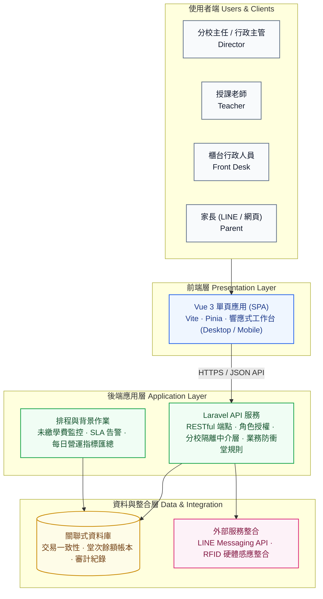

# AllTrue 補習班營運管理系統 (AllTrue Operations Platform)

AllTrue 是專為多校區補習班與教育機構設計的現代化營運管理平台。系統將多校排課、師資調度、學生打卡點名、課後評量、學費帳務與家長 LINE 雙向溝通整合於單一可靠平台，協助教學現場、櫃台行政與分校主任擺脫破碎的紙本與試算表作業，實現標準化、可追蹤的日常營運閉環。

AllTrue is a production tutoring-center operations platform designed for multi-branch educational organizations. It unifies scheduling, attendance, learning records, billing, teacher workflows, and parent communication into a resilient, evidence-driven system.

> **儲存庫公開說明**：本儲存庫曾進行歷史物件機敏資訊脫敏與隱私防護處理。所有正式環境憑證、金鑰與真實學童個資均不存放於本儲存庫中。

---

## 1. 產品核心價值 (Product Overview)

傳統補習班與培訓機構在跨校擴展時，普遍面臨排課衝堂、出缺席漏扣堂、課後評量回饋不及時、學費催繳混亂以及多校區資訊孤島等問題。

AllTrue 的核心設計原則是：**「讓教學專注教學，讓營運清晰可控」**。
- **降噪與專注**：依角色（主任、老師、櫃台、家長）提供高頻工作台，每日僅優先呈現需處理與做決定的項目。
- **嚴謹的業務一致性**：點名、扣堂、請假、補課與學費餘額具備強一致性連動，杜絕人為疏漏。
- **多校區安全隔離**：同一套系統支援跨分校切換管理，同時在後端實施嚴密的分校資料存取邊界。

---

## 2. 解決的營運痛點 (What AllTrue Solves)

AllTrue 涵蓋補習班日常運作的完整生命週期，所有功能皆對應真實教學現場的營運需求：

* **多校區營運與權限隔離 (Multi-Campus Operations)**  
  支援多實體校區架構。主任與行政人員可依授權切換分校，系統在前端提供清楚的校區情境，並在後端中介層強制隔離各分校學生、課表與財務資料。

* **學生資料與學籍管理 (Student Lifecycle Management)**  
  集中管理學生基本資料、就讀學校、家長緊急聯絡資訊、RFID 實體卡綁定狀態與在籍狀態。

* **課程合約與課時額度 (Course & Contract Management)**  
  彈性支援常態單堂、課時套裝合約、多生共約與試聽方案。提供課時儲值、堂次消費追蹤與合約展期管理。

* **智慧排課與防衝堂機制 (Scheduling & Conflict Prevention)**  
  提供視覺化週行事曆與日課表。在排課與調課當下自動驗證「學生時段重複」、「教師跨校衝堂」與「教室時段容量」，杜絕人為排課衝突。

* **師資管理與代課調度 (Teacher Availability & Substitute Workflows)**  
  管理專職與兼職教師授課資格、可用時段與鐘點費率；提供完整代課派任、確認與跨校調度流程。

* **出勤打卡與課時連動 (Attendance & Check-in)**  
  支援 RFID 刷卡感應與手動點名。學生到校即時連動課堂出席狀態，並即刻觸發合約堂數扣抵與紀錄保留。

* **學習評量與成長回饋 (Learning Records & Evaluation)**  
  授課教師課後線上撰寫學習評量與課堂表現；分校主任審核把關後，自動發布至家長端，建立家校信任。

* **請假、補課與調課審批 (Leave, Makeup & Rescheduling)**  
  家長可線上送出請假申請；系統自動依原堂次篩選合適的補課候選時段，主任可線上完成補課媒合、核准免補課或退回申請。

* **學費帳務、催繳與月收試算 (Billing, Receivables & Revenue Visibility)**  
  清楚掌握應收帳款、逾期未繳學生與即將用罄課時；提供繳費單開立、繳費明細紀錄與各分校當月學收試算報表。

* **教師專屬工作台 (Teacher Daily Workspace)**  
  教師每日登入即可掌握第一堂課時間、完成上下課簽到退打卡，並依優先順序完成「現在先做」的教學待辦（點名與評量填寫）。

* **家長入口與 LINE 官方帳號整合 (Parent Portal & LINE Integration)**  
  家長可綁定 LINE 帳號或使用專屬入口，即時接收學童進出校通知、查看每週課表、查閱已審核的課後評量及學費繳納狀態。

* **課表異常回報與稽核 (Operational Discrepancy Tracking)**  
  現場授課若與系統排定不符，老師可於工作台一鍵回報異常；主任接手後確認修正，所有處理歷程均留下完整審計軌跡。

---

## 3. 使用者角色與核心流程 (Users and Core Workflows)

AllTrue 針對四大核心角色設計專屬的操作情境與介面層級：

| 角色 | 核心工作流程 | 主要操作目標 |
|---|---|---|
| **分校主任 / 行政主管<br/>(Director / Admin)** | 每日營運巡檢、家長請假審核、課後評量把關、未繳學費跟進、課表異常處理、當月學收查閱。 | 掌握分校全局營運節奏，維持排課資料真實性，在單一工作台做決策。 |
| **授課老師<br/>(Teacher)** | 上下課打卡簽到退、今日教學任務優先隊列、每週跨校課表檢視、課後學習評量填寫、課表異常一鍵回報。 | 減少行政干擾，聚焦教學品質，清楚掌握當日課務與課堂交辦事項。 |
| **櫃台 / 前台行政<br/>(Front Desk)** | 學生到校刷卡感應、出缺席即時登記、家長現場洽詢、收費入帳登記與學費單據列印。 | 快速處理現場人流，確認學生進出安全與出勤即時記錄。 |
| **家長 / 學童監護人<br/>(Parent)** | LINE 即時接收出勤推播、查看孩子課表與請假申請、查閱老師課後評量與學習狀況、掌握剩餘堂數與帳務。 | 即時了解學童在班安全與學習成效，保持與補習班通暢透明的溝通。 |

---

## 4. 產品介面展示 (Product Screenshots)

> **資料隱私與展示規範說明**：  
> AllTrue 正式環境涉及未成年學童之姓名、家長聯絡電話、校區歸屬與學費收據等高度機敏資訊（PII）。  
> 為了維護真實學童隱私與資訊安全，本儲存庫嚴格禁止截取或上傳包含真實資料的生產畫面。正式的產品介面展示圖集將由專屬脫敏之展示環境（Sanitized Demo Environment）產出後統一部署於官方展示站點。

---

## 5. 系統架構 (System Architecture)

AllTrue 採用現代化分層架構，將使用者介面、API 應用服務、定時排程引擎與持久化資料層清晰解耦：



更詳細的系統架構文件、資料表關係與控制面契約請參閱：
- [`docs/architecture/README.md`](docs/architecture/README.md) — 系統架構全貌與模組設計
- [`docs/CONTROL_PLANE_CONTRACT.md`](docs/CONTROL_PLANE_CONTRACT.md) — 控制面契約與維運規範
- [`docs/MEMPALACE_OPERATIONS_HANDBOOK.md`](docs/MEMPALACE_OPERATIONS_HANDBOOK.md) — 本地輔助系統說明。MemPalace is a non-production, best-effort local system. It has no incident authority, no SLO, and no execution impact on production.

---

## 6. 工程可靠性與品質防護 (Engineering Reliability)

AllTrue 支撐真實教學現場的日常營運，程式碼並非未經驗證的隨意生成產物，而是建立在嚴格的工程規範與自動化防護機制之上：

1. **嚴格限制的變更邊界 (Bounded Change Scope)**  
   *為什麼存在*：避免非預期的擴張修改。每一次修改都必須綁定具體需求或問題單，限定變更檔案範圍，防止不相關模組受波及。
2. **獨立的任務工作區 (Isolated Task Worktrees)**  
   *為什麼存在*：各項開發與修復工作皆在隔離的 Git 工作樹中執行，確保多個任務並行時不產生未提交程式碼污染或覆蓋衝突。
3. **分層自動化迴歸防護 (Layered Automated Regression Suite)**  
   *為什麼存在*：涵蓋後端 PHPUnit 單元與 Feature 測試、前端 Vitest 組件與無障礙性（A11y）測試、核心排課業務防衝堂規則，以及關鍵路徑 E2E 煙霧測試，確保既有排課、計費與扣堂邏輯不產生隱性回退。
4. **受保護的正式分支與同儕審查 (Protected Main & PR Review)**  
   *為什麼存在*：禁止直接推送至主分支；所有程式碼變更必須透過 Pull Request 提出，並由維護者審核合規後始得合併。
5. **完整自動化 CI 檢查閘門 (Continuous Integration Gates)**  
   *為什麼存在*：每次 PR 均自動執行靜態分析、PHPStan 嚴格型別檢查、Vite 前端建置、Gitleaks 機敏資訊掃描與文件完整性檢查。
6. **變更溯源驗證 (Provenance & Traceability)**  
   *為什麼存在*：每一次程式碼修改皆可回溯至所屬任務單、工作階段與驗證紀錄，防止未授權的隨意變更流入生產系統。
7. **受控的正式環境發布 (Protected Deployment & Runtime Verification)**  
   *為什麼存在*：生產環境部署僅由指定流程觸發，部署後自動執行真實環境健康檢查與版本 SHA 驗證，並具備完整的回滾與備份復原措施。
8. **備份與審計機制 (Backup, Audit Logs & Recovery)**  
   *為什麼存在*：財務異動、權限變更與課表修正皆記錄操作軌跡；生產資料庫具備定期備份與復原演練規範。

---

## 7. AI 協同開發理念 (AI-Assisted Engineering)

AllTrue 積極引入 AI 工具協助軟體工程，但我們堅持明確的交付原則：

> **核心精神：AI 加速實作，證據決定完工。**  
> *AI accelerates implementation. Evidence determines completion.*

- **AI 不具備最終決定權**：AI 工具可用於輔助撰寫程式碼、發想測試案例與檢查潛在缺陷，但系統**絕不接受 AI 的「自我宣告完成」**作為驗收標準。
- **證據本位的交付模型**：
  $$\text{產品意圖 (Product Intent)} \longrightarrow \text{限定邊界實作} \longrightarrow \text{自動化測試通過} \longrightarrow \text{PR 與 CI 閘門} \longrightarrow \text{客觀證據驗證} \longrightarrow \text{授權部署} \longrightarrow \text{線上運行驗收}$$
- **嚴禁生產無權限操作**：生產環境部署、金鑰異動、資料修復與版本發布等具備不可逆影響的操作，均由專屬控制面嚴格把關，不賦予任何自動化腳本無限生產權限。

---

## 8. 發布與交付流程 (Delivery Pipeline)

所有進入 AllTrue 系統的變更均遵循嚴格定義的階段狀態，絕不將「程式已撰寫」含糊等同於「已上線驗收」：

```mermaid
graph LR
    classDef step fill:#f8fafc,stroke:#64748b,stroke-width:1.5px,color:#0f172a
    classDef gate fill:#eff6ff,stroke:#2563eb,stroke-width:1.5px,color:#1e3a8a
    classDef prod fill:#ecfdf5,stroke:#059669,stroke-width:1.5px,color:#064e3b

    S1["1. 程式撰寫<br/>Code Written"]:::step
    --> S2["2. 測試通過<br/>Tests Passed"]:::step
    --> S3["3. 建立 PR<br/>PR Opened"]:::step
    --> S4["4. CI 閘門通過<br/>CI Passed"]:::gate
    --> S5["5. 合併至 main<br/>Merged"]:::gate
    --> S6["6. 受控部署<br/>Deployed"]:::prod
    --> S7["7. 運行驗證<br/>Runtime Verified"]:::prod
    --> S8["8. 正式驗收<br/>Accepted"]:::prod
```



### 明確區分的工作狀態：
1. **Code Written（程式已撰寫）**：程式碼修改完成。
2. **Tests Passed（測試通過）**：相關單元、整合與契約測試在本地執行通過。
3. **PR Opened（PR 已開啟）**：建立 Pull Request，附帶完整變更說明與驗證證據。
4. **CI Passed（CI 通過）**：遠端 CI 檢查全數綠燈（無警告、無跳過）。
5. **Merged（已合併）**：審核通過並合併至受保護的 `main` 分支。
6. **Deployed（已部署）**：受控部署管線執行完畢並進入目標環境。
7. **Runtime Verified（運行已驗證）**：線上健康檢查端點正常，版本 SHA 一致。
8. **Production Accepted（正式驗收）**：真實營運路徑無異常，產出線上驗收證據。

---

## 9. 儲存庫地圖與開發指引 (Repository & Development Guide)

### 儲存庫結構 (Repository Map)

| 目錄路徑 | 模組說明 |
|---|---|
| `frontend/` | Vue 3 單頁前端應用程式（包含組件、頁面、狀態管理與單元測試） |
| `backend/` | Laravel API 後端服務（資料庫遷移、控制器、服務層、授權與 Feature 測試） |
| `operations/` | 版本化的生產維運型錄、修正腳本與維運策略 |
| `scripts/` | 治理、CI 檢查、健康驗證、備份與自動化維護工具 |
| `docs/` | 系統架構、SOP、維運手冊、決策紀錄與事故檢討文件 |
| `.github/workflows/` | CI 流程、安全掃描、部署管線與生產驗證配置 |

### 核心參考文件索引

- [系統文件總覽索引 (Documentation Index)](docs/INDEX.md)
- [系統技術指引 (System Technical Guide)](docs/SYSTEM_TECH_GUIDE.md)
- [事故應變指引 (Incident Start Here)](docs/INCIDENT_START_HERE.md)
- [維運標準作業手冊 (Operations Runbook)](docs/OPERATIONS_RUNBOOK.md)
- [部署操作指引 (Deployment Guide)](docs/DEPLOYMENT.md)
- [高風險維運清單 (Dangerous Operations)](docs/DANGEROUS_OPERATIONS.md)
- [代理人與工作區規範 (Agents & Worktrees)](AGENTS.md)

### 本地開發環境設置 (Local Development)

系統開發需具備以下環境：
- PHP 8.2+ 與 Composer
- Node.js 22+ 與 npm
- MySQL 8.0+

```bash
# 取得程式碼
git clone https://github.com/jerry200176-png/AllTrue_System.git
cd AllTrue_System

# 後端環境配置
cd backend
cp .env.example .env
composer install
php artisan key:generate
php artisan migrate

# 前端環境配置
cd ../frontend
npm install
npm run dev
```

> **注意**：本地開發請務必使用獨立的本機資料庫，嚴禁將測試環境指向正式資料庫。

### 品質檢查指令 (Quality Gates)

在提交任何 Pull Request 之前，請確保執行對應的品質檢查：

```bash
# 後端測試
cd backend && php artisan test

# 前端單元測試與型別檢查
cd frontend && npm run test:unit && npm run build

# 文件與控制面完整性檢查
cd ..
node scripts/docs-integrity-check.mjs --strict
node scripts/control-plane-lint.mjs
```

### 維運與部署 (Operations & Delivery)

- 部署工作流程：[`.github/workflows/deploy.yml`](.github/workflows/deploy.yml)
- 生產環境驗證腳本：[`scripts/production-identity.sh`](scripts/production-identity.sh)
- 維運操作目錄：[`operations/catalog.yaml`](operations/catalog.yaml)
- 災難復原與備份策略：[`docs/OPERATIONS_RUNBOOK.md`](docs/OPERATIONS_RUNBOOK.md)

### 資安通報政策 (Security)

若在系統中發現任何潛在安全性弱點或缺陷，請勿在公開 Issue 中張貼金鑰、學童個資或伺服器細節。請依循 [`SECURITY.md`](SECURITY.md) 的安全通報管道聯繫維護團隊。

### 貢獻與開發規範 (Contributing)

參與開發前請詳閱 [`CONTRIBUTING.md`](CONTRIBUTING.md) 與 [`AGENTS.md`](AGENTS.md)。所有變更皆須具備明確的 Issue 關聯、單元測試防護與客觀驗證證據。

---

## 授權條款 (License)

Copyright © 2026 Jerry. All rights reserved. 詳見 [`LICENSE.md`](LICENSE.md)。
