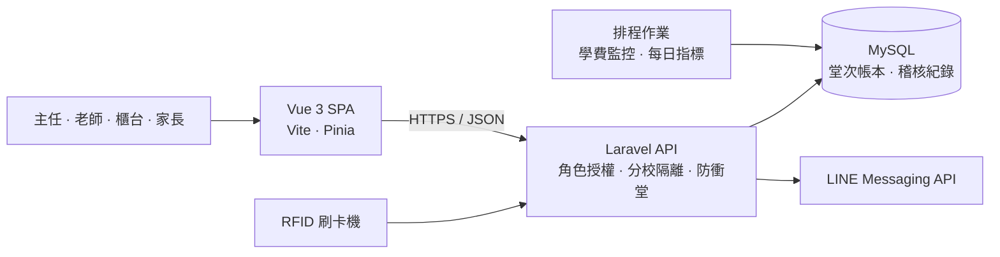

<div align="center">


# AllTrue 補習班營運管理系統

**排課、點名、扣堂、評量、帳務與家長 LINE 溝通，集中在同一套系統。**

[文件索引](docs/INDEX.md) · [系統技術指引](docs/SYSTEM_TECH_GUIDE.md) · [維運手冊](docs/OPERATIONS_RUNBOOK.md) · [事故應變](docs/INCIDENT_START_HERE.md)

</div>

AllTrue 是給多校區補習班使用的營運平台，目前已在正式環境運作。主任、老師、櫃台與家長各有自己的工作台，每天只先看到需要處理的事。

*AllTrue is a production operations platform for multi-campus tutoring centers. It unifies scheduling, attendance, lesson-credit deduction, learning records, billing, and LINE parent messaging.*

> [!IMPORTANT]
> 本儲存庫不存放任何正式環境憑證、金鑰或真實學童個資，也不收錄含真實資料的畫面截圖。發現安全問題請依 [`SECURITY.md`](SECURITY.md) 通報，不要開公開 Issue。

## 功能

| 領域 | 內容 |
|---|---|
| 多校區 | 依授權切換分校；後端強制隔離各分校的學生、課表與帳務資料 |
| 學生與合約 | 學籍、家長聯絡人、RFID 卡綁定；單堂、套裝、多生共約與試聽方案 |
| 排課 | 週行事曆與日課表；排課時檢查學生重複、老師跨校衝堂與教室容量 |
| 師資與代課 | 授課資格、可用時段、鐘點費率；代課派任與跨校調度 |
| 出勤 | RFID 刷卡與手動點名，出席即時連動合約扣堂 |
| 請假與補課 | 家長線上請假；系統推薦補課時段，主任核准或退回 |
| 學習評量 | 老師課後填寫，主任審核後才發布給家長 |
| 帳務 | 應收帳款、逾期提醒、繳費單與收據、各分校當月學收試算 |
| 家長端 | LINE 綁定；到校／離校通知、課表、評量與剩餘堂數 |
| 異常回報 | 老師一鍵回報「現場與系統不符」，主任處理並留下稽核紀錄 |

### 使用角色

| 角色 | 每天主要在做什麼 |
|---|---|
| 分校主任 | 營運巡檢、審請假與評量、追未繳學費、處理課表異常 |
| 老師 | 上下課打卡、點名、填評量、看跨校課表 |
| 櫃台 | 學生刷卡、現場登記出缺席、收費入帳與列印單據 |
| 家長 | 收 LINE 通知、請假、看評量與帳務 |

> [!NOTE]
> 同一儲存庫也包含開發中的 **TrueFit 學習工作台**（功能旗標關閉，尚未上線）。紙本考卷上傳、OCR 與 AI 診斷**尚未實作**。實際狀態以 [`docs/truefit/PROGRAM_STATUS.md`](docs/truefit/PROGRAM_STATUS.md) 為準；產品邊界見 [`docs/truefit/PRODUCT_ARCHITECTURE_BRIEF.md`](docs/truefit/PRODUCT_ARCHITECTURE_BRIEF.md)。

## 系統架構


```mermaid
graph LR
    Users["主任 · 老師 · 櫃台 · 家長"] --> VUE["Vue 3 SPA<br/>Vite · Pinia"]
    VUE -->|HTTPS / JSON| API["Laravel API<br/>角色授權 · 分校隔離 · 防衝堂"]
    SCHED["排程作業<br/>學費監控 · 每日指標"] --> DB
    API --> DB[("MySQL<br/>堂次帳本 · 稽核紀錄")]
    API --> LINE["LINE Messaging API"]
    RFID["RFID 刷卡機"] --> API
```

| 層 | 技術 |
|---|---|
| 前端 | Vue 3、Vite、Pinia、Vitest |
| 後端 | Laravel 8、PHP 8.2、PHPUnit、PHPStan |
| 資料庫 | MySQL 8.0 |
| 整合 | LINE Messaging API、RFID 刷卡 |
| CI / 部署 | GitHub Actions；正式部署只走 [`deploy.yml`](.github/workflows/deploy.yml) |

架構細節見 [`docs/architecture/README.md`](docs/architecture/README.md) 與 [`docs/CONTROL_PLANE_CONTRACT.md`](docs/CONTROL_PLANE_CONTRACT.md)。

## 快速開始

需要：PHP 8.2+ 與 Composer、Node.js 22+、MySQL 8.0+。

```bash
git clone https://github.com/jerry200176-png/AllTrue_System.git
cd AllTrue_System

# 後端
cd backend
cp .env.example .env
composer install
php artisan key:generate
php artisan migrate

# 前端
cd ../frontend
npm install
npm run dev
```

> [!CAUTION]
> 本地只能連本機資料庫。`php artisan test` 會清空資料庫，**絕對不要**對正式環境或正式資料庫執行任何測試或 migration。

## 提交前檢查

```bash
cd backend && php artisan test                 # 後端測試
cd ../frontend && npm run test:unit            # 前端單元測試
npm run build                                  # 含多項契約測試的正式建置
cd .. && node scripts/docs-integrity-check.mjs --strict
node scripts/control-plane-lint.mjs
```

PR 開啟後，CI 會再跑 PHPStan、建置、Gitleaks 機敏掃描與文件完整性檢查。

## 交付流程

每個變更都要依序走完，「程式寫好」不等於「已上線」：

```text
程式撰寫 → 測試通過 → 開 PR → CI 全綠 → 合併 main → 受控部署 → 線上驗證 → 正式驗收
```

- 每個任務在獨立的 git worktree 進行，變更可追溯到任務、工作階段與驗證紀錄。
- `main` 受保護，只能透過 PR 合併。
- 部署後自動檢查健康端點與版本 SHA，並保有回滾與備份復原程序。

> [!TIP]
> **AI 加速實作，證據決定完工。** AI 可以寫程式和測試，但「AI 說做完了」不算驗收；完工要靠測試、CI 與線上證據。AI 代理人的工作規範見 [`AGENTS.md`](AGENTS.md)。

## 目錄結構

| 路徑 | 內容 |
|---|---|
| `frontend/` | Vue 3 前端 |
| `backend/` | Laravel API、migration 與測試 |
| `operations/` | 版本化的維運型錄與修正腳本 |
| `scripts/` | 治理、CI 檢查、健康驗證與備份工具 |
| `docs/` | 架構、SOP、決策紀錄與事故檢討 |
| `.github/workflows/` | CI、安全掃描、部署與正式環境驗證 |

## 延伸閱讀

- [文件總覽 `docs/INDEX.md`](docs/INDEX.md)：所有文件的導航地圖
- [部署指引](docs/DEPLOYMENT.md) · [高風險維運清單](docs/DANGEROUS_OPERATIONS.md) · [維運型錄](operations/catalog.yaml)
- [MemPalace 本地輔助系統](docs/MEMPALACE_OPERATIONS_HANDBOOK.md)：MemPalace is a non-production, best-effort local system. It has no incident authority, no SLO, and no execution impact on production.
- 貢獻規範：[`CONTRIBUTING.md`](CONTRIBUTING.md) · 授權：[`LICENSE.md`](LICENSE.md)
