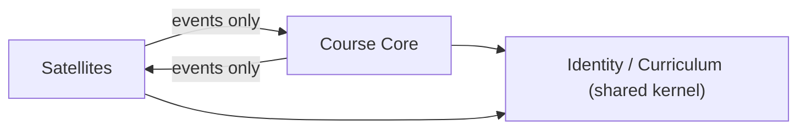

# AllTrue Engineering Architecture Handbook

> **This document is normative.** Every engineer (human or AI) **must** follow these rules.
> A change that violates a rule here is rejected regardless of test status.
> The single thesis of this handbook: **every business fact has exactly one owner; every cross-context effect is an event; money and session-units live in one consistency boundary.**
>
> Navigation: this is the *rules*. The *why* lives in the ADRs (§2). The current code is **not** authoritative over these rules; where code disagrees, the code is debt (see `docs/TECH_DEBT.md`).

---

## 0. Bounded Contexts (the map all rules reference)

| Context | Class | Owns (facts) |
|---|---|---|
| **Identity & Org** | shared kernel | Party (staff/student/parent), Campus, access |
| **Curriculum** | shared kernel | Subject, Room, teacher competency |
| **Enrollment** | core | Contract terms (rate, billing mode, purchased units) |
| **Scheduling** | core | Occurrence (when a class happens), recurrence rule, instructor assignment |
| **Attendance** | core (edge) | AttendanceEvent (swipe/sign-in) |
| **Delivery** | core | SessionRecord (LearningRecord), evaluation |
| **Billing** | core | Invoice, Payment, SessionLedger (units), reconciliation |
| **Payroll** | satellite | accruals, rate cards (read projection of Delivery) |
| **Engagement** | satellite | XP, rank, badges |
| **Communication** | satellite | chat, notifications, announcements |
| **Parent Portal / LINE** | satellite | parent read + feedback + LINE binding |
| **Support** | generic | bug reports |

**Core consistency boundary** = Enrollment + Scheduling + Delivery + Billing (one transactional unit). Satellites are **eventually consistent event consumers**.

---

## 1. Architecture Principles

1. **P1 — Single owner per fact.** Each business fact is written by exactly one context. Everyone else holds a read-only projection. (No fact may have two writers.)
2. **P2 — Events across boundaries.** A context never writes another context's tables. Cross-context effects happen via domain events.
3. **P3 — Money + session-units share one consistency boundary.** Never split "is paid", "units remaining", and "session delivered" across services/transactions. No distributed sagas over money.
4. **P4 — Reads do not write.** A read/query path must not mutate persistent state. Materialization/backfill happens via background jobs triggered by events, never lazily on a GET/page-load.
5. **P5 — Append-only ledgers are the source of truth for quantities.** Balances (units, paid amount) are *derived projections* of an append-only ledger, never primary mutable counters.
6. **P6 — Aggregates are the transactional unit.** Invariants are enforced inside an aggregate root. Cross-aggregate consistency is eventual (events), never a second in-line write.
7. **P7 — Expand/Contract for every change.** No destructive migration; during transition the legacy field is a read-only projection, not a second writer.
8. **P8 — One decision contract, shared by producer and consumer.** Decision/error codes (e.g. scheduling 409s, auth outcomes) are defined once and shared FE↔BE; an unhandled code must fail the build, not reach a user.
9. **P9 — Determinism.** The same inputs produce the same decision. Behavior pinned by golden scenarios + revert-proof tests; recurring-defect families (`AI_REGRESSION_LESSONS §復發家族`) have invariant tests.
10. **P10 — Correctness over simplicity.** When a rule and convenience conflict, the rule wins. Simplicity is achieved by *removing duplicate owners*, not by skipping invariants.

---

## 2. Architecture Decision Records (ADR)

> Format: each ADR is immutable once `Accepted`. Supersede, never edit. New architecturally-significant decisions **require** a new ADR.

**ADR-001 — Occurrence is the single source of truth for "when a class happens."** *Accepted.*
Context: `schedules` and `ClassSession` both represent timing → reconciliation defects (F1/F3/F5, #170/#173/#175/#176). Decision: `Occurrence` is SoR; the recurrence template becomes a *rule + exception events* that only *generate* occurrences and is never read as truth. Consequence: `schedule_discrepancies` is retired by construction.

**ADR-002 — Billing ledger is the single source of truth for money and units.** *Accepted.*
`Invoice/Payment` + append-only `SessionLedger` are authoritative; `StudentClass.{Paid,Charge,Remaining*}` become read-only projections; `preservedDelta` is removed. Retires G-009 dual-truth (#172/#159/#798).

**ADR-003 — The Course Core is one consistency boundary.** *Accepted.*
Enrollment + Scheduling + Delivery + Billing remain one transactional service. Splitting them would require sagas over money; rejected.

**ADR-004 — Cross-context effects are domain events.** *Accepted.*
Replace in-line `approval→deduction→counters`, `swipe→session`, `delivery→payroll` writes with the Event Catalog (§5) via a transactional outbox.

**ADR-005 — All occurrence creation flows through one `SessionWriter`.** *Accepted.*
Today 13 sites create `ClassSession`; this enables duplicates/orphans. One writer enforces the uniqueness invariant (DI-1).

**ADR-006 — One identity model (`Party`); finish `Teacher`→`User` retirement.** *Accepted.* (Wave A in progress.)

**ADR-007 — Read models live off the write path.** *Accepted.* Calendar/eval projections are precomputed/queued; GET never materializes.

**ADR-008 — Shared decision-contract package.** *Accepted.* Decision/error codes are codegen'd into TS+PHP; consumers referencing an unknown code fail the build (prevents the #174 class).

**ADR-009 — Emergency change must reconcile to the canonical source.** *Accepted.* Any out-of-band production change (e.g. emergency manual deploy) must converge `origin/main` to the deployed state before the next normal deploy, and emit a break-glass record. (No permanent divergence between deployed artifact and SoT.)

---

## 3. Domain Invariants (hard — enforced in code + tests)

- **DI-1 (Occurrence uniqueness):** at most one non-cancelled `Occurrence` per `(student, date, start_slot)`. *Test family: cross-course dedup; revert-proof.*
- **DI-2 (Unit conservation):** session units change **only** via a `SessionLedger` append; `remaining = purchased − Σ consumed`; remaining never negative; no path writes a counter directly.
- **DI-3 (Single paid-writer):** only Billing writes paid/amount; `Invoice.paid ≤ Invoice.total`; a voided invoice/payment is terminal; mode change triggers explicit reconciliation, never silent overwrite.
- **DI-4 (Instructor determinism):** an `Occurrence` stores its resolved instructor assignment; payroll/eval read it; no per-row re-resolution at query time.
- **DI-5 (Delivery↔Occurrence 1:1):** one `SessionRecord` per delivered `Occurrence`; void/restore is explicit and audited.
- **DI-6 (Identity singularity):** one `Party` per real person; no fact keyed independently by both `Teacher.id` and `User.id`.
- **DI-7 (Lifecycle closure):** when a Contract closes/settles, no future `scheduled` occurrences may remain (F1 closure).

Every invariant **must** have a revert-proof test (git-stash → ≥1 failing case). A change touching an invariant's family must cite the invariant ID.

---

## 4. State Ownership Rules

| Fact | Owning context | Authoritative store | Allowed elsewhere |
|---|---|---|---|
| When a class occurs | Scheduling | `Occurrence` | read-only projection |
| Is it paid / amount | Billing | `Invoice/Payment` | `StudentClass.Paid` = projection |
| Units remaining | Billing | `SessionLedger` (append-only) | `Remaining*` = projection |
| Who teaches a session | Scheduling | `Occurrence.instructor` | payroll/eval read-only |
| Delivery/eval | Delivery | `SessionRecord` | — |
| Identity | Identity | `Party` | — |

Rules:
- **SO-1:** Writing a fact you do not own = rejected. Subscribe to its event and keep a projection.
- **SO-2:** A projection is rebuildable from its owner at any time; it is never read back as truth by the owner.
- **SO-3:** No column may encode two facts owned by two contexts (decompose `StudentClass`: contract terms ≠ schedule template ≠ billing ≠ counters).

---

## 5. Event Catalog (canonical, published language)

> Events are **past-tense facts**, immutable, ordered per aggregate, delivered via transactional outbox. Payload = aggregate id + minimal facts; consumers enrich via projections.

| Event | Producer | Key payload | Consumers |
|---|---|---|---|
| `ContractActivated` / `Renewed` / `Closed` | Enrollment | contract id, terms, recurrence | Scheduling, Billing |
| `ContractModeChanged` | Enrollment | contract id, old/new mode | Billing (reconcile open invoices) |
| `OccurrenceScheduled` / `Rescheduled` / `Cancelled` | Scheduling | occurrence id, student, slot, instructor | Delivery, Payroll, Parent |
| `LeaveApplied` | Scheduling | occurrence id, leave type | Delivery, Billing |
| `SwipeRecorded` | Attendance | occurrence ref, party, time | Delivery |
| `SessionDelivered` | Delivery | occurrence id, contract id | Billing (consume unit), Payroll (accrue) |
| `EvaluationSubmitted` / `Approved` | Delivery | session record id | Parent, Engagement |
| `SessionUnitConsumed` | Billing | contract id, ledger entry | Enrollment (project remaining) |
| `InvoiceIssued` / `PaymentRecorded` / `PaymentVoided` | Billing | invoice/payment id, amount | Enrollment (project paid), Parent |

Rules:
- **EV-1:** Event names are `AggregatePastTense`. No CRUD names (`*Updated` only if the fact is literally "updated").
- **EV-2:** Within Core, events may be consumed in the same transaction (outbox); to satellites they are async — satellites must be idempotent and tolerate at-least-once.
- **EV-3:** Adding a field to an event = backward-compatible only; removing/renaming = new event version + ADR.

---

## 6. Module Ownership Rules

- **MO-1:** Each context owns its tables exclusively; the table prefix/namespace declares ownership. Foreign reads cross-context go through a published query/projection, not a raw join into another context's tables.
- **MO-2:** `CODEOWNERS` maps each context's directory to an owner; a PR touching a context requires that owner.
- **MO-3:** Shared kernel (Identity, Curriculum) changes require sign-off from **all** core contexts (highest blast radius).
- **MO-4:** A new feature that needs another context's data **subscribes to its events**; it does not add a column to that context.

---

## 7. Dependency Rules



- **DEP-1:** Dependency direction: Satellites → Core is **events only** (no DB/table dependency). Core → Satellites is events only.
- **DEP-2:** Core → shared kernel (Identity, Curriculum) is allowed (read reference data). Shared kernel must not depend on Core.
- **DEP-3:** No cyclic dependency between application services. (Today's service graph is acyclic — keep it so.)
- **DEP-4:** A high-fan-in shared utility (e.g. unit-deduction) is allowed *inside one context* only; it must not become a cross-context backdoor write.
- **DEP-5:** No module imports another context's internal classes; only its published interface/events.

---

## 8. Layering Rules

```
HTTP / Edge  →  Application (use-case service)  →  Domain (aggregate + invariant)  →  Persistence (repository)
                         │
                         └── emits → Outbox (events)
```

- **LY-1:** Authorization is a **single PDP** per request resolved at the edge (PEP middleware); controllers/services **must not** re-decide authorization inline. (Remove scattered inline auth.)
- **LY-2:** Invariants live in the **domain layer** (aggregate), not controllers. Controllers orchestrate; they do not enforce business rules.
- **LY-3:** Persistence is reached through repositories; raw query builder in controllers is debt.
- **LY-4 (P4):** No layer mutates state on a read path.
- **LY-5:** The frontend is a consumer of the decision contract; it must not re-implement domain decisions (e.g. occurrence/leave precedence) — it renders a server projection.

---

## 9. Naming Rules

- **NM-1 Contexts:** `kebab` directory per context (`scheduling/`, `billing/`…); class namespace mirrors context.
- **NM-2 Aggregates:** singular noun (`Occurrence`, `Contract`, `Invoice`, `SessionRecord`).
- **NM-3 Commands:** imperative (`ScheduleOccurrence`, `RecordPayment`).
- **NM-4 Events:** `AggregatePastTense` (`SessionDelivered`).
- **NM-5 Projections:** suffix `Projection`/`View` (`PaidStatusProjection`); never named to look like a SoR.
- **NM-6 Ledgers:** suffix `Ledger`, entries are append-only `LedgerEntry`.
- **NM-7 Enums (status/leave/role):** defined once in the shared decision-contract package; **string literals duplicated across modules are forbidden** (a status value lives in one enum, referenced everywhere).
- **NM-8 Docs:** follow `docs/INDEX.md` prefixes (`RULE_/RUNBOOK_/REF_/MODULE_/GUIDE_/POLICY_/ADR_`).

---

## 10. Future Evolution Rules

- **FE-1:** Every architecturally-significant change requires a new **ADR** (immutable; supersede, don't edit).
- **FE-2:** **Never introduce a second writer** for an existing fact. To change ownership: Expand (new owner writes, old becomes projection) → verify → Contract (delete old writer).
- **FE-3:** A new bounded context starts as an **event consumer** (read model) before it owns any write; it earns write-ownership only via ADR.
- **FE-4:** Splitting a service is allowed **only along proven event seams**; the Core stays whole until events are stable in production (ADR-003).
- **FE-5:** Deprecation: a field/event is marked `deprecated` for ≥1 release with a live projection before removal; removal requires the consuming contexts' sign-off.
- **FE-6:** Recurring-defect families are first-class: any fix in a family must extend the family's invariant test, not just patch the symptom.
- **FE-7:** Reversibility is mandatory: every migration has a working `down()`; every behavioral change is `git revert`-able or backed by a backup + reversible data migration.

---

## Enforcement

- A PR is **non-conforming** (rejected) if it: writes a non-owned fact (SO-1), creates an occurrence outside `SessionWriter` (ADR-005), mutates state on a read path (P4/LY-4), adds a second writer for a fact (FE-2), duplicates a status literal (NM-7), or makes an architecturally-significant change without an ADR (FE-1).
- Invariant-touching changes must cite the `DI-n` and the recurring-defect family.
- This handbook supersedes ad-hoc architectural decisions; conflicts resolve in favor of this document.

*Founding revision — Principal Architect, 2026-06-27. Derived from the production-readiness, production-architecture, and domain-redesign reviews of this repository.*
