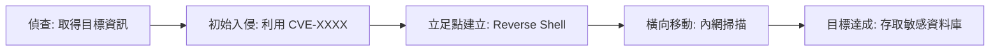

# 資安報告 AI 自動化撰寫指南

> **用途**：讓 AI Agent 無需人工審核，依照業界標準，端對端完成一份完整的資安評估報告。  
> **適用對象**：任何 AI 工具（Claude、GPT、Cursor Agent）執行資安評估任務時。

---

## 一、報告分類速查表

| 報告類型 | 觸發情境 | 產出目標 |
|---------|---------|---------|
| **漏洞評估報告** (Vulnerability Assessment) | 定期掃描、新系統上線前 | 找出已知弱點並排序風險 |
| **滲透測試報告** (Penetration Test) | 委外驗收、年度稽核 | 模擬攻擊路徑、證明可利用性 |
| **安全稽核報告** (Security Audit) | 法規要求、ISO/SOC 認證 | 控制措施符合度 |
| **事件回應報告** (Incident Response) | 資安事件發生後 | 根因分析、補救行動追蹤 |
| **合規性報告** (Compliance) | GDPR、PCI-DSS、ISO 27001 | 缺口分析與改善計畫 |
| **威脅情資報告** (Threat Intelligence) | 持續監控 | 外部威脅趨勢與對策 |

AI 必須在啟動前根據任務描述**自動判斷**適用報告類型，若無法判斷則預設使用「漏洞評估報告」。

---

## 二、AI 執行前置準備（Pre-flight Checklist）

AI 啟動後依序執行以下步驟，**全部完成才能進入掃描階段**：

```bash
# Step 1 — 確認目標範圍 (Scope)
# 從任務描述提取：IP 範圍、網域、應用程式 URL、環境（production/staging）
# 若任務中沒有明確 scope，寫入 UNKNOWN 並在報告首頁標註「待確認」

# Step 2 — 確認授權
# 必須在任務描述中看到以下任一字眼才能繼續：
#   「授權」、「authorized」、「委託」、「pentest agreement」、「bug bounty in scope」
# 若無授權文字，報告第一行寫「⚠️ 未發現授權憑據，AI 停止作業，請補充授權文件」並停止。

# Step 3 — 記錄測試環境
uname -a && date -u && whoami
```

---

## 三、報告統一骨架（Universal Template）

每份報告**無論類型**都必須包含以下章節，AI 逐節填寫：

```
1. 封面頁 (Cover Page)
2. 摘要 (Executive Summary)          ← 給管理層看，不超過半頁
3. 範圍與方法論 (Scope & Methodology)
4. 發現摘要 (Finding Summary)        ← 圖表 + 數字
5. 詳細發現 (Detailed Findings)      ← 每個漏洞一節
6. 風險矩陣 (Risk Matrix)
7. 修補建議 (Remediation Recommendations)
8. 附錄 (Appendix)                   ← 原始掃描輸出、截圖、指令日誌
```

---

## 四、各章節 AI 填寫規範

### 4.1 封面頁

```markdown
# [報告類型] 資安評估報告

| 欄位 | 內容 |
|------|------|
| **目標系統** | {自動填入 scope} |
| **評估期間** | {自動填入 start_date} 至 {自動填入 end_date} |
| **報告版本** | v1.0 — 草稿 (AI 自動生成) |
| **機密等級** | 機密 (CONFIDENTIAL) |
| **測試人員** | AI Agent ({model_name} / {agent_version}) |
| **報告日期** | {今日日期 ISO 8601} |
```

AI 規則：所有 `{...}` 欄位必須在掃描結束後自動填入，不得留空。

---

### 4.2 執行摘要（Executive Summary）

業界格式（**必須包含以下四段**）：

```markdown
## 執行摘要

本次評估針對 {target} 進行 {report_type}，歷時 {duration}。

**整體風險評級：{CRITICAL / HIGH / MEDIUM / LOW / INFORMATIONAL}**

共發現 {total} 項問題，其中：
- 嚴重 (Critical)：{n} 項
- 高風險 (High)：{n} 項
- 中風險 (Medium)：{n} 項
- 低風險 (Low)：{n} 項
- 資訊性 (Informational)：{n} 項

最高優先修補項目為 **{top_finding_title}**（CVSS {score}），
攻擊者可藉此 {one_sentence_impact}。

建議於 {remediation_deadline} 前完成所有 Critical/High 項目修補。
```

---

### 4.3 範圍與方法論

```markdown
## 範圍與方法論

### 測試範圍
| 項目 | 說明 |
|------|------|
| 目標 IP / 網域 | {scope_list} |
| 排除範圍 | {exclusions，若無填「無」} |
| 測試類型 | Black-box / Grey-box / White-box |
| 環境 | Production / Staging / Development |

### 方法論框架
本次測試遵循以下業界標準：
- **OWASP Testing Guide v4.2**（網頁應用程式）
- **PTES (Penetration Testing Execution Standard)**（基礎架構）
- **NIST SP 800-115**（技術資訊安全測試）
- **CVSS v3.1**（漏洞評分）

### 測試階段
1. 偵查 (Reconnaissance)
2. 弱點掃描 (Vulnerability Scanning)
3. 利用 (Exploitation) — 僅限授權範圍
4. 後滲透 (Post-Exploitation) — 僅限授權範圍
5. 報告撰寫 (Reporting)
```

---

### 4.4 詳細發現（每個漏洞的標準格式）

**業界黃金標準：每個發現必須包含 7 個欄位。**

```markdown
### [FIND-{編號:三位數}] {漏洞名稱}

| 欄位 | 內容 |
|------|------|
| **嚴重程度** | 🔴 Critical / 🟠 High / 🟡 Medium / 🟢 Low / ⚪ Info |
| **CVSS v3.1 分數** | {0.0 - 10.0} |
| **CVSS 向量** | `CVSS:3.1/AV:.../AC:.../PR:.../UI:.../S:.../C:.../I:.../A:...` |
| **CWE 編號** | CWE-{number}：{name} |
| **CVE 編號** | CVE-{year}-{number}（若適用，否則填「N/A」） |
| **受影響組件** | {host:port/path} |
| **發現工具** | {tool_name + version} |

#### 描述
{用 2-4 句話解釋這個漏洞是什麼、為何存在。技術人員看得懂即可。}

#### 影響
{如果被利用，攻擊者能做什麼？舉例：「攻擊者可在未授權情況下讀取所有使用者的個資」}

#### 重現步驟 (Proof of Concept)
```bash
# 指令或 HTTP Request，必須可重現
{poc_command_or_request}
```

#### 截圖/證據
{附上掃描輸出片段或截圖路徑，格式：`附錄 A - 圖{n}`}

#### 修補建議
**短期（{urgency_days} 天內）**：{immediate_fix}
**長期（治本）**：{root_cause_fix}

#### 參考資料
- {CVE_link or vendor_advisory}
- {OWASP or CWE link}
```

---

### 4.5 CVSS v3.1 評分規則（AI 自動計算）

AI 必須依照下表**客觀填入**，不得主觀調整：

| 指標 | 選項與說明 |
|------|-----------|
| **攻擊向量 (AV)** | N=網路可達 / A=相鄰網段 / L=本機 / P=實體接觸 |
| **攻擊複雜度 (AC)** | L=低（重現簡單）/ H=高（需特殊條件）|
| **所需權限 (PR)** | N=不需 / L=低權限 / H=高權限 |
| **使用者互動 (UI)** | N=不需 / R=需受害者操作 |
| **影響範圍 (S)** | U=僅限受影響組件 / C=蔓延至其他組件 |
| **機密性影響 (C)** | N=無 / L=部分 / H=全部或關鍵資料 |
| **完整性影響 (I)** | N=無 / L=部分 / H=全部 |
| **可用性影響 (A)** | N=無 / L=降級 / H=完全中斷 |

評分分級對應：
```
9.0 - 10.0 → Critical  🔴
7.0 - 8.9  → High      🟠
4.0 - 6.9  → Medium    🟡
0.1 - 3.9  → Low       🟢
0.0        → Info      ⚪
```

---

## 五、各類報告的額外必填章節

### 5.1 漏洞評估報告（Vulnerability Assessment）

掃描工具清單（AI 依環境選擇）：

```bash
# 網路層
nmap -sV -sC -O --script vuln {target} -oA nmap_output
masscan -p1-65535 {target} --rate=1000

# Web 應用層
nikto -h {target_url} -output nikto_output.txt
nuclei -u {target_url} -t cves/ -o nuclei_output.txt

# 系統強化檢查
lynis audit system --quiet --log-file lynis_output.log

# 容器 / IaC
trivy image {image_name} --format json -o trivy_output.json
trivy fs . --security-checks vuln,secret

# 密碼/憑證外洩
truffleHog git file://. --json > secrets_output.json
```

AI 執行規則：
1. 全部工具執行完畢，將輸出存入 `./scan_results/` 資料夾
2. 解析輸出並對應至「詳細發現」章節
3. 若工具未安裝，在附錄記錄「工具缺失：{tool_name}，建議補充」

---

### 5.2 滲透測試報告（Penetration Test）

額外必填章節：

```markdown
## 攻擊鏈分析 (Attack Chain / Kill Chain)

描述最嚴重的完整攻擊路徑（用 Mermaid 圖表）：



**業務衝擊說明**：若攻擊者實際執行此鏈，預估影響為 {business_impact}。
```

---

### 5.3 事件回應報告（Incident Response）

必須包含時間線（Timeline）：

```markdown
## 事件時間線

| 時間 (UTC) | 事件 | 發現者 | 採取行動 |
|-----------|------|--------|---------|
| {datetime} | 異常偵測觸發 | SIEM 告警 | 通知 SOC |
| {datetime} | 初步鑑識確認入侵 | SOC 分析師 | 隔離受影響主機 |
| {datetime} | 根因分析完成 | IR Team | 修補漏洞 |
| {datetime} | 系統恢復上線 | 系統管理員 | 確認正常運作 |

## 根因分析 (Root Cause Analysis)

**5 個為什麼 (5 Whys)**：
1. 為何系統遭入侵？→ {answer}
2. 為何 {answer} 發生？→ {answer}
3. 為何 ...（依序追溯）

**根本原因**：{root_cause}

## 改善行動追蹤

| 項目 | 負責人 | 期限 | 狀態 |
|------|--------|------|------|
| {action} | {owner} | {date} | 🔄 進行中 |
```

---

### 5.4 合規性報告（Compliance Gap Analysis）

```markdown
## 合規差距分析

### 評估框架：{ISO 27001 / PCI-DSS v4.0 / GDPR / SOC 2 Type II}

| 控制項編號 | 控制項說明 | 現況 | 差距 | 優先級 |
|-----------|-----------|------|------|--------|
| {A.8.1.1} | 資產盤點 | 部分實施 | 缺乏自動更新機制 | 高 |
| {A.9.2.1} | 使用者存取管理 | 已實施 | 無差距 | — |

**整體合規率**：{n}% ({compliant_count}/{total_controls} 項符合)
```

---

## 六、風險矩陣（AI 自動生成）

AI 掃描完成後，必須生成以下矩陣：

```markdown
## 風險矩陣

```
         │ 低影響 │ 中影響 │ 高影響 │ 極高影響
─────────┼────────┼────────┼────────┼──────────
高可能性  │  中風險 │  高風險 │ 嚴重風險│  嚴重風險
中可能性  │  低風險 │  中風險 │  高風險 │  嚴重風險
低可能性  │  低風險 │  低風險 │  中風險 │  高風險
極低可能性│  資訊性 │  低風險 │  低風險 │  中風險
```

各發現項目定位：
- FIND-001：高可能性 × 極高影響 → 🔴 嚴重風險
- FIND-002：中可能性 × 高影響 → 🟠 高風險
```

---

## 七、修補建議優先排序規則

AI 依以下邏輯自動排序並輸出修補計畫：

```
優先級 1（立即，24-72 小時）：CVSS ≥ 9.0，且有公開 PoC 或正在被積極利用
優先級 2（短期，2 週內）：CVSS 7.0-8.9，或 CVSS < 7.0 但涉及身份驗證繞過
優先級 3（中期，1 個月內）：CVSS 4.0-6.9
優先級 4（長期，季度計畫）：CVSS < 4.0、設定最佳化、稽核日誌補強
```

輸出格式：

```markdown
## 修補優先計畫

### 🔴 立即處理（72 小時內）
1. **[FIND-001] {漏洞名稱}**
   - 動作：{具體指令或設定步驟，必須可執行}
   - 驗證方法：{如何確認已修補成功}

### 🟠 短期處理（2 週內）
...
```

---

## 八、附錄規範

```markdown
## 附錄 A — 工具版本清單
| 工具 | 版本 | 指令 |
|------|------|------|
| nmap | {version} | `nmap --version` |
| nuclei | {version} | `nuclei -version` |

## 附錄 B — 完整掃描指令日誌
{逐行記錄所有執行過的指令，含時間戳}

## 附錄 C — 原始掃描輸出
{嵌入關鍵片段，或標注檔案路徑}

## 附錄 D — 術語表
| 術語 | 說明 |
|------|------|
| CVSS | Common Vulnerability Scoring System，通用漏洞評分系統 |
| CVE | Common Vulnerabilities and Exposures，通用漏洞揭露 |
| PoC | Proof of Concept，概念驗證（攻擊可行性証明）|
```

---

## 九、AI 自動輸出格式與檔名規範

AI 完成後必須輸出以下檔案結構：

```
security_report_{target_sanitized}_{YYYY-MM-DD}/
├── REPORT.md                    ← 主報告（人類可讀）
├── REPORT_EXECUTIVE.md          ← 僅執行摘要（給管理層）
├── findings.json                ← 結構化發現（機器可讀）
├── remediation_plan.md          ← 修補計畫（獨立文件）
└── scan_results/
    ├── nmap_output.xml
    ├── nuclei_output.txt
    └── ...（所有原始輸出）
```

`findings.json` 格式（供後續自動化追蹤）：

```json
{
  "report_id": "VA-{YYYY}-{NNN}",
  "generated_at": "{ISO8601}",
  "target": "{scope}",
  "summary": {
    "critical": 0,
    "high": 0,
    "medium": 0,
    "low": 0,
    "informational": 0
  },
  "findings": [
    {
      "id": "FIND-001",
      "title": "",
      "severity": "critical|high|medium|low|informational",
      "cvss_score": 0.0,
      "cvss_vector": "",
      "cwe": "",
      "cve": "",
      "affected_component": "",
      "description": "",
      "impact": "",
      "poc": "",
      "remediation_short": "",
      "remediation_long": "",
      "status": "open|in_progress|resolved|accepted_risk",
      "discovered_at": ""
    }
  ]
}
```

---

## 十、品質門檻（AI 自我檢核，輸出前必跑）

AI 在輸出最終報告前，必須逐項確認：

```
[ ] 每個 FIND-XXX 都有完整的 7 欄位（嚴重程度、CVSS、CVSS向量、CWE、CVE、組件、工具）
[ ] Executive Summary 包含整體評級、各嚴重度數量、最高風險項目
[ ] 每個漏洞都有可執行的 PoC 指令或 HTTP Request
[ ] 每個漏洞都有具體可操作的修補建議（不是「請修補此漏洞」這種廢話）
[ ] 風險矩陣已填入所有發現
[ ] 修補計畫按優先級排序
[ ] findings.json 格式合法（JSON validate）
[ ] 附錄包含所有掃描工具的原始輸出片段
[ ] 報告中無空白的 {placeholder} 欄位
[ ] 封面頁日期、版本、測試人員已填入
```

若任何一項未通過，AI 必須補充完成後再輸出，**不得輸出含空欄位的報告**。

---

## 十一、常見失誤與禁止事項

| 禁止行為 | 正確做法 |
|---------|---------|
| 寫「建議更新系統」（沒有具體版本） | 寫「更新 OpenSSL 至 3.3.x，執行 `apt upgrade openssl`」 |
| CVSS 分數憑感覺給 | 依向量公式計算，附完整向量字串 |
| PoC 只寫「可利用此漏洞」 | 附可重現的指令、curl、或 Burp Suite Request |
| 發現欄位留空 | 若無資訊填「N/A - 原因說明」 |
| 未區分 production/staging 影響 | 明確標注受影響的環境 |
| 修補建議只針對症狀 | 同時提供短期（補丁）與長期（架構改善）兩種建議 |
| 報告超過 50 頁還沒摘要 | Executive Summary 永遠在第一章，不超過一頁 |

---

## 十二、AI 啟動指令範本

將以下 prompt 貼給 AI，即可啟動完整自動化報告流程：

```
請依照 docs/SECURITY_REPORT_AI_GUIDE.md 的規範，對以下目標執行完整的漏洞評估並產出報告：

目標：{target_ip_or_url}
環境：{production / staging}
授權文件：{附上授權聲明或輸入「本次為內部授權測試，目標為自有系統」}
報告類型：{漏洞評估 / 滲透測試 / 安全稽核 / 事件回應}（可省略，AI 自行判斷）
特別關注：{例如：重點檢查 API 認證、SQL Injection、Docker 配置}（可省略）

請完整執行 Pre-flight Checklist → 掃描 → 分析 → 撰寫報告，
最後輸出 REPORT.md + findings.json，無需等待人工確認每個步驟。
```

---

*本指南版本：v1.0 | 參考標準：OWASP TG v4.2、PTES、NIST SP 800-115、CVSS v3.1*
