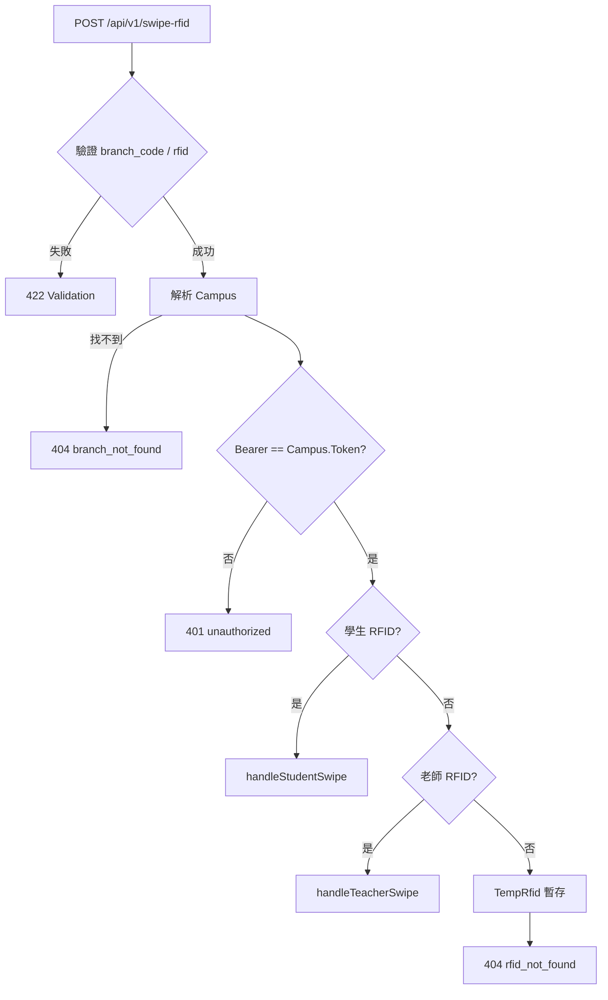

# swipe-rfid API 說明文件

本文件描述 AllTrue 補習班管理系統中，供讀卡機／樹莓派等裝置呼叫的 **RFID 刷卡 API**。內容依後端實作：`POST /api/v1/swipe-rfid`（`SwipeRfidController::swipe`）。

---

## 1. 用途與流程概覽

- **用途**：讀卡機送出「分校」與「RFID 字串」，後端判斷為**學生**或**老師**，並建立或更新當日**到班／離班**紀錄。
- **認證**：使用 **HTTP `Authorization: Bearer <Token>`**，Token 必須與該分校在資料庫 `Campus` 表中的 **`Token` 欄位**完全一致（見下方「認證」）。
- **路由**：公開端點（無 Laravel `auth` middleware），但 **必須通過 Bearer 與分校 Token 驗證**。



---

## 2. 端點

| 項目 | 說明 |
|------|------|
| **Method** | `POST` |
| **Path** | `/api/v1/swipe-rfid` |
| **完整 URL 範例** | `https://<你的網域>/api/v1/swipe-rfid` |
| **Content-Type** | `application/json` |

---

## 3. 認證

| 標頭 | 格式 | 說明 |
|------|------|------|
| `Authorization` | `Bearer <Token>` | `<Token>` 為該分校 `Campus.Token`（資料庫儲存值，需**完全一致**） |

- 若未帶 `Authorization`、格式不是 `Bearer ...`、或 Token 與該分校 `Campus.Token` 不符 → **HTTP 401**，body 見「錯誤回應」。

---

## 4. 請求本文（JSON）

| 欄位 | 型別 | 必填 | 限制 | 說明 |
|------|------|------|------|------|
| `branch_code` | string | 是 | 最長 32 字元 | 分校識別，見下方「分校解析規則」 |
| `rfid` | string | 是 | 最長 32 字元 | 卡片讀到的 RFID 字串（通常為十六進位，不含分隔符；實際格式須與資料庫 `Student.RFID` / `Teacher.RFID` 一致） |

### 4.1 `branch_code` 解析規則（後端實作順序）

1. 若 `branch_code` **為純數字**：以 `Campus::find($branchCode)` 依 **主鍵 ID** 查詢。
2. 否則：以 `Campus::where('code', $branchCode)->first()` 依 **`code` 欄位**查詢。
3. 若仍找不到：以 `Campus::where('name', 'like', "%{$branchCode}%")->first()` 做**名稱模糊比對**（第一筆命中即採用）。

找不到任何分校 → **HTTP 404**，`error: branch_not_found`。

---

## 5. 業務邏輯摘要

### 5.1 學生（`Student`）

- 查詢條件：`Student.RFID = rfid` 且 `Student.CampusID = 分校ID` 且 `Student.enable = 1`。
- **若當日已有「未離班」紀錄**（`StudentSignIn`：同日 `SignInDT`、且 `SignOutDT` 為 `null`，取最新一筆）→ 視為 **離班**：更新該筆 `SignOutDT`、`MDT` → **HTTP 200**，`action: sign_out`。
- 否則視為 **到班**：
  - 透過 `findMatchingClass()` 嘗試對應課程／堂數（見下）。
  - 建立 `StudentSignIn`（`Memo` 固定為字串 `swipe-rfid`）。
  - 若有對應到 `StudentClass` 且尚未扣堂，會呼叫 `SessionDeductionService::deductOnAttendance`（點名成功才扣堂）。
  - **HTTP 201**，`action: sign_in`。

#### `findMatchingClass`（到班時對應課程）

1. **優先**：當日 `ClassSession`（`SessionDate` 為刷卡當日），且關聯的 `StudentClass` 為該學生、`Stop = 0`。在開始時間 **±30 分鐘**內，取與刷卡時間差距最小者。
2. **否則**：該學生有效區間內的 `StudentClass`（`Stop = 0`、`StartDate`／`EndDate` 合理），比對 `week1`～`week6` 與 `time1`～`time6` 是否符合**當日星期**與**時間 ±30 分鐘**。
3. 若皆無 → 仍會建立簽到紀錄，但課程相關欄位可能為 `null`。

### 5.2 老師（`Teacher`）

- 查詢條件：`Teacher.RFID = rfid` 且 `Teacher.CampusID = 分校ID` 且 `Teacher.Enable = 1`。
- **若當日已有未離班紀錄**（`TeacherSignIn`：同日 `SignInDT`、`SignOutDT` 為 `null`）→ **離班** → **HTTP 200**，`action: sign_out`。
- 否則 **到班**：新建 `TeacherSignIn` → **HTTP 201**，`action: sign_in`。

### 5.3 非學生亦非老師

- 以 `TempRfid::updateOrCreate(['CampusID' => $campusId], ['RFID' => $rfid])` 暫存（每分校一筆會被覆寫）。
- **HTTP 404**，`error: rfid_not_found`；回應內仍可能帶 `campus.TelegramToken` 供前端／通知整合使用（見下方範例）。

---

## 6. 成功回應

### 6.1 學生到班

- **HTTP 201**
- 重點欄位：

| 欄位 | 說明 |
|------|------|
| `ok` | `true` |
| `type` | `"student"` |
| `action` | `"sign_in"` |
| `record` | 新建的 `StudentSignIn` 模型序列化 |
| `student` | `id`, `name`, `TelegramID`, `TelegramID1`, `TelegramID2` |
| `class` | 若有對應課程：`id`（`StudentClass.ID`）、`teacher_id`；否則 `null` |
| `campus` | `TelegramToken`（可能為 `null`） |

### 6.2 學生離班

- **HTTP 200**
- `action`: `"sign_out"`，其餘結構類似到班（`record` 為更新後的簽到紀錄）。

### 6.3 老師到班

- **HTTP 201**
- `type`: `"teacher"`，`action`: `"sign_in"`  
- `teacher`: `id`, `name`（`T_Name`）  
- `campus`: `TelegramChatID`, `TelegramToken`

### 6.4 老師離班

- **HTTP 200**
- `action`: `"sign_out"`，`record` 為 `fresh()` 後的模型。

---

## 7. 錯誤回應

| HTTP | `error` | 說明 |
|------|---------|------|
| **422** | Laravel 驗證錯誤 | `branch_code` / `rfid` 缺漏或超長 |
| **404** | `branch_not_found` | 分校解析失敗 |
| **401** | `unauthorized` | Bearer 缺失或與 `Campus.Token` 不符 |
| **404** | `rfid_not_found` | RFID 未綁定學生或老師；已寫入 `TempRfid` |

### 7.1 `branch_not_found` 範例

```json
{
  "ok": false,
  "error": "branch_not_found",
  "message": "分校代碼不存在"
}
```

### 7.2 `unauthorized` 範例

```json
{
  "ok": false,
  "error": "unauthorized",
  "message": "Authorization Bearer Token 無效或未提供"
}
```

### 7.3 `rfid_not_found` 範例

```json
{
  "ok": false,
  "error": "rfid_not_found",
  "message": "RFID 未綁定學生或老師（已暫存，請於 5 分鐘內綁定）",
  "campus": {
    "TelegramToken": "<可能為 null 或實際 Bot Token>"
  }
}
```

> 註：「5 分鐘內綁定」為 API 訊息文字；實際暫存生命週期請以 `TempRfid` 相關流程／排程為準。

### 7.4 伺服器例外

驗證與業務流程中若發生未捕捉以外的例外，Laravel 會依設定回傳 **500**（controller 內 `catch` 後會 `throw $e`，不吞錯）。

---

## 8. 與讀卡機整合注意事項

1. **Token 安全**：`CAMPUS_TOKEN` 等同資料庫機密，勿寫入版本庫；建議用 systemd `EnvironmentFile` 或主機權限保護的設定檔。
2. **`rfid` 格式一致**：讀卡程式輸出的字串（例如大寫十六進位、長度）須與後台為學生／老師綁定的 `RFID` 欄位一致。
3. **`branch_code` 建議**：優先使用分校的 **`code`**（如 `daan`），避免依賴名稱模糊比對造成誤判。
4. **HTTP 狀態**：客戶端應同時判斷 **status code** 與 body 的 `ok` / `error`；成功到班為 **201**、離班為 **200**。
5. **Telegram**：學生成功刷卡時，客戶端可依 `student.TelegramID*` 與 `campus.TelegramToken` 自行發送通知（專案內 `GetRFID.py` 即為一例）。

---

## 9. 請求範例（cURL）

```bash
curl -sS -X POST "https://daan.lifenet.com.tw/api/v1/swipe-rfid" \
  -H "Content-Type: application/json" \
  -H "Authorization: Bearer <Campus.Token>" \
  -d '{"branch_code":"daan","rfid":"85570EE33F"}'
```

---

## 10. 相關程式位置（開發者）

| 項目 | 路徑 |
|------|------|
| 路由 | `backend/routes/api.php`（`Route::prefix('v1')` 內 `POST swipe-rfid`） |
| 控制器 | `backend/app/Http/Controllers/SwipeRfidController.php` |
| 樹莓派範例客戶端 | `scripts/raspberry-pi/GetRFID.py` |

---

## 11. 與 `POST /api/v1/attendance/swipe` 的差異（參考）

- `swipe-rfid`：**Bearer = `Campus.Token`**，body 為 `branch_code` + `rfid`，專給分校讀卡機。
- `attendance/swipe`：使用 **`api_key` middleware** 與不同 body 格式，流程與簽到規則不同；測試步驟可見 `backend/docs/rfid_swipe_test_steps.md`。

若僅要整合「分校門口讀卡機」，請以 **本文件 `swipe-rfid`** 為準。

---

## 12. 疑難排解：讀卡機出現 `404`、`<!DOCTYPE html>`、`invalid_json`

### 12.1 先分辨：是 **Apache/HTML** 還是 **Laravel/JSON**

| 現象 | 代表意義 |
|------|----------|
| 回應內容是 **HTML**，標題含 `404 Not Found`、`Apache/2.x` | 請求 **沒有進到 Laravel**，多為 **網址或虛擬主機 DocumentRoot 設定錯誤**。 |
| 回應是 **JSON**，含 `"ok":false`、`"error":"branch_not_found"` 等 | 已進到 Laravel；再依 `error` 與 HTTP 狀態排查業務邏輯。 |

後端路由實作為 **`POST` `/api/v1/swipe-rfid`**（見 `backend/routes/api.php`）。若在**瀏覽器網址列**直接開此路徑，送出的是 **GET**，即使 Laravel 已掛好，也可能得到 **405** 或路由層級的 404；但像你截圖那樣出現 **`Apache/2.x` 的 HTML「Not Found」**，代表 **連 `public/index.php` 都沒走到**，問題在 **虛擬主機 DocumentRoot / rewrite**，不是刷卡程式 body。

**先驗證網域是否已掛上 Laravel**（同網域、公開 GET）：

```bash
curl -sS -i "https://pi.lifenet.com.tw/api/health"
```

- 預期大致為 **HTTP 200** 且 body 含 `{"ok":true`（見 `routes/api.php` 的 `/api/health`）。
- 若仍是 **HTML + Apache**：`pi.lifenet.com.tw` 的 **DocumentRoot 必須改為專案的 `backend/public`**，並啟用 `mod_rewrite`、`AllowOverride All`（`backend/public/.htaccess` 才能把 `/api/...` 轉給 `index.php`）。

**部署請對照** `docs/DEPLOYMENT.md`、`docs/OPERATIONS_RUNBOOK.md`。

### 12.2 `branch_code` 與 `Authorization` 不可弄反

- JSON 本文的 **`branch_code`**：分校代碼或 ID（例如 `daan`、或數字字串主鍵），**不是** `Campus.Token`。
- HTTP 標頭 **`Authorization: Bearer …`**：才放 **該分校的 `Campus.Token`**（機密）。

若程式把 Token 印成 `BranchCode:` 並當作 `branch_code` 送出，即使 URL 正確，也可能得到 **`branch_not_found`**（JSON）；若目前仍是 HTML 404，則須先修正 **12.1 的網址／主機**。

### 12.3 在樹莓派上快速驗證（建議）

在 Pi 上執行（將 `<TOKEN>`、`<分校 code>` 換成真實值）：

```bash
curl -sS -i -X POST "https://pi.lifenet.com.tw/api/v1/swipe-rfid" \
  -H "Content-Type: application/json" \
  -H "Authorization: Bearer <TOKEN>" \
  -d '{"branch_code":"<分校 code 例如 daan>","rfid":"TEST"}'
```

- 若仍看到 **HTML** 與 Apache 404：請檢查 **實際呼叫的網域** 之 Apache 虛擬主機是否將 `DocumentRoot` 指向 `backend/public`（各校應使用已部署的 **`https://<分校>.lifenet.com.tw`**，例如大安為 `daan.lifenet.com.tw`）。
- 若回 **JSON**（例如 401 / 404 `branch_not_found`）：表示 API 已通，再對照本文件第 7 節調整 Token 與 `branch_code`。

### 12.4 與專案內建議腳本的對應

請使用 **`scripts/raspberry-pi/GetRFID.py`** 的環境變數區分：

- `BRANCH_CODE` → 對應 API 的 `branch_code`
- `CAMPUS_TOKEN` → 對應 `Authorization: Bearer`

若你使用樹莓派上的自訂讀卡腳本（檔名不限），請自行核對變數是否與上述一致；本專案維護的範例為 `scripts/raspberry-pi/GetRFID.py`。
