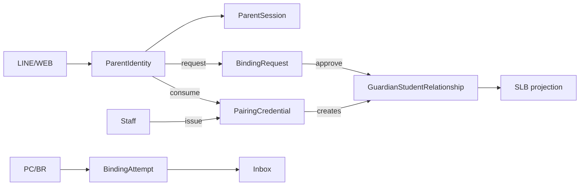
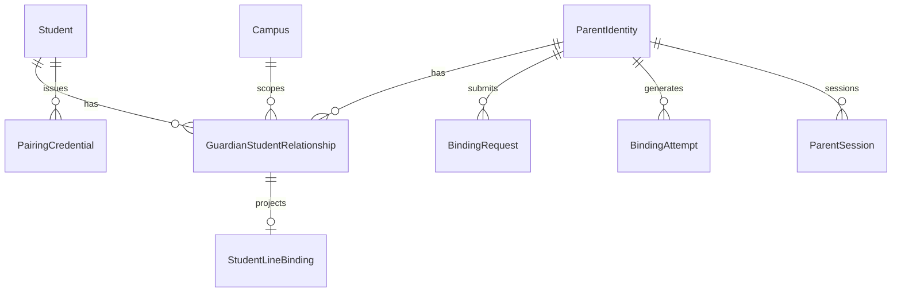

# Parent Identity — Target Architecture

| Field | Value |
|-------|-------|
| Status | **ADR Accepted** (Founder 2026-07-26) — design only; **NO PRODUCTION CODE** |
| ADR | [`ADR-PARENT-STUDENT-BINDING.md`](../adr/ADR-PARENT-STUDENT-BINDING.md) |

## Separation & current gaps

| Concept | Today → Target |
|---------|----------------|
| Auth | LINE/ParentSession → `ParentIdentity`+session |
| Relationship | `SLB.verified_at` → `GuardianStudentRelationship` |
| Channel / Credential / Ops | SLB → projection · name+phone → `PairingCredential` · none → Inbox+`BindingRequest` |

**Forbidden:** auth≡relationship. Paths: `LineWebhookController`, `ParentPortalController`, `StudentContactPhone`, SLB, `ParentSession`, StudentsList/Wizard, Import, ActionInbox (no binding).

| Gap | Today |
|-----|-------|
| Enum / copy | LINE echoes name+campus; Portal empty-phone 401 leaks existence |
| Ambiguous / cross-campus | LINE first-match vs Portal 409; Portal global name login |
| Ops / orphan / quality | No attempts/Inbox; delete leaves SLB; unbind≠expire session; Import→Phone only; no webhook RL |

## Target + ERD

Anon: no existence leak. ParentIdentity: own GSR. Director+`require_campus`: issue/approve/revoke. SA: cross-campus audit.

| Entity | Constraints |
|--------|-------------|
| ParentIdentity | `line_user_id` UK |
| GSR | parent+student+`campus_id`; UNIQUE active/pending `(parent,student)` |
| PairingCredential | `token_hash` UK; **Founder:** max_uses=1; ≤4 active unused/student+campus; TTL 24h/72h/7d def 7d; no permanent/extend |
| BindingRequest / Attempt | `dedupe_key` UK · reason+masked id; no full phone |

Indexes: token_hash; cred(student,campus,revoked,expires); GSR(*_id,status); requests(campus,state,sla); attempts(created_at). Soft revoke; **revoke→immediate ParentSession invalidate**; consume atomic `UPDATE … WHERE use_count<max AND revoked IS NULL AND expires>now`. Retention: attempts 180d; revoked GSR 2y; consumed hash 90d. Legacy: verified SLB→PI+GSR(`contact_phone_legacy`)+keep SLB; Phase2 dual-write; Phase3 read GSR.

## State machines & reason codes

- **Credential:** `active → consumed|expired|revoked`
- **Request:** `submitted ⇄ needs_information → approved|rejected|expired|cancelled`
- **GSR:** `pending→active→revoked`; `active→read_only→suspended`; staff may restore read_only→active
- **Student:** `paused`=keep active; `graduated`/`inactive`→**read_only 365d**→**suspended**; revoke→**session invalidate**

| Anon=safe | Staff sees | Specific OK |
|-----------|------------|-------------|
| `STUDENT_NOT_FOUND` `CONTACT_PHONE_MISSING` `PHONE_MISMATCH` `AMBIGUOUS_MATCH` `CAMPUS_MISMATCH` `CODE_INVALID` `CODE_REVOKED` | all left + codes | `CODE_EXPIRED` `CODE_CONSUMED` |
| Soft/yes to parent | `ALREADY_BOUND` · `RELATIONSHIP_PENDING` · `RATE_LIMITED` · `MANUAL_REVIEW_REQUIRED` · `AUTHORIZATION_DENIED` (generic) | |

Machine `reason_code`; display `message`; FE never parse Chinese for state.

## API `/api/v1/…`

| Method | Path | Notes |
|--------|------|-------|
| POST | `parent-binding/students/{id}/pairing-credentials` | director+campus; TTL 24\|72\|168 def 168; max_uses=1; raw once; cap4→`ACTIVE_CREDENTIAL_CAP` |
| GET/POST | `parent/pairing/status` | state only; **no PII**; RL 10/10min |
| POST | `parent/pairing/consume` | ParentIdentity; **atomic**; idempotent `ALREADY_BOUND` |
| POST | `parent/binding-requests` | **auth LINE**; campus+name; safe generic; dedupe; RL 5/day; staff proxy OK |
| POST | `parent-binding/requests/{id}/approve\|reject` | campus; atomic GSR |
| GET/POST | `…/guardians` · `…/relationships/{id}/revoke` · `…/regenerate` · `…/completeness` | list; expire sessions; revoke+issue; missing/pending counts |

Inbox (high-signal): `parent_contact_missing`, `binding_request_pending|sla`, `binding_failure_data`, `relationship_reconfirm`. Dedupe+7d cooldown; no phone/typo spam.

Flows: LINE→PI → consume **or** BindingRequest → portal; legacy flag=name+phone+safe+no ambiguous auto-bind. Staff: completeness/issue/QR/revoke/Inbox. Flags: `safe_copy|inbox|pairing|legacy_bind`. OOS: schedule/billing/leave/RFID/learning; no second password IdP.
