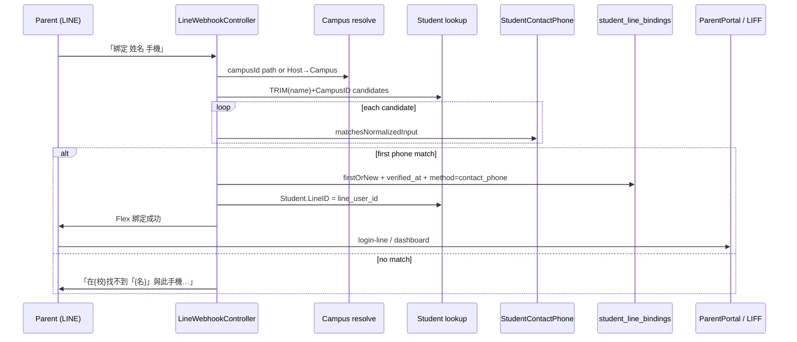
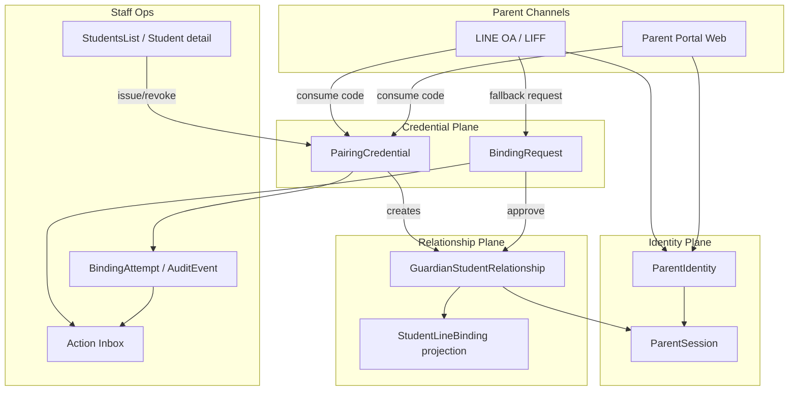

# Parent Identity & Student Binding — Target Architecture

| Field | Value |
|-------|-------|
| Status | **ADR Accepted** (Founder 2026-07-26) — design docs only; **NO PRODUCTION CODE** |
| Date | 2026-07-26 |
| Base | `origin/main` audited 2026-07-26 |
| ADR | [`ADR-PARENT-STUDENT-BINDING.md`](../adr/ADR-PARENT-STUDENT-BINDING.md)（Accepted） |

---

## 0. Separation of concerns（強制）

| Concept | Meaning | AllTrue today | Target |
|---------|---------|---------------|--------|
| **Authentication** | 證明「你是這個家長通道」 | LINE user id / ParentSession | `ParentIdentity` + session |
| **Guardian relationship** | 證明「你可看這個學生」 | `StudentLineBinding.verified_at` 混用 | `GuardianStudentRelationship` |
| **Channel binding** | LINE 推播／LIFF 連結 | `student_line_bindings` | Projection／adapter（可自 relationship 衍生） |
| **Credential** | 建立關係的短期憑證 | 姓名+手機 | `PairingCredential` |
| **Ops case** | 主任可處理的工作項 | （幾乎無） | Inbox + BindingRequest |

**禁止**把 authentication 與 guardian relationship 混為單一欄位真相。

---

## 1. Current-state audit（code-backed）

### 1.1 Sequence（現行）



### 1.2 Key files

| Area | Path |
|------|------|
| LINE bind | `backend/app/Http/Controllers/LineWebhookController.php` |
| Portal login | `backend/app/Http/Controllers/ParentPortalController.php` |
| Phone SSOT | `backend/app/Support/StudentContactPhone.php` |
| Binding model | `backend/app/Models/StudentLineBinding.php` |
| Session | `backend/app/Models/ParentSession.php` |
| Students UI | `frontend/src/pages/StudentsList.vue` |
| Wizard | `frontend/src/pages/StudentWizard.vue` |
| Import | `backend/app/Http/Controllers/ImportController.php` |
| Inbox | `backend/app/Services/ActionInboxService.php`（目前無 binding cases） |
| Tests | `LineWebhookBindingTest`, `ParentPortalLoginIsolationTest`, `ParentLoginLineTest`, `Issue1401CrossFamilyLineIsolationTest` |

### 1.3 Schema facts

| Table | Facts |
|-------|-------|
| `Student` | `Phone`, `parent_phone`, `parent_name`, `CampusID`, `status`, `LineID`, … |
| `student_line_bindings` | UNIQUE `(student_id, line_user_id)`；`verified_at`, `verification_method`, `campus_id`, `notify_learning_feedback` |
| `ParentSession` | `StudentID`, `TokenHash` (sha256), `ExpiresAt` (+30d) |

Migrations of note：`2026_03_13_000001_add_parent_fields_to_student_table.php`；`2026_04_16_200000_create_student_line_bindings_table.php`；`2026_07_24_130000_require_verified_parent_line_bindings.php`。

### 1.4 Branch table（摘要）

| Branch | LINE/HTTP | Persist | Privacy | Staff visibility |
|--------|-----------|---------|---------|------------------|
| Bind success | Flex success | verified binding + LineID | name in reply | line_bound UI |
| Already bound | text | none | name | same |
| Name+phone fail（含空手機） | 「找不到姓名與此手機」 | none | name+campus echoed | **none** |
| Portal empty phone | 401 補登 | none | **confirms name exists** | none structured |
| Portal ambiguous | 409 | none | confirms collision | none |
| Portal wrong | 404 generic | none | better | none |
| Staff unbind | 200 | delete binding | — | log director remove；**sessions remain** |

### 1.5 Scenario matrix（現行）

| Scenario | Behavior |
|----------|----------|
| 姓名在、手機皆空 | Portal 401；LINE 偽「找不到」 |
| 手機不符 | Portal 404；LINE name 路徑偽找不到；ID 路徑「不符」 |
| 同分校同名 | LINE first-win；Portal 多筆 409 |
| 跨校同名 | LINE 隔離；Portal name **全球搜** |
| 多家長／多子女 | UNIQUE 對允許；switch 靠 shared verified LINE |
| 再綁 | already-bound |
| 刪學生 | orphan bindings |
| Webhook replay | already-bound；無 event dedupe |
| 並發 | 靠 UNIQUE；無顯式 lock |

### 1.6 Top gaps

1. Enumeration／不一致文案  
2. Ambiguous LINE first-match  
3. Cross-campus name login  
4. 無 ops workflow／audit for failures  
5. Orphan bindings + session not revoked  
6. Import 只寫 `Phone`；Wizard 不收 `parent_phone`  
7. Webhook 無 throttle  

---

## 2. Target architecture overview



**Security boundaries**

- Anonymous／未驗證：不可獲知學生是否存在、校區、是否已有家長。  
- Authenticated ParentIdentity：可見自己的 relationships。  
- Director + `require_campus`：發碼／審核／撤銷僅限授權校區。  
- Super admin：跨校稽核（另權）。

---

## 3. Data model

### 3.1 ERD（邏輯）

```mermaid
erDiagram
  ParentIdentity ||--o{ GuardianStudentRelationship : has
  Student ||--o{ GuardianStudentRelationship : has
  Campus ||--o{ GuardianStudentRelationship : scopes
  Student ||--o{ PairingCredential : issues
  Campus ||--o{ PairingCredential : scopes
  ParentIdentity ||--o{ BindingRequest : submits
  Student ||--o{ BindingRequest : targets
  ParentIdentity ||--o{ BindingAttempt : generates
  GuardianStudentRelationship ||--o| StudentLineBinding : projects
  ParentIdentity ||--o{ ParentSession : sessions

  ParentIdentity {
    bigint id PK
    string line_user_id UK
    string phone_normalized_hash NULL
    string status
    datetime last_verified_at
  }

  GuardianStudentRelationship {
    bigint id PK
    bigint parent_identity_id FK
    bigint student_id FK
    bigint campus_id FK
    string relationship_type
    string status
    string verification_method
    bigint verified_by NULL
    datetime approved_at
    datetime revoked_at
  }

  PairingCredential {
    bigint id PK
    bigint student_id FK
    bigint campus_id FK
    string token_hash UK
    string purpose
    int max_uses
    int use_count
    int attempt_count
    datetime expires_at
    datetime consumed_at NULL
    datetime revoked_at NULL
    bigint created_by FK
  }

  BindingRequest {
    bigint id PK
    bigint parent_identity_id FK
    bigint campus_id FK
    string claimed_student_name
    bigint student_id NULL
    string state
    string failure_reason_code
    string dedupe_key UK
    datetime sla_due_at
    bigint reviewer_id NULL
  }

  BindingAttempt {
    bigint id PK
    string correlation_id
    string source
    string reason_code
    string masked_identifier
    bigint campus_id NULL
    datetime created_at
  }
```

### 3.2 Cardinality & constraints

| Entity | Cardinality / uniqueness |
|--------|--------------------------|
| ParentIdentity | 1 per `line_user_id`（LINE 主鍵）；未來可擴 email |
| GuardianStudentRelationship | 0..n per parent；0..n per student；**UNIQUE** `(parent_identity_id, student_id)` where `status IN ('pending','active')`（應用層 partial unique） |
| PairingCredential | 多筆歷史；同一 `student+campus` 最多 **4** 組 **active 且未使用** credentials（Founder）；default `max_uses=1`（每監護人獨立碼）；regenerate 可 revoke 指定碼或發新碼直至 cap |
| BindingRequest | UNIQUE `dedupe_key`（例：`campus|parent|normalized_name|day`） |
| StudentLineBinding | 保留 UNIQUE `(student_id, line_user_id)` 作為 channel projection |

### 3.3 Indexes（建議）

- `pairing_credentials(token_hash)` UNIQUE  
- `pairing_credentials(student_id, campus_id, revoked_at, expires_at)`  
- `guardian_student_relationships(student_id, status)`  
- `guardian_student_relationships(parent_identity_id, status)`  
- `guardian_student_relationships(campus_id, status)`  
- `binding_requests(campus_id, state, sla_due_at)`  
- `binding_attempts(created_at)` + `(reason_code, campus_id, created_at)`  

### 3.4 Soft delete / revocation

- 不硬刪關係；`status=revoked` + `revoked_at` + `revoked_by`。  
- Credential：`revoked_at` 或 `consumed`（use_count>=max_uses）；**禁止延長** `expires_at`。  
- ParentSession：relationship **revoke → 立即失效**該 parent 對該 student 的 sessions（強制）。

### 3.5 Tenant isolation

所有 write/read staff API：`campus_id ∈ auth_campus_ids`。  
Credential consume：token 自身綁定 campus；忽略 caller 自帶 campus。  
Parent portal：只列 `status=active` relationships。

### 3.6 Concurrent insert

- Consume：`UPDATE pairing_credentials SET use_count=use_count+1, … WHERE id=? AND use_count < max_uses AND revoked_at IS NULL AND expires_at > NOW()`；affected=0 → 失敗 reason。  
- Relationship：transaction + unique；衝突 → `ALREADY_BOUND` / idempotent success if same parent。

### 3.7 Data retention

| Data | Retention |
|------|-----------|
| BindingAttempt | 180 days（可配），無完整手機 |
| Revoked relationships | 2 years audit，portal 不可見 |
| Consumed credentials | 90 days then hard-delete hash row |
| Active credentials | until expiry/revoke |

### 3.8 Legacy migration mapping

| Legacy | Target |
|--------|--------|
| `student_line_bindings` verified | Backfill `ParentIdentity(line_user_id)` + `GuardianStudentRelationship(active, verification_method=contact_phone_legacy)` + keep SLB row |
| `ParentSession` | 不變機制；授權改查 relationship |
| `Student.parent_phone` / `Phone` | 仍為聯絡資料；**不再是唯一綁定權威** |
| Unverified bindings | 不升格 relationship；維持現行 verified gate |

**漸進原則**：Phase 2 雙寫（relationship + SLB）；Phase 3 讀路徑以 relationship 為準。

---

## 4. State machines

### 4.1 PairingCredential

```
issued → active → consumed
                → expired
                → revoked
active → revoked
```

| From | To | Trigger |
|------|----|---------|
| — | issued/active | staff issue |
| active | consumed | use_count reaches max_uses |
| active | expired | expires_at < now（lazy + job） |
| active | revoked | staff regenerate/revoke |
| issued | active | synonym；實作可合併為 `active` |

### 4.2 BindingRequest

```
submitted → needs_information → submitted
submitted → approved | rejected | expired | cancelled
```

### 4.3 GuardianStudentRelationship

```
pending → active → suspended → active
active → revoked
pending → revoked
active → read_only → suspended
read_only → active   (staff extend / student re-activated)
```

| Student status | Relationship behaviour（Founder） |
|----------------|----------------------------------|
| `paused` | 維持 normal `active` access |
| `graduated` / `inactive` | relationship → **`read_only` for 365 days** |
| After 365 days | → **`suspended`**（staff 可人工延長 read_only；須 audit） |
| Relationship `revoked` | **立即失效**該 parent+student 的所有 `ParentSession` |

`read_only`：可查看歷史／帳務摘要（產品允許範圍），不可建立新綁定副作用；精確可讀 API 清單於實作 PR 定。

---

## 5. Reason codes（stable）

| Code | Internal meaning | Expose to anonymous parent? | Staff sees? |
|------|------------------|-----------------------------|-------------|
| `STUDENT_NOT_FOUND` | no student | No（safe copy） | Yes（若高置信） |
| `CONTACT_PHONE_MISSING` | name hit, phones empty | No | Yes + Inbox |
| `PHONE_MISMATCH` | phones differ | No | Aggregated |
| `AMBIGUOUS_MATCH` | >1 candidate | No | Yes |
| `CAMPUS_MISMATCH` | wrong campus | No | Yes |
| `ALREADY_BOUND` | same parent-student active | Soft yes（已綁定文案） | Yes |
| `RELATIONSHIP_PENDING` | awaiting approval | Yes（待審文案） | Yes |
| `CODE_INVALID` | bad token | Safe copy | Yes |
| `CODE_EXPIRED` | expired | Specific copy OK（不洩學生） | Yes |
| `CODE_CONSUMED` | max uses | Specific copy OK | Yes |
| `CODE_REVOKED` | revoked | Safe copy | Yes |
| `RATE_LIMITED` | throttle | Yes | Yes |
| `AUTHORIZATION_DENIED` | staff/parent authZ | Yes generic | Yes |
| `MANUAL_REVIEW_REQUIRED` | routed to request | Yes | Yes |

**規則**：API 機讀用 `reason_code`；`message` 只供顯示；前端禁止解析中文判斷狀態。

---

## 6. API contract（versioned）

Base：`/api/v1/parent-binding/…`（staff）與 `/api/v1/parent/…`（parent）。  
Auth：既有 Bearer；staff + `role:director|admin|super_admin` + `require_campus`。

### 6.1 Issue pairing credential

| Field | Spec |
|-------|------|
| Method / path | `POST /api/v1/parent-binding/students/{studentId}/pairing-credentials` |
| AuthZ | director+；student.CampusID in scope |
| Body | `{ "ttl_hours": 24\|72\|168, "purpose": "guardian_link" }` — default TTL **168h (7d)**；`max_uses` 固定 **1**（Founder；API 不開放提高） |
| Response | `{ "credential_id", "expires_at", "max_uses": 1, "code"?, "deep_link"?, "qr_payload"? }` — **raw 僅此一次** |
| Idempotency | `Idempotency-Key` optional；同 key 重放同結果 |
| Rate limit | `30/hour/staff` |
| Audit | `PAIRING_ISSUED` |
| Side effect | 若該 student+campus 已有 **4** 組 active unused → `400`／`ACTIVE_CREDENTIAL_CAP`；否則新增；不自動延長舊碼；過期碼不可 revive |

### 6.2 Inspect safe credential status

| Field | Spec |
|-------|------|
| Method | `GET /api/v1/parent/pairing/status?code=…` **或** POST body |
| Auth | ParentIdentity or anonymous rate-limited |
| Response | `{ "state": "active\|expired\|consumed\|revoked\|unknown", "expires_at"?: }` — **無學生 PII** |
| Reason | `CODE_*` |
| Rate limit | `10/10min/IP` + LINE user |

### 6.3 Consume pairing credential

| Field | Spec |
|-------|------|
| Method | `POST /api/v1/parent/pairing/consume` |
| Auth | ParentIdentity（LINE login 後） |
| Body | `{ "code": "..." }` |
| Response | `{ "relationship_id", "student": {id, name, campus_id}, "reason_code": null }` |
| Atomicity | 強制；禁止 TOCTOU |
| Errors | uniform mapping to safe copy + machine code for authenticated parents only where safe |
| Audit | `PAIRING_CONSUMED` / failure attempt |
| Idempotency | 同一 parent 重送已綁 → `ALREADY_BOUND` success-equivalent |

### 6.4 Submit binding request（家長自助 — Founder）

| Field | Spec |
|-------|------|
| Method | `POST /api/v1/parent/binding-requests` |
| Auth | **必須** authenticated `ParentIdentity`（LINE）；匿名禁止 |
| Body | `{ "campus_id", "claimed_student_name", "note"? }` — **無完整手機必填** |
| External response | Safe generic only；**不透露**學生是否存在 |
| Dedupe | `dedupe_key` |
| Response | `{ "request_id", "state": "submitted" }`（成功與「已受理」語意對家長一致） |
| Rate limit | `5/day/parent/campus` |
| Staff | 可代建；Inbox 僅 masked evidence |
| Inbox | create case if policy matches |

### 6.5 Approve / reject request

| Field | Spec |
|-------|------|
| Method | `POST /api/v1/parent-binding/requests/{id}/approve` / `…/reject` |
| AuthZ | campus scope |
| Approve | 原子建立 relationship；不可重複建立 |
| Reject | `{ "reason_code" }` |
| Audit | yes |

### 6.6 List / revoke relationships

- `GET /api/v1/parent-binding/students/{id}/guardians`  
- `POST /api/v1/parent-binding/relationships/{id}/revoke` → expire sessions  

### 6.7 Regenerate credential

`POST …/pairing-credentials/regenerate` = revoke active + issue new（單一 audit 關聯）。

### 6.8 Completeness summary

`GET /api/v1/parent-binding/campuses/current/completeness`

```json
{
  "missing_parent_phone": 12,
  "no_active_relationship": 40,
  "pairing_expired_unused": 3,
  "pending_requests": 2,
  "binding_failures_need_ops": 5
}
```

### 6.9 Action Inbox integration

新 case types（高信號 only）：

| Type | When |
|------|------|
| `parent_contact_missing` | 高置信 name match + empty contact（來自 legacy attempt 聚合） |
| `binding_request_pending` | new request |
| `binding_request_sla` | near/over SLA |
| `binding_failure_data` | repeated `CONTACT_PHONE_MISSING` / `PHONE_MISMATCH` for same student |
| `relationship_reconfirm` | student campus transfer |

**禁止**：每次打錯姓名都建 inbox；完整手機進通知；把 Notification 當業務真相。

Dedupe key 例：`contact_missing:{student_id}`；cooldown 7d；resolve when `parent_phone` set OR relationship active。

---

## 7. Target parent flow

1. 加入 LINE／開啟 LIFF → 建立／確認 `ParentIdentity`。  
2. **有碼**：輸入短碼或開 deep link → consume → relationship active → portal。  
3. **無碼**：提示聯繫分校拿碼；或送出 BindingRequest（若開啟）。  
4. Legacy（flag on）：姓名+手機仍可用但 rate-limited + safe copy + 永不 ambiguous auto-bind。

---

## 8. Target staff flow

1. 學生頁顯示：聯絡完整度、active guardians、credential 狀態。  
2. 一鍵產生碼／複製連結／QR／撤銷。  
3. Completeness 篩選與 Inbox。  
4. 審核 pending；撤銷錯綁；看 audit（masked）。

---

## 9. Compatibility with production data

- 不改既有成功 verified binding 的語意直到 backfill 完成。  
- `StudentContactPhone` 規則保留給聯絡與 legacy fallback。  
- Import／Wizard 在 Phase 1 補齊 `parent_phone` 寫入（實作 issue）。  
- Feature flags：`parent_binding_safe_copy`、`parent_binding_inbox`、`parent_binding_pairing`、`parent_binding_legacy_bind`。

---

## 10. Out of scope（本架構不碰）

排課、扣堂、billing、leave domain、RFID、評量審核邏輯。  
不一次重寫整個 Parent Portal UI。  
不引入第二套與 LINE 無關的永久密碼體系（除非未來 ADR）。  
