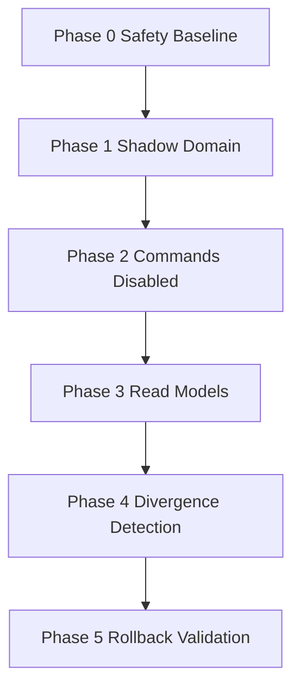

> **HISTORICAL CONTEXT ONLY**
> This document does **not** override [`CONTROL_PLANE_CONTRACT.md`](../CONTROL_PLANE_CONTRACT.md) (I1–I5).

# Master Refactor Plan — Domain Boundary Migration

> Phase 5 artifact. Governs gradual evolution toward bounded contexts with zero-behavior-change shadow layers.
> **Status:** Phases 0–5 complete. Phases 6–10 are future only — not implemented.

---

## Current State Summary

AllTrue is a Laravel 8 + Vue 3 monolith with:

- **God controllers:** `StudentClassController` (~5,156 LOC), `LearningRecordController`, `ClassSessionController`
- **Triple scheduling model:** `StudentClass` recurrence + `schedules` exceptions + `ClassSession` materializations
- **Four-way session usage authority:** sign-in flags, ClassSession status, orphan LRs, ledger — combined via `max()`
- **Payment dual-truth:** `StudentClass.Paid` vs invoice OR-logic in index vs Paid-only in alerts

### Shadow Layer Inventory (Phases 0–5)

| Layer | Location | Runtime status |
|---|---|---|
| Domain mirrors | `backend/app/Domain/` | CLI / tests only |
| Commands | `backend/app/Application/Command/` | Disabled (`use_command_layer=false`) |
| Read models | `backend/app/ReadModel/` | Tests + checker only |
| Consistency checker | `backend/app/Monitoring/DomainConsistencyChecker.php` | Log-only, flag off |
| Config | `backend/config/refactor.php` | All flags default false |

### Phase Reports

- [Phase 0 — Safety Baseline](phase-report-0.md)
- [Phase 1 — Shadow Domain](phase-report-1.md)
- [Phase 2 — Commands](phase-report-2.md)
- [Phase 3 — Read Models](phase-report-3.md)
- [Phase 4 — Divergence Detection](phase-report-4.md)
- [Phase 5 — Rollback Validation](phase-report-5.md)

---

## Target Architecture (Future — NOT Implemented)

```
CourseContract Aggregate   → enrollment, pricing snapshot, pause
ScheduleBook Aggregate     → exceptions + materialized occurrences
SessionBalance Aggregate   → ledger events → projected counters
PaymentLedger Aggregate    → invoice/payment read model
Single-writer command layer per domain
```

---

## Completed Migration Plan (Phases 0–5)



| Phase | Deliverable | Behavior change |
|---|---|---|
| 0 | Docs + golden test scaffold | None |
| 1 | Domain mirrors + artisan compare | None |
| 2 | Command dry-run + config | None |
| 3 | Read models + payment golden test | None |
| 4 | Checker + append hooks (flag off) | None |
| 5 | Master plan + rollback validation | None |

---

## Future Phases (6–10 — NOT Implemented)

### Phase 6: Staging Shadow CI

- Run `php artisan refactor:shadow-compare` in CI on seeded fixtures
- Enable `REFACTOR_CONSISTENCY_CHECK=true` on staging only
- Gate: mismatch rate < 1% for index payment/session fields

### Phase 7: Single Write Path Pilot

- One endpoint (e.g. `RecordPaymentCommand`) behind `use_command_layer` + feature flag
- Dual-write with legacy for one release cycle
- Rollback: flag off → legacy only

### Phase 8: Aggregate Extraction (Migration-Only PR)

- Introduce `course_contracts` table as read replica of `StudentClass` contract fields
- Backfill migration; no cutover yet

### Phase 9: Retire Duplicate Merge

- Server-owned occurrence API replaces frontend `calendarOccurrenceMerge.js` authority
- Frontend becomes thin renderer

### Phase 10: Deprecate Legacy Paths

- Return 410 on deprecated endpoints (no delete)
- Command layer becomes sole writer per domain (one at a time)

---

## Safety Guarantees

1. **Legacy always wins** until explicit promotion checklist signed off
2. **All flags default false** — shadow/command/checker inert in production
3. **Rollback < 1 revert** per phase (verified Phase 5)
4. **No schema changes** in Phases 0–5
5. **Diffs log only** — never block requests
6. **Known divergences documented** in [`shadow-domain-validation.md`](shadow-domain-validation.md)

---

## Activation Strategy (Future Only)

| Stage | Environment | Flags |
|---|---|---|
| Dev | Local WSL | `REFACTOR_SHADOW_ENABLED=true` for artisan |
| Staging | Pi staging | `REFACTOR_CONSISTENCY_CHECK=true`, `REFACTOR_LOG_SHADOW_DIFF=true` |
| Prod observe | Production | `REFACTOR_CONSISTENCY_CHECK=true` (log-only) after staging clean |
| Prod pilot | Production | `REFACTOR_USE_COMMAND_LAYER=true` for **one** command only (Phase 7+) |

Promotion checklist (required before each flag enable):

- [ ] Architecture tests green
- [ ] Shadow mismatch rate below threshold (see [`diff-reporting.md`](diff-reporting.md))
- [ ] Rollback rehearsed (revert + env disable)
- [ ] CEO approval

---

## Rollback Philosophy

1. **Prefer flag disable** over revert for Phase 4+ (instant, no deploy)
2. **Prefer single-commit revert** when removing a whole phase
3. **Never partial revert** of controller hooks — full `git checkout HEAD -- <file>` if needed
4. **Legacy path must remain** until Phase 10 deprecation — no delete, only 410

See [`rollback-strategy.md`](rollback-strategy.md) for triggers and verification steps.

---

## Key Commands

```bash
# Shadow compare (CLI, no production impact)
cd backend && php artisan refactor:shadow-compare --limit=20

# Architecture tests
php artisan test --filter=Architecture

# Command router dry-run (disabled by default)
php artisan tinker
>>> app(\App\Application\Command\CommandRouter::class)->dispatch('create_session', ['student_class_id' => 1]);
```

---

## Related Documents

- [`safety-baseline.md`](safety-baseline.md)
- [`shadow-domain-validation.md`](shadow-domain-validation.md)
- [`diff-reporting.md`](diff-reporting.md)
- [`rollback-strategy.md`](rollback-strategy.md)
