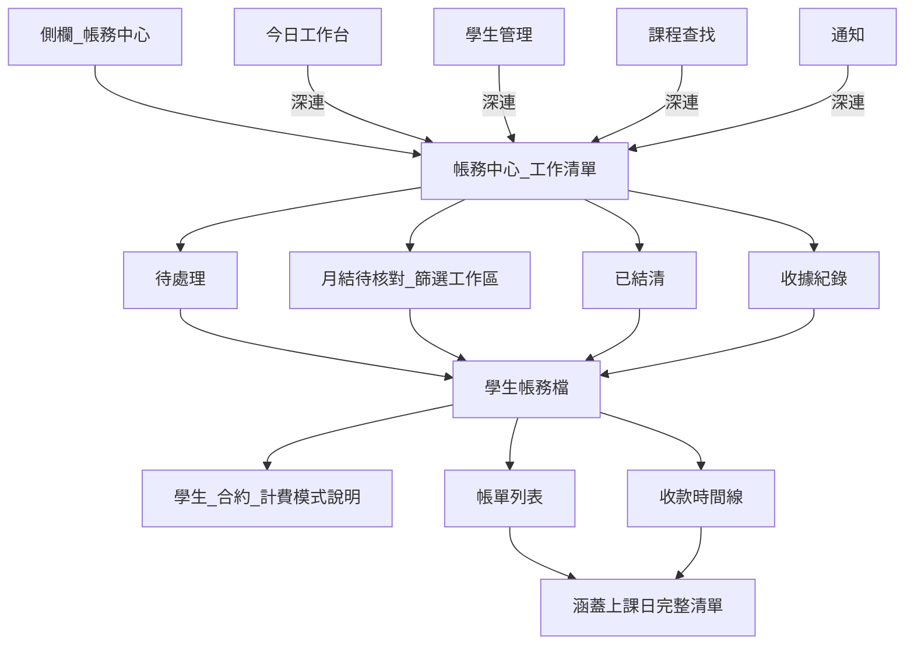

# PRD：主任學生帳務對帳資訊架構重規劃

> **Risk tier:** T0（本 PR 僅文件／IA）；後續實作分期為 T2（UI＋唯讀／展示契約），不改催繳列入條件、不改收款寫入語意。  
> **Canonical siblings（不取代）:** [`DIRECTOR_PAYMENT_ALERT_RULES.md`](../DIRECTOR_PAYMENT_ALERT_RULES.md) · [`RFC_REPORTED_PAID_ACCOUNTING_SPLIT.md`](../architecture/RFC_REPORTED_PAID_ACCOUNTING_SPLIT.md) · [`GUIDE_NIGHTLY_SESSION_RECONCILE.md`](../GUIDE_NIGHTLY_SESSION_RECONCILE.md) · [`2026-09-29-monthly-billing-review.md`](2026-09-29-monthly-billing-review.md)

---

## 1. 文件資訊

| 欄位 | 內容 |
|------|------|
| 功能名稱 | 主任學生帳務對帳 IA（Information Architecture）重規劃 |
| 版本 | v1.0 |
| 狀態 | Accepted — M0 契約；**實作交給 Claude Code／Codex worker**（見 IMPL_HANDOFF_M1） |
| 目標角色 | 主任／行政（`director` / `admin` / `super_admin`） |
| 日期 | 2026-10-06 |
| 觸發 | Founder：學生對帳入口不明顯、資訊不完整（只見合約第一堂）、帳務中心與月結／堂數制混淆、學生個別對帳未發揮效用；最終目的＝主任對帳方便、知道哪筆錢對哪幾天課、入口不要一大堆 |

---

## 2. 目標與業務背景

### 痛點（非技術語言）

主任要核對「家長繳的這筆錢，到底是哪幾天的課」時：

1. **入口太多**：帳務中心、學生管理、課程查找、今日工作台、通知、收據列表各自有「對帳／繳費明細／帳單與對帳／前往帳務中心」，不知道該從哪進。
2. **資訊不夠**：收據／對帳畫面常只標「第一堂課日期」，看不出整份合約或本帳單涵蓋的全部上課日。
3. **計費方式混在一起**：月結與堂數制擠在同一工作清單，學生帳務檔又沒有用白話說明「這門課怎麼算錢」，主任要用腦內轉換。
4. **「對帳」一詞過載**：學費流水、堂數異常、夜間系統檢查都叫對帳，點進去卻是不同東西。

### 業務價值

- 縮短主任核帳時間：一眼對上「錢 ↔ 課」。
- 降低誤登／找錯合約風險（尤其月結跨期）。
- 減少「功能做了但找不到／看不懂」的訓練成本。

### KPI（可量化）

| KPI | 基線（現況） | 目標 |
|-----|-------------|------|
| 主任完成「查某生某筆收款對應上課日」的入口數 | ≥4 個平行入口（帳務中心／課程查找／學生管理／工作台） | **1 個權威入口**（帳務中心）＋其餘僅深連 |
| 學生帳務檔是否列出帳單涵蓋的全部上課日 | 主畫面多為第一堂；完整日期散落在繳費單／課程查找 | **帳單／收款列可展開完整上課日清單** |
| 「對帳」文案指涉學費流水的專一度 | 與堂數異常／夜間檢查共用「對帳」 | 學費用「學生帳務／繳費明細」；堂數異常與夜間檢查不同名 |

---

## 3. 範圍

### In Scope

- 定義主任帳務 **單一資訊架構**（入口、層級、命名、錢↔課對照規則）。
- 規定學生帳務檔必備資訊：計費模式、合約、帳單、收款、**本單涵蓋之上課日期**。
- 規定次要畫面（學生管理／課程查找／工作台／通知）只能 **深連到帳務中心學生帳務檔**，不得再維護第二套殘缺對帳 UI。
- 分期實作里程碑、驗收、回滾與文件更新義務。
- 文案正名方向（對齊 TD-081／`GUIDE_UI_COPY.md`）。

### Out of Scope

- 不改 [`DIRECTOR_PAYMENT_ALERT_RULES.md`](../DIRECTOR_PAYMENT_ALERT_RULES.md) 催繳 **列入條件**。
- 不改已回報≠已入帳狀態機（[`RFC_REPORTED_PAID_ACCOUNTING_SPLIT.md`](../architecture/RFC_REPORTED_PAID_ACCOUNTING_SPLIT.md)）。
- 不做銀行對帳、夜間堂數一致性檢查合併。
- 不做法定收據 PDF／Receipt Domain T3（TD-068）。
- 不做 production 歷史帳務資料修復（走既有月結更正／Repair Manifest）。
- 不做家長入口改版。
- 不整包重寫前端或帳務中心（對齊 `ALLTRUE_ENGINEERING_NORTH_STAR`：增量）。

---

## 4. RACI

| 角色 | 代表 | R/A/C/I |
|------|------|---------|
| 實作 | `[FEATURE]` Agent | R/A |
| 測試 | `[TEST]` Agent | R |
| 審查 | `[REVIEW]` Agent | R |
| 文件 | `[DOCS]` Agent | R |
| 部署 | `[OPS]` Agent | R |
| 人類 | Founder／主任 | I（可閱讀；不阻擋 DoD） |

---

## 4b. Dependencies

| 類型 | 說明 | 狀態 |
|------|------|------|
| 前置 | RFC 已回報≠已入帳 Phase 1+2 | 已完成 |
| 前置 | 帳務中心「月結待核對」計畫 | 已有文件；UI 邊界沿用 |
| 前置 | 繳費單／收據已能列多筆上課日（後端 slip／receipt 路徑） | 已存在；學生帳務檔應複用同一「涵蓋堂次」語意，不另發明 |
| 外部服務 | 無 | — |
| 環境 | 無新 migration 為預設；若 API 僅擴充唯讀欄位則無 schema cutover | 已存在 |

本次規劃文件 **無外部依賴**。

---

## 5. User Stories + AC

### US-1 單一入口

**As a** 主任，**I want** 所有學費核帳都從「帳務中心」進去，**so that** 我不用猜該點哪個「對帳」。

**AC**

- Given 側欄，When 主任找學費相關功能，Then 只有「帳務中心」是權威入口（當月學收仍是報表、PIN 另開，不叫對帳）。
- Given 今日工作台／通知／學生管理／課程查找出現繳費相關 CTA，When 點擊，Then 一律深連 `tuition-collect` 並帶 `studentId`＋`courseId` 開啟學生帳務檔；不另開第二套殘缺流水視窗當主路徑。

### US-2 錢對上哪幾天課

**As a** 主任，**I want** 在學生帳務檔展開某張帳單或某筆收款時看到完整上課日期清單，**so that** 我知道這筆錢對應哪幾天。

**AC**

- Given 月結合約帳單，When 展開「涵蓋上課日」，Then 列出該帳單服務期間內的全部有效堂次日期（含狀態標籤），不得只顯示第一堂。
- Given 堂數制合約帳單／已確認收款，When 展開「涵蓋上課日」，Then 列出本合約購買範圍內已上與預計堂次（與現行繳費單／收據涵蓋語意一致），不得只顯示第一堂。
- Given 佇列列或收據摘要需要短標，When 顯示識別字，Then 可用「科目＋第一堂／期間」當**副標**；完整日期仍必須在展開區可得。

### US-3 計費方式一眼懂

**As a** 主任，**I want** 學生帳務檔開頭用白話標月結或堂數制，**so that** 我知道該用「本期上課日」還是「購買堂次」在對。

**AC**

- Given 打開學生帳務檔，When 畫面載入，Then 頂部顯示模式徽章＋一句說明（月結＝依結算期／本期上課日計費；堂數制＝依購買堂數／剩餘堂數）。
- Given 月結待核對分頁，When 主任進入，Then 文案說明這是帳務中心內的**篩選工作區**，不是第二個帳務系統。

### US-4 命名不打架

**As a** 主任，**I want** 按鈕名稱對應實際內容，**so that** 點「堂數異常」不會跑進學費流水、點「學生帳務」不會以為是夜間檢查。

**AC**

- Given 學費流水入口，When 顯示按鈕，Then 文案為「學生帳務」或「繳費明細」（禁止單獨「對帳」當學費主動詞）。
- Given `usage_balance` 異常，When 顯示提醒，Then 文案為「堂數異常」；動作為「查看堂次說明」（可仍開同一學生檔的堂次區）。
- Given 系統管理員夜間面板，When 顯示，Then 維持「夜間堂數對帳」且主任側欄不可見（現況保留）。

---

## 5b. UI/UX 精緻化

### 帳務中心（佇列層）

| 面向 | 規格 |
|------|------|
| 版面層次 | 維持單一頁頂部分頁：待處理／月結待核對／已結清／收據紀錄。首屏是工作表，不是五張大卡（對齊 `GUIDE_UI_COPY` 掃讀密度）。 |
| 色彩 | 沿用既有 design token：未繳 warning、已回報待確認 info、已繳 success、作廢 muted。 |
| 互動 | 列上主 CTA「打開學生帳務」；次要動作（登記回報／確認入帳）保留但完成後仍回到同一佇列脈絡。 |
| 空狀態 | 「目前沒有待處理」＋一句「學費核帳請從這裡進入學生帳務」。 |
| Loading | 表格 skeleton；切分校丟棄舊資料。 |
| 防呆 | 深連帶入的學生／課程高亮；找不到時 toast「找不到這筆課程的帳務，已顯示該生其他合約」。 |
| 響應式 | 桌面表格式；手機卡片式；操作不橫向溢位遮金額（既有修復保留）。 |
| 無障礙 | 分頁 `aria-selected`；主 CTA 有明確 `aria-label`含學生姓名。 |

### 學生帳務檔（明細層；取代薄型 modal 為主體驗）

| 面向 | 規格 |
|------|------|
| 版面層次 | 全高面板或帳務中心內嵌頁（非小 dialog）：① 學生＋合約抬頭 ② 模式說明條 ③ 帳單表 ④ 收款時間線。 |
| 錢↔課 | 每張帳單列可展開「涵蓋上課日」：日期 chips（已上／請假／取消／預計）＋計數摘要「共 N 堂」。 |
| 色彩 | 模式條：月結用既有 monthly chip 色；堂數制用 session chip 色；不新增紫色主題。 |
| 互動 | 展開／收合動畫 150–200ms；列 hover 顯示「展開上課日」。 |
| 空狀態 | 尚無帳單：「尚未開單 — 應繳仍依課程估算」＋開單／登記入口（沿用 RFC 語意）。 |
| Loading | 抬頭先出，帳單區 spinner。 |
| 防呆 | 危險作廢維持二次確認；作廢列不計入有效收款。 |
| 響應式 | 手機改為單一欄：抬頭 → 模式條 → 手風琴帳單 → 時間線。 |
| 無障礙 | 展開區 `aria-expanded`；日期清單用 list。 |

### 次要入口（學生管理／課程查找／工作台）

| 面向 | 規格 |
|------|------|
| 版面 | 只留一個帳務 CTA：「在帳務中心打開」；移除或降級平行「對帳／帳單與對帳」為同一深連。 |
| 課程查找上課日期 chips | **保留**作排課／教務用途，不宣稱是帳務對帳主路徑。 |

---

## 6. 功能需求 FR

| ID | 需求 | 可驗收 |
|----|------|--------|
| FR-001 | 帳務中心為主任學費核帳唯一權威入口 | 側欄與深連規格見 US-1 |
| FR-002 | 學生帳務檔為唯一學生級學費明細表面 | 佇列／收據／深連皆開同一元件 |
| FR-003 | 帳單／收款必須可展示「涵蓋上課日」完整清單 | 月結＝服務期間堂次；堂數制＝購買範圍堂次；禁止僅第一堂當唯一內容 |
| FR-004 | 學生帳務檔抬頭顯示計費模式白話說明 | 月結／堂數制（含方案包註記若適用） |
| FR-005 | 次要頁面帳務 CTA 一律深連帳務中心學生帳務檔 | 不維護第二套殘缺 ledger |
| FR-006 | 學費與堂數異常／夜間檢查文案分離 | 對齊 US-4／TD-081 |
| FR-007 | 既有登記回報→確認入帳→收據流程仍在學生帳務檔／帳務中心完成 | 不開新狀態機 |
| FR-008 | 多校區隔離：學生帳務檔僅能讀寫目前校區授權範圍 | 跨校 403／空結果與現況一致 |
| FR-009 | 佇列短標可用第一堂／期間，但不得取代 FR-003 | 雙層資訊：列表短標＋明細完整日 |

---

## 7. 非功能需求 NFR

| ID | 需求 |
|----|------|
| NFR-001 | 學生帳務檔首屏（抬頭＋帳單摘要）P95 &lt; 2s（同分校既有 ledger 量級） |
| NFR-002 | 涵蓋上課日展開採隨點載入或已內嵌於 ledger；單合約堂次上限展示與繳費單一致（既有上限／截斷規則須明示「尚有 N 堂未列」） |
| NFR-003 | API 失敗時顯示人話錯誤（`GUIDE_UI_COPY`），保留重試；不清空已載入抬頭 |
| NFR-004 | 不新增 PIN 閘道於帳務中心（當月學收維持 PIN） |
| NFR-005 | 降級：若涵蓋堂次查詢失敗，仍顯示金額／狀態，並標「上課日暫時無法載入」 |

---

## 8. 技術方向（禁止 code）

### 業界對齊的 IA（選定）

採用大公司共通的 **Hub-and-spoke（工作清單 → 客戶／訂單明細）**：

- **Stripe Dashboard**：Invoices／Payments 列表進 Customer／Invoice 明細；明細才看完整應用與時間線；客戶餘額有不可變交易歷史。
- **Shopify Admin**：Orders 列表進 Order 明細；Timeline 把付款事件與履約內容放在同一訂單脈絡。

映射到 AllTrue：

| 業界 | AllTrue |
|------|---------|
| Orders／Invoices 列表 | 帳務中心待處理／收據佇列 |
| Customer／Order 明細 | **學生帳務檔**（學生＋課程合約脈絡） |
| Line items／fulfillment | **涵蓋上課日**（這筆錢對應的課） |
| Payment timeline | 已回報／確認入帳／收據時間線（既有 RFC） |

### 架構取捨

1. **不新建第二個「對帳中心」** — 亂的根因是入口增殖；解法是收斂。
2. **不把課程查找改成帳務主場** — 課程查找保留教務／排課；帳務動作深連出去。
3. **複用既有「繳費單／收據涵蓋堂次」語意** — 學生帳務檔展示與 slip／receipt 同源規則，避免第三套日期算法。
4. **薄型 modal → 學生帳務檔面板** — 同一路由意圖 `tuition-collect`＋focus；實作可先加大既有 ledger 表面，再視需要變內嵌頁。
5. **月結待核對保留為帳務中心分頁** — 是篩選工作區，文件與 UI 說明禁止暗示獨立產品。

### 資料與 API 邊界（名級）

- 讀：既有帳務 ledger、alerts/tuition、class-sessions／slip session 細節、payment-reports。
- 寫：沿用 payment-reports 登記／確認／退回與既有開單路徑；本 IA **不新發明收款狀態**。
- 權限：既有 `role`＋`require_campus`。

### 前端表面（名級）

- 權威：帳務中心頁、學生帳務檔元件（由現有學生帳務對帳表面演進）。
- 深連來源：主任儀表板、通知中心、學生管理、課程查找（CTA 收斂）。
- 明確非帳務：夜間堂數對帳面板、當月學收報表。

---

## 8b. Decision Log

| 日期 | 決策 | 替代方案 | 選擇理由 |
|------|------|----------|----------|
| 2026-10-06 | 唯一權威入口＝帳務中心 | 以學生管理或課程查找當帳務主場；或新建「對帳中心」 | Founder 要求入口不要多；對齊 Stripe／Shopify 單一財務作業入口 |
| 2026-10-06 | 學生帳務檔必須顯示完整涵蓋上課日 | 只加強第一堂標籤；或叫主任去課程查找對日期 | 第一堂不足以對帳；完整日期已存在於 slip／receipt，應匯入帳務檔 |
| 2026-10-06 | 次要頁只深連、不維護第二套 ledger | 各頁各做完整對帳 | 多入口是現況混亂主因（R30／文案债 TD-081） |
| 2026-10-06 | 月結／堂數制用模式說明條，不拆兩個帳務中心 | 依模式拆兩個頂層產品 | 主任同一天兩邊都要處理；拆頂層會更難找 |
| 2026-10-06 | 學費文案不用單獨「對帳」 | 繼續統稱對帳 | `GUIDE_NIGHTLY_SESSION_RECONCILE`／TD-081 已證明同名傷害 |
| 2026-10-06 | 本 PR 只交 IA／PRD，程式分期 | 立刻大改 TuitionCollectionPage | 先鎖定產品契約再 RED→GREEN，避免邊做邊改入口 |

---

## 9. 資安與存取控制

| 維度 | 評估 |
|------|------|
| Spoofing | 沿用 Bearer＋role；無新公開端點 |
| Tampering | 本 IA 展示為主；寫入仍走既有 confirm／void；禁止前端自算已繳 |
| Repudiation | 確認入帳／作廢既有 audit 保留 |
| Information disclosure | ledger 必須校區隔離；日期清單同校區課程堂次；PII（姓名／電話）不新增到 URL query 明文（深連用既有 id） |
| DoS | 堂次列表須有上限／分頁或截斷提示 |
| Elevation | 老師角色不可進入帳務中心（現況）；不放寬 |

STRIDE 快評：**GREEN**（文件階段）；實作 PR 若新增 API 欄位需再跑 `module-security` 清單。

---

## 10. QA 驗收

### Happy Path

1. 主任從側欄進帳務中心 → 待處理點學生 → 學生帳務檔顯示模式說明 → 展開帳單見完整上課日 → 與繳費單日期集合一致。
2. 從今日工作台「前往帳務中心」深連 → 自動 focus 同一學生／課程帳務檔。
3. 堂數制與月結各一筆：模式說明不同；展開日期規則符合 FR-003。

### Edge

1. 尚無帳單：顯示估算說明，無空白死路。
2. 預收（付款日早於第一堂）：短標可含預收註記；展開仍列購買／期間堂次。
3. 作廢收據：可開啟帳務檔追蹤但不計有效收款。
4. 堂次超過展示上限：顯示「尚有 N 堂」。

### Error

1. ledger API 失敗 → 人話錯誤＋重試。
2. 涵蓋堂次失敗 → 金額仍可見＋「上課日暫時無法載入」。
3. 深連 course 不存在 → toast＋該生其他合約。

### UI/UX 驗收清單

- [ ] 側欄無第二個「學費對帳」入口
- [ ] 學生管理／課程查找無平行殘缺「對帳」主路徑
- [ ] 學生帳務檔不是只能看到第一堂
- [ ] 「堂數異常」與「學生帳務」文案可區分
- [ ] 手機可完成展開上課日與返回佇列

---

## 11. 上線與維運

| 項目 | 策略 |
|------|------|
| 部署 | 一般 PR → CI → merge → `deploy.yml`；文件-only 批次可跳過 production deploy |
| Feature flag | 首期以「學生帳務檔加強展示」為主，不需 flag；若要大改面板切換，用既有前端軟切＋docs-only 說明 |
| Observability | 既有 API 延遲／4xx；不新增 PII log |
| 回滾 | `git revert` 實作 PR；無 migration 則無 DB 回滾 |
| Smoke | 主任登入 → 帳務中心 → 打開一筆學生帳務 → 展開上課日 → health 200 |

---

## 12. 里程碑與優先級

| 優先級 | 里程碑 | 執行 Agent | 內容 |
|--------|--------|------------|------|
| P0 | M0 契約入庫 | `[DOCS]` | 本 PRD＋INDEX 導航（本 PR） |
| P0 | M1 錢↔課可見 | `[FEATURE]` `[TEST]` | 學生帳務檔／ledger 展示完整涵蓋上課日；佇列短標規則 FR-009 |
| P1 | M2 入口收斂 | `[FEATURE]` `[TEST]` | 次要頁 CTA 深連統一；學費按鈕正名；薄 modal 升全高帳務檔 |
| P1 | M3 模式說明 | `[FEATURE]` | 抬頭模式條＋月結待核對「非獨立產品」說明 |
| P2 | M4 文案清债 | `[DOCS]` `[FEATURE]` | TD-081 剩餘「對帳」字樣清扫；`GUIDE_UI_COPY`／STAFF_UPDATES |

---

## 13. 風險／假設／開放問題

### 本專案既有證據

- 收據列表刻意用第一堂當辨識（CHANGELOG 2026-09-15）→ 對列表有用，對核帳不夠。
- 「對帳」過載已文件化（`GUIDE_NIGHTLY_SESSION_RECONCILE`、TD-081）。
- 繳費單／收據已能列多日；帳務檔未複用 → 資訊落差是 IA 問題多於資料缺失。

### 業界／開源（WebSearch 2026-10-06）

- Stripe：Customer／Invoice 明細承載支付應用與餘額交易歷史；列表進明細是預設作業路徑（Stripe Billing customer balance／invoicing docs）。
- Shopify：Orders 列表 → Order 明細 Timeline 承載付款事件與訂單內容同一脈絡（Shopify admin order timeline）。

### 風險

| 風險 | 緩解 |
|------|------|
| 收斂入口時主任找不到舊按鈕 | M2 保留深連；STAFF_UPDATES 說明「請到帳務中心」 |
| 第三套日期算法 | 強制與 slip／receipt 同源（Decision Log） |
| 一次改太大 | M1→M2 分期；本檔先鎖契約 |

### 假設

- 主任是唯一主要操作者（與 RFC：無獨立會計角色）一致。
- Founder 要的是作業清晰，不是新的帳務狀態機。

### 開放問題

- [AI-RESOLVABLE] 學生帳務檔用全高面板或帳務中心內嵌子頁：M2 實作時依既有 `TuitionCollectionPage` 佈局選變更最小者，預設全高面板演進自現有 ledger modal。
- [AI-RESOLVABLE] 方案包多科目：帳務檔以「方案＋成員科目」分組列出涵蓋日，不另開入口。

---

## 14. Definition of Done

### M0（本文件 PR）

- [ ] 本檔存在於 `docs/plans/2026-10-06-director-student-billing-reconciliation-ia.md`：驗證方式：`test -f` 成功
- [ ] `docs/INDEX.md` 含指向本計畫的導航列：驗證方式：`rg "director-student-billing-reconciliation-ia" docs/INDEX.md` 有命中
- [ ] 14 節齊全：驗證方式：`rg "^## " docs/plans/2026-10-06-director-student-billing-reconciliation-ia.md` 含 1–14 對應標題
- [ ] `docs/CHANGELOG.md` 有本文件入庫一行：驗證方式：`rg "主任學生帳務對帳 IA" docs/CHANGELOG.md` 有命中

### 後續實作 PR（承本契約；非本 PR）

- [ ] FR-001–FR-009 各有自動化測試或可執行 UI 驗收腳本通過 CI
- [ ] 月結與堂數制各至少一則「展開涵蓋上課日」回歸
- [ ] 次要入口深連測試：意圖帶 `studentId`/`courseId` 開啟同一學生帳務檔
- [ ] 未改 `DIRECTOR_PAYMENT_ALERT_RULES` 列入條件（diff 證明）
- [ ] deploy 後 `GET /api/v1/health` 200；帳務中心 smoke 通過

---

## Todos（跨功能）

| 類別 | Agent | 任務 |
|------|-------|------|
| 文件更新 | `[DOCS]` | M0：本 PRD＋INDEX＋CHANGELOG |
| 後端 API／資料 | `[FEATURE]` | M1：ledger／帳務讀型 API 回傳（或組合）帳單涵蓋上課日；與 slip 同源 |
| 前端 UI | `[FEATURE]` | M1–M3：學生帳務檔展開日期、模式條、CTA 深連收斂 |
| UI/UX 精緻化 | `[FEATURE]` | 依 §5b 全高面板、空狀態、截斷提示、手機手風琴 |
| 測試與自動 QA | `[TEST]` | 月結／堂數制涵蓋日、深連、校區隔離、截斷、失敗降級 |
| 資安靜態審查 | `[REVIEW]` | 實作 PR：校區隔離＋PII 不進 URL／log |
| Code Review | `[REVIEW]` | 逐條 FR-001–009；禁止第三套日期算法 |
| 部署與 health | `[OPS]` | 實作 PR merge 後 health＋帳務中心 smoke（M0 docs-only 可跳過 deploy） |

---

## 附錄 A — 目標資訊架構（示意）

## 附錄 B — 「對帳」正名對照（執行時）

| 舊／含糊 | 新（主任可見） |
|----------|----------------|
| 對帳（學費） | 學生帳務／繳費明細 |
| 堂數待對帳 | 堂數異常 |
| 待對帳（`pending_report`：家長已回報、尚未確認入帳） | 待確認入帳（Founder 2026-10-06 決定；與按鈕「確認入帳」同詞） |
| 夜間堂數對帳 | 維持（僅系統管理員） |
| 月結待核對 | 維持（帳務中心內分頁說明） |

## 附錄 C — M2 實作決定（2026-10-06）

- 深連分兩種意圖：`intent=ledger`（「學生帳務」按鈕）在帳務中心**直接打開學生帳務檔**，並仍定位佇列列；付款動作（前往繳費／查看待對帳）維持只定位佇列列，因為登記回報／確認入帳按鈕在列上，不在帳務檔內。
- 課程查找「帳單與對帳紀錄」與學生管理「月結帳單記錄」兩個殘缺帳單視窗移除，改為「學生帳務」深連（FR-005）。
- 課程查找「堂數待對帳 → 查看對帳明細」仍就地開同一個 `AccountingLedgerModal`（同元件，符合 FR-002；文案於 M4 改「堂數異常」）。
