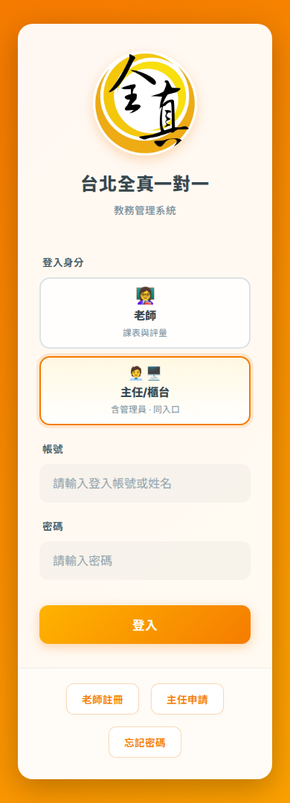
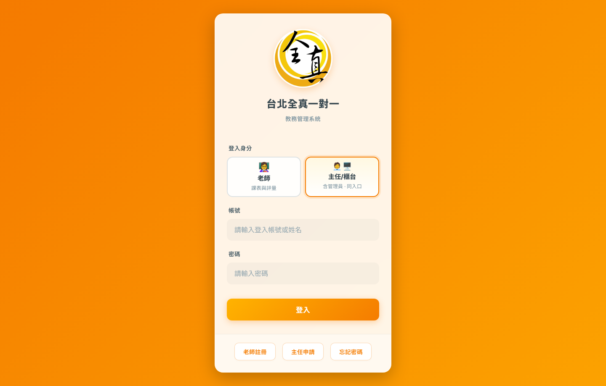

# Login.vue DS polish — visual evidence (PR #1386 / Epic #687)

Durable before/after screenshots committed for review. Regenerate with:

```bash
# Vite on :5173
node scripts/login-polish-screenshots.mjs before http://127.0.0.1:5173/ ./docs/reviews/login-polish-1386/before
node scripts/login-polish-screenshots.mjs after  http://127.0.0.1:5173/ ./docs/reviews/login-polish-1386/after
```

Default local (gitignored) output: `artifacts/login-polish/<phase>/`.

| State | 390 | 768 | 1440 |
|-------|-----|-----|------|
| Before default |  |  |  |
| After default |  |  |  |
| After error | |  | |
| After forgot | |  | |
| After reduced-motion | |  | |
